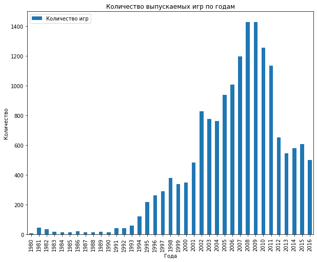
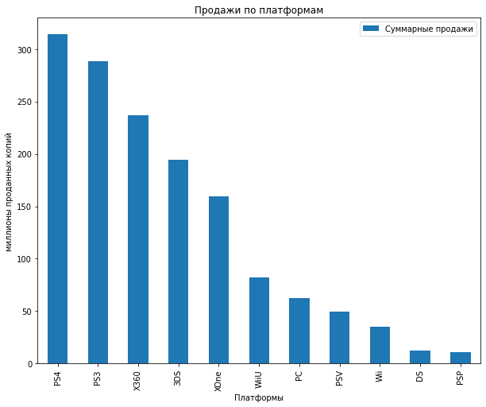
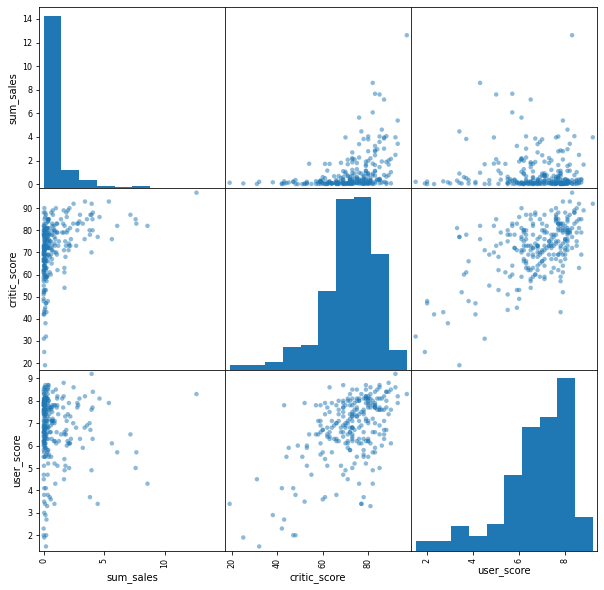

# Сборный проект

Вы работаете в интернет-магазине «Стримчик», который продаёт по всему миру компьютерные игры. Из открытых источников доступны исторические данные о продажах игр, оценки пользователей и экспертов, жанры и платформы (например, Xbox или PlayStation). Вам нужно выявить определяющие успешность игры закономерности. Это позволит сделать ставку на потенциально популярный продукт и спланировать рекламные кампании.

Перед вами данные до 2016 года. Представим, что сейчас декабрь 2016 г., и вы планируете кампанию на 2017-й. Нужно отработать принцип работы с данными. Неважно, прогнозируете ли вы продажи на 2017 год по данным 2016-го или же 2027-й — по данным 2026 года.

В наборе данных попадается аббревиатура ESRB (Entertainment Software Rating Board) — это ассоциация, определяющая возрастной рейтинг компьютерных игр. ESRB оценивает игровой контент и присваивает ему подходящую возрастную категорию, например, «Для взрослых», «Для детей младшего возраста» или «Для подростков».

**Задача** — выявить определяющие успешность игры закономерности.

**Ход исследования**

Данные получим из файла:
- /datasets/games.csv.

О качестве данных ничего не известно. Поэтому перед проверкой гипотез понадобится обзор данных.  

Таким образом, исследование пройдёт в шесть этапов:
 1. Изучение данных.
 2. Предобработка данных.
 3. Исследовательский анализ данных.
 4. Составление портрета пользователя каждого региона
 5. Проверка гипотез.
 6. Вывод.

## Изучение данных


```python
import pandas as pd #импорт библиотеки pandas
from scipy import stats as st #импорт библиотеки stats
from scipy.stats import levene #импорт библиотеки levene
import numpy as np #импорт библиотеки numpy
import plotly.express as px #импорт библиотеки plotly
import matplotlib.pyplot as plt #импорт библиотеки matplotlib
import plotly.graph_objs as go #импорт библиотеки plotly.graph_objs
import seaborn as sns #импорт библиотеки seaborn
df = pd.read_csv('/datasets/games.csv') #чтение файла с данными и сохранение в df
```


```python
display(df.head(10)) #получение первых 10 строк таблицы df
print()
display(df.info()) #получение общей информации о данных в таблице df
```


<div>
<table border="1" class="dataframe">
  <thead>
    <tr style="text-align: right;">
      <th></th>
      <th>Name</th>
      <th>Platform</th>
      <th>Year_of_Release</th>
      <th>Genre</th>
      <th>NA_sales</th>
      <th>EU_sales</th>
      <th>JP_sales</th>
      <th>Other_sales</th>
      <th>Critic_Score</th>
      <th>User_Score</th>
      <th>Rating</th>
    </tr>
  </thead>
  <tbody>
    <tr>
      <th>0</th>
      <td>Wii Sports</td>
      <td>Wii</td>
      <td>2006.0</td>
      <td>Sports</td>
      <td>41.36</td>
      <td>28.96</td>
      <td>3.77</td>
      <td>8.45</td>
      <td>76.0</td>
      <td>8</td>
      <td>E</td>
    </tr>
    <tr>
      <th>1</th>
      <td>Super Mario Bros.</td>
      <td>NES</td>
      <td>1985.0</td>
      <td>Platform</td>
      <td>29.08</td>
      <td>3.58</td>
      <td>6.81</td>
      <td>0.77</td>
      <td>NaN</td>
      <td>NaN</td>
      <td>NaN</td>
    </tr>
    <tr>
      <th>2</th>
      <td>Mario Kart Wii</td>
      <td>Wii</td>
      <td>2008.0</td>
      <td>Racing</td>
      <td>15.68</td>
      <td>12.76</td>
      <td>3.79</td>
      <td>3.29</td>
      <td>82.0</td>
      <td>8.3</td>
      <td>E</td>
    </tr>
    <tr>
      <th>3</th>
      <td>Wii Sports Resort</td>
      <td>Wii</td>
      <td>2009.0</td>
      <td>Sports</td>
      <td>15.61</td>
      <td>10.93</td>
      <td>3.28</td>
      <td>2.95</td>
      <td>80.0</td>
      <td>8</td>
      <td>E</td>
    </tr>
    <tr>
      <th>4</th>
      <td>Pokemon Red/Pokemon Blue</td>
      <td>GB</td>
      <td>1996.0</td>
      <td>Role-Playing</td>
      <td>11.27</td>
      <td>8.89</td>
      <td>10.22</td>
      <td>1.00</td>
      <td>NaN</td>
      <td>NaN</td>
      <td>NaN</td>
    </tr>
    <tr>
      <th>5</th>
      <td>Tetris</td>
      <td>GB</td>
      <td>1989.0</td>
      <td>Puzzle</td>
      <td>23.20</td>
      <td>2.26</td>
      <td>4.22</td>
      <td>0.58</td>
      <td>NaN</td>
      <td>NaN</td>
      <td>NaN</td>
    </tr>
    <tr>
      <th>6</th>
      <td>New Super Mario Bros.</td>
      <td>DS</td>
      <td>2006.0</td>
      <td>Platform</td>
      <td>11.28</td>
      <td>9.14</td>
      <td>6.50</td>
      <td>2.88</td>
      <td>89.0</td>
      <td>8.5</td>
      <td>E</td>
    </tr>
    <tr>
      <th>7</th>
      <td>Wii Play</td>
      <td>Wii</td>
      <td>2006.0</td>
      <td>Misc</td>
      <td>13.96</td>
      <td>9.18</td>
      <td>2.93</td>
      <td>2.84</td>
      <td>58.0</td>
      <td>6.6</td>
      <td>E</td>
    </tr>
    <tr>
      <th>8</th>
      <td>New Super Mario Bros. Wii</td>
      <td>Wii</td>
      <td>2009.0</td>
      <td>Platform</td>
      <td>14.44</td>
      <td>6.94</td>
      <td>4.70</td>
      <td>2.24</td>
      <td>87.0</td>
      <td>8.4</td>
      <td>E</td>
    </tr>
    <tr>
      <th>9</th>
      <td>Duck Hunt</td>
      <td>NES</td>
      <td>1984.0</td>
      <td>Shooter</td>
      <td>26.93</td>
      <td>0.63</td>
      <td>0.28</td>
      <td>0.47</td>
      <td>NaN</td>
      <td>NaN</td>
      <td>NaN</td>
    </tr>
  </tbody>
</table>
</div>


    
    <class 'pandas.core.frame.DataFrame'>
    RangeIndex: 16715 entries, 0 to 16714
    Data columns (total 11 columns):
     #   Column           Non-Null Count  Dtype  
    ---  ------           --------------  -----  
     0   Name             16713 non-null  object 
     1   Platform         16715 non-null  object 
     2   Year_of_Release  16446 non-null  float64
     3   Genre            16713 non-null  object 
     4   NA_sales         16715 non-null  float64
     5   EU_sales         16715 non-null  float64
     6   JP_sales         16715 non-null  float64
     7   Other_sales      16715 non-null  float64
     8   Critic_Score     8137 non-null   float64
     9   User_Score       10014 non-null  object 
     10  Rating           9949 non-null   object 
    dtypes: float64(6), object(5)
    memory usage: 1.4+ MB


    None


### Вывод

После первого ознакомления с данными видим несоответствие типов данных в столбце `Year_of_Release` и `User_Score`, также видим неправильный стиль названия стобцов и пропуски, в столбцах `Critic_Score` и `Rating` в большом количестве. 
С причиной их возникновения будем разбираться на следующих этапах.

Описание данных:

- `Name` — название игры
- `Platform` — платформа
- `Year_of_Release` — год выпуска
- `Genre` — жанр игры
- `NA_sales` — продажи в Северной Америке (миллионы проданных копий)
- `EU_sales` — продажи в Европе (миллионы проданных копий)
- `JP_sales` — продажи в Японии (миллионы проданных копий)
- `Other_sales` — продажи в других странах (миллионы проданных копий)
- `Critic_Score` — оценка критиков (максимум 100)
- `User_Score` — оценка пользователей (максимум 10)
- `Rating` — рейтинг от организации ESRB (англ. Entertainment Software Rating Board). Эта ассоциация определяет рейтинг компьютерных игр и присваивает им подходящую возрастную категорию.

Из описания проекта знаем, что данные за 2016 год могут быть неполными.

## Предобработка данных 

Сначала приведем названия столбцов к нижнему регистру.


```python
df.columns = df.columns.str.lower() #приводим названия столбцов к нижнему регистру 
df.columns #проверка
```


    Index(['name', 'platform', 'year_of_release', 'genre', 'na_sales', 'eu_sales',
           'jp_sales', 'other_sales', 'critic_score', 'user_score', 'rating'],
          dtype='object')


Далее разберемся с пропусками и проверим наличие дубликатов. 


```python
df.isna().sum() #количество пропусков
```


    name                  2
    platform              0
    year_of_release     269
    genre                 2
    na_sales              0
    eu_sales              0
    jp_sales              0
    other_sales           0
    critic_score       8578
    user_score         6701
    rating             6766
    dtype: int64


```python
df.isna().mean() #доля пропусков
```


    name               0.000120
    platform           0.000000
    year_of_release    0.016093
    genre              0.000120
    na_sales           0.000000
    eu_sales           0.000000
    jp_sales           0.000000
    other_sales        0.000000
    critic_score       0.513192
    user_score         0.400897
    rating             0.404786
    dtype: float64


```python
df.duplicated().sum() #проверяем дубликаты
```


    0


Явных дубликатов в данных не обнаружено.

Для начала посмотрим на пропуски в столбце `name`.


```python
display(df.query('name.isna()')) #смотрим на пропуски в столбце name
```


<div>
<table border="1" class="dataframe">
  <thead>
    <tr style="text-align: right;">
      <th></th>
      <th>name</th>
      <th>platform</th>
      <th>year_of_release</th>
      <th>genre</th>
      <th>na_sales</th>
      <th>eu_sales</th>
      <th>jp_sales</th>
      <th>other_sales</th>
      <th>critic_score</th>
      <th>user_score</th>
      <th>rating</th>
    </tr>
  </thead>
  <tbody>
    <tr>
      <th>659</th>
      <td>NaN</td>
      <td>GEN</td>
      <td>1993.0</td>
      <td>NaN</td>
      <td>1.78</td>
      <td>0.53</td>
      <td>0.00</td>
      <td>0.08</td>
      <td>NaN</td>
      <td>NaN</td>
      <td>NaN</td>
    </tr>
    <tr>
      <th>14244</th>
      <td>NaN</td>
      <td>GEN</td>
      <td>1993.0</td>
      <td>NaN</td>
      <td>0.00</td>
      <td>0.00</td>
      <td>0.03</td>
      <td>0.00</td>
      <td>NaN</td>
      <td>NaN</td>
      <td>NaN</td>
    </tr>
  </tbody>
</table>
</div>


Видим, что пропуски в столбце `name` совпадают со столбцом `genre`, заполнить их не сможем поэтому примем решение их удалить. Данные игры были выпущены в 1993 году, так что вряд ли удаление этих строк можем повлиять на дальнейший анализ. 


```python
df.drop(index = [659, 14244],axis = 0, inplace = True) #удаляем строки с пропусками
```

Посмотрим на пропуски в столбце `year_of_release`.


```python
display(df.query('year_of_release.isna()')) #смотрим на пропуски в столбце year_of_release
```


<div>
<table border="1" class="dataframe">
  <thead>
    <tr style="text-align: right;">
      <th></th>
      <th>name</th>
      <th>platform</th>
      <th>year_of_release</th>
      <th>genre</th>
      <th>na_sales</th>
      <th>eu_sales</th>
      <th>jp_sales</th>
      <th>other_sales</th>
      <th>critic_score</th>
      <th>user_score</th>
      <th>rating</th>
    </tr>
  </thead>
  <tbody>
    <tr>
      <th>183</th>
      <td>Madden NFL 2004</td>
      <td>PS2</td>
      <td>NaN</td>
      <td>Sports</td>
      <td>4.26</td>
      <td>0.26</td>
      <td>0.01</td>
      <td>0.71</td>
      <td>94.0</td>
      <td>8.5</td>
      <td>E</td>
    </tr>
    <tr>
      <th>377</th>
      <td>FIFA Soccer 2004</td>
      <td>PS2</td>
      <td>NaN</td>
      <td>Sports</td>
      <td>0.59</td>
      <td>2.36</td>
      <td>0.04</td>
      <td>0.51</td>
      <td>84.0</td>
      <td>6.4</td>
      <td>E</td>
    </tr>
    <tr>
      <th>456</th>
      <td>LEGO Batman: The Videogame</td>
      <td>Wii</td>
      <td>NaN</td>
      <td>Action</td>
      <td>1.80</td>
      <td>0.97</td>
      <td>0.00</td>
      <td>0.29</td>
      <td>74.0</td>
      <td>7.9</td>
      <td>E10+</td>
    </tr>
    <tr>
      <th>475</th>
      <td>wwe Smackdown vs. Raw 2006</td>
      <td>PS2</td>
      <td>NaN</td>
      <td>Fighting</td>
      <td>1.57</td>
      <td>1.02</td>
      <td>0.00</td>
      <td>0.41</td>
      <td>NaN</td>
      <td>NaN</td>
      <td>NaN</td>
    </tr>
    <tr>
      <th>609</th>
      <td>Space Invaders</td>
      <td>2600</td>
      <td>NaN</td>
      <td>Shooter</td>
      <td>2.36</td>
      <td>0.14</td>
      <td>0.00</td>
      <td>0.03</td>
      <td>NaN</td>
      <td>NaN</td>
      <td>NaN</td>
    </tr>
    <tr>
      <th>...</th>
      <td>...</td>
      <td>...</td>
      <td>...</td>
      <td>...</td>
      <td>...</td>
      <td>...</td>
      <td>...</td>
      <td>...</td>
      <td>...</td>
      <td>...</td>
      <td>...</td>
    </tr>
    <tr>
      <th>16373</th>
      <td>PDC World Championship Darts 2008</td>
      <td>PSP</td>
      <td>NaN</td>
      <td>Sports</td>
      <td>0.01</td>
      <td>0.00</td>
      <td>0.00</td>
      <td>0.00</td>
      <td>43.0</td>
      <td>tbd</td>
      <td>E10+</td>
    </tr>
    <tr>
      <th>16405</th>
      <td>Freaky Flyers</td>
      <td>GC</td>
      <td>NaN</td>
      <td>Racing</td>
      <td>0.01</td>
      <td>0.00</td>
      <td>0.00</td>
      <td>0.00</td>
      <td>69.0</td>
      <td>6.5</td>
      <td>T</td>
    </tr>
    <tr>
      <th>16448</th>
      <td>Inversion</td>
      <td>PC</td>
      <td>NaN</td>
      <td>Shooter</td>
      <td>0.01</td>
      <td>0.00</td>
      <td>0.00</td>
      <td>0.00</td>
      <td>59.0</td>
      <td>6.7</td>
      <td>M</td>
    </tr>
    <tr>
      <th>16458</th>
      <td>Hakuouki: Shinsengumi Kitan</td>
      <td>PS3</td>
      <td>NaN</td>
      <td>Adventure</td>
      <td>0.01</td>
      <td>0.00</td>
      <td>0.00</td>
      <td>0.00</td>
      <td>NaN</td>
      <td>NaN</td>
      <td>NaN</td>
    </tr>
    <tr>
      <th>16522</th>
      <td>Virtua Quest</td>
      <td>GC</td>
      <td>NaN</td>
      <td>Role-Playing</td>
      <td>0.01</td>
      <td>0.00</td>
      <td>0.00</td>
      <td>0.00</td>
      <td>55.0</td>
      <td>5.5</td>
      <td>T</td>
    </tr>
  </tbody>
</table>
<p>269 rows × 11 columns</p>
</div>


Какой-то явной взаимосвязи не обнаружено, пропуски в столбце `year_of_release` занимают всего 1,6%, но заполнить мы их не можем, поэтому примем решение их тоже удалить. 


```python
df.dropna(subset=['year_of_release'], inplace = True) 
#удаляем строки с пропусками в столбце year_of_release
```

Пропуски в столбце `rating` занимают более чем 40% всех данных. Так как у нас данные представлены начиная с 1980 года, а ассоциация ESRB появилась только в 1994 году, пропуски в столбце `rating` вполне объяснимы. Однако, в дальнейшем анализе нам понадобится  оценивать влияние рейтинга ESRB на продажи в каждом регионе. Чтобы игры без рейтинга не оказались полностью исключенными из анализа, заменим пропуски на "no_rating".


```python
df['rating'] = df['rating'].fillna('no_rating') #заполняем пропуски значением no_rating
```

Видим, что пропуски в столбцах `critic_score` и `user_score` представлены в большом количестве. Оценки критиков и пользователей носят неоднозначный характер, возможно начиная с 1980 года еще не было правила оценивать игры и данная процедура появилась сильно позже, с развитием игровой индустрии. Но также вероятно, что данные были не заполнены случайно.

В любом случае, всякое заполнение пропусков приведет к искажению данных, поэтому оставим их нетронутыми. 

Далее поменяем тип данных в столбцах `year_of_release` и `critic_score` на Int, `user_score` на Float.


```python
df['year_of_release'] = df['year_of_release'].astype('Int64') #меняем тип данных 
df['critic_score'] = df['critic_score'].astype('Int64') #меняем тип данных 
```

В столбце `user_score` присутствует аббревиатура 'tbd', что означает 'to be determined', то есть 'Подлежит определению'. Заменим 'tbd' на NaN и преобразуем тип данных в столбце на float. 


```python
df['user_score'] = df['user_score'].replace("tbd", np.NaN).astype('float64') #меняем тип данных 
```


```python
df.info() # проверяем результат исправления типов данных
```

    <class 'pandas.core.frame.DataFrame'>
    Int64Index: 16444 entries, 0 to 16714
    Data columns (total 11 columns):
     #   Column           Non-Null Count  Dtype  
    ---  ------           --------------  -----  
     0   name             16444 non-null  object 
     1   platform         16444 non-null  object 
     2   year_of_release  16444 non-null  Int64  
     3   genre            16444 non-null  object 
     4   na_sales         16444 non-null  float64
     5   eu_sales         16444 non-null  float64
     6   jp_sales         16444 non-null  float64
     7   other_sales      16444 non-null  float64
     8   critic_score     7983 non-null   Int64  
     9   user_score       7463 non-null   float64
     10  rating           16444 non-null  object 
    dtypes: Int64(2), float64(5), object(4)
    memory usage: 1.5+ MB


```python
df['sum_sales'] = df['na_sales'] + df['eu_sales'] + df['jp_sales'] + df['other_sales'] 
#добавляем столбец с суммарными продажами во всех регионах
```

### Вывод

Мы исправили названия столбцов, удалили пропуски в столбцах `name`, `genre` и `year_of_release`, заполнили пропуски в столбце `rating` на "no_rating",
преобразовали тип данных в столбцах `user_score`, `critic_score` и `year_of_release`, и добавили новый столбец `sum_sales` с суммарными продажами во всех регионах.

## Исследовательский анализ данных

### Посмотрим, сколько игр выпускалось в разные годы


```python
df.groupby(['year_of_release'])['name'].count().plot.bar(figsize=(10,8)) 
#строим гистограмму кол-ва выпускаемых игр по годам
plt.title('Количество выпускаемых игр по годам')
plt.legend(['Количество игр'])
plt.xlabel('Года')
plt.ylabel('Количество')
plt.show()
```


    

    


Видим явную тенденцию роста количества выпускаемых игр начиная с 1994 года, и более резкий рост начиная с 2000 года.

Также прослеживается не менее резкий спад с 2010 года вплоть до 2012 года, после которого 
количество выпускаемых игр в год примерно на одном уровне. Столь резкое падение может быть обусловлено стремительным развитием мобильных приложений на платформах iOS и Android, а также некий переход на онлайн игры.

### Посмотрим, как менялись продажи по платформам. Выберите платформы с наибольшими суммарными продажами и постройте распределение по годам. За какой характерный срок появляются новые и исчезают старые платформы?

Так как нам нужно выявить потенциально популярный продукт и спланировать рекламные кампании на 2017 год, будем брать во внимание только данные с 2012 по 2016 год. Анализировать предшествующие года будет не информативно. 


```python
df_year = df[df['year_of_release'] >= 2012] #делаем срез данных начиная с 2012 года
```


```python
df_year.groupby(['platform'])['sum_sales'].sum().sort_values(ascending=False).to_frame().head(10).reset_index()
```


<div>
<table border="1" class="dataframe">
  <thead>
    <tr style="text-align: right;">
      <th></th>
      <th>platform</th>
      <th>sum_sales</th>
    </tr>
  </thead>
  <tbody>
    <tr>
      <th>0</th>
      <td>PS4</td>
      <td>314.14</td>
    </tr>
    <tr>
      <th>1</th>
      <td>PS3</td>
      <td>288.79</td>
    </tr>
    <tr>
      <th>2</th>
      <td>X360</td>
      <td>236.54</td>
    </tr>
    <tr>
      <th>3</th>
      <td>3DS</td>
      <td>194.61</td>
    </tr>
    <tr>
      <th>4</th>
      <td>XOne</td>
      <td>159.32</td>
    </tr>
    <tr>
      <th>5</th>
      <td>WiiU</td>
      <td>82.19</td>
    </tr>
    <tr>
      <th>6</th>
      <td>PC</td>
      <td>62.65</td>
    </tr>
    <tr>
      <th>7</th>
      <td>PSV</td>
      <td>49.18</td>
    </tr>
    <tr>
      <th>8</th>
      <td>Wii</td>
      <td>35.37</td>
    </tr>
    <tr>
      <th>9</th>
      <td>DS</td>
      <td>12.55</td>
    </tr>
  </tbody>
</table>
</div>


```python
df_year.groupby(['platform'])['sum_sales'].sum().sort_values(ascending=False).plot.bar(figsize=(10,8))
#строим гистограмму суммарных продаж выпускаемых игр по платформам
plt.title('Продажи по платформам')
plt.legend(['Суммарные продажи'])
plt.xlabel('Платформы')
plt.ylabel('миллионы проданных копий')
plt.show()
```


    

    


На графике явно наблюдаем самые "продаваемые" платформы, это PS4, PS3, X360, 3DS и XOne. Далее наблюдаем заметный спад в продажах. Поэтому остановимся на этих пяти платформах для дальнейшего анализа. 

Построим распределение по годам для платформ с наибольшими суммарными продажами.


```python
df_platform = df_year[df_year['platform'].isin(['PS4', 'PS3', 'X360', '3DS','XOne'])] 
#делаем срез данных, включающий только платформы PS4, PS3, X360, 3DS и XOne
```


```python
fig = px.bar(df_platform, x='year_of_release', y='sum_sales', color='platform', barmode='group')
#строим график распределения по годам для платформ с наибольшими суммарными продажами
fig.update_layout(
    title_text='Распределение по годам для платформ с наибольшими суммарными продажами', 
    xaxis_title_text='Года', 
    yaxis_title_text='Общие продажи'
)
```


    ---------------------------------------------------------------------------

    NameError                                 Traceback (most recent call last)

    /tmp/ipykernel_140/280258082.py in <module>
    ----> 1 fig = px.bar(df_platform, x='year_of_release', y='sum_sales', color='platform', barmode='group')
          2 #строим график распределения по годам для платформ с наибольшими суммарными продажами
          3 fig.update_layout(
          4     title_text='Распределение по годам для платформ с наибольшими суммарными продажами',
          5     xaxis_title_text='Года',


    NameError: name 'px' is not defined


По графику видим, что для каждой платформы характерно примерно 5 лет прибывания на рынке.
 - PS3 с 2012 по 2016, ровно 5 лет, пик продаж приходится на 2013 год.
 - X360 с 2012 по 2016 (5 лет), пик продаж приходится на 2012 год. 
 - 3DS с 2012 по 2016 (5 лет), пик продаж приходится на 2013 год. 
 - PS4 с 2013 - 2016 (4 года), пик продаж приходится на 2015 г
 - XOne с 2013 - 2016 (4 года), пик продаж приходится на 2015 г
 
Можем отметить двух явных лидеров по суммарным продажам PS3 и PS4, также видно, как постепенно PS4 смещает с рынка PS3. Еще можем отметить достаточно хорошие продажи у платформы X360, которая на протяжении всего рассматриваемого периода идет почти "ногу в ногу" с PS3. 

### Какие платформы лидируют по продажам, растут или падают? Выберите несколько потенциально прибыльных платформ.

На основании предыдущих выводов отфильтруем наши данные, будем рассматривать данные начиная с 2012 года.


```python
df= df[df['year_of_release'] >= 2012] #делаем фильтр исходной таблицы 
df.head()
```


<div>
<table border="1" class="dataframe">
  <thead>
    <tr style="text-align: right;">
      <th></th>
      <th>name</th>
      <th>platform</th>
      <th>year_of_release</th>
      <th>genre</th>
      <th>na_sales</th>
      <th>eu_sales</th>
      <th>jp_sales</th>
      <th>other_sales</th>
      <th>critic_score</th>
      <th>user_score</th>
      <th>rating</th>
      <th>sum_sales</th>
    </tr>
  </thead>
  <tbody>
    <tr>
      <th>16</th>
      <td>Grand Theft Auto V</td>
      <td>PS3</td>
      <td>2013</td>
      <td>Action</td>
      <td>7.02</td>
      <td>9.09</td>
      <td>0.98</td>
      <td>3.96</td>
      <td>97</td>
      <td>8.2</td>
      <td>M</td>
      <td>21.05</td>
    </tr>
    <tr>
      <th>23</th>
      <td>Grand Theft Auto V</td>
      <td>X360</td>
      <td>2013</td>
      <td>Action</td>
      <td>9.66</td>
      <td>5.14</td>
      <td>0.06</td>
      <td>1.41</td>
      <td>97</td>
      <td>8.1</td>
      <td>M</td>
      <td>16.27</td>
    </tr>
    <tr>
      <th>31</th>
      <td>Call of Duty: Black Ops 3</td>
      <td>PS4</td>
      <td>2015</td>
      <td>Shooter</td>
      <td>6.03</td>
      <td>5.86</td>
      <td>0.36</td>
      <td>2.38</td>
      <td>&lt;NA&gt;</td>
      <td>NaN</td>
      <td>no_rating</td>
      <td>14.63</td>
    </tr>
    <tr>
      <th>33</th>
      <td>Pokemon X/Pokemon Y</td>
      <td>3DS</td>
      <td>2013</td>
      <td>Role-Playing</td>
      <td>5.28</td>
      <td>4.19</td>
      <td>4.35</td>
      <td>0.78</td>
      <td>&lt;NA&gt;</td>
      <td>NaN</td>
      <td>no_rating</td>
      <td>14.60</td>
    </tr>
    <tr>
      <th>34</th>
      <td>Call of Duty: Black Ops II</td>
      <td>PS3</td>
      <td>2012</td>
      <td>Shooter</td>
      <td>4.99</td>
      <td>5.73</td>
      <td>0.65</td>
      <td>2.42</td>
      <td>83</td>
      <td>5.3</td>
      <td>M</td>
      <td>13.79</td>
    </tr>
  </tbody>
</table>
</div>


```python
fig = px.histogram(df, x = 'year_of_release', y= 'sum_sales', color = 'platform')
#строим график общих продаж по годам
fig.update_layout(
    title_text='Продажи по годам', 
    xaxis_title_text='Год', 
    yaxis_title_text='Общие продажи', 
    bargap=0.1, 
    bargroupgap=0.1
)
```


<div>                            <div id="2af71cf0-cdd3-43bd-afaa-8090a94908b0" class="plotly-graph-div" style="height:525px; width:100%;"></div>            <script type="text/javascript">                require(["plotly"], function(Plotly) {                    window.PLOTLYENV=window.PLOTLYENV || {};                                    if (document.getElementById("2af71cf0-cdd3-43bd-afaa-8090a94908b0")) {                    Plotly.newPlot(                        "2af71cf0-cdd3-43bd-afaa-8090a94908b0",                        [{"alignmentgroup":"True","bingroup":"x","histfunc":"sum","hovertemplate":"platform=PS3<br>year_of_release=%{x}<br>sum of sum_sales=%{y}<extra></extra>","legendgroup":"PS3","marker":{"color":"#636efa","pattern":{"shape":""}},"name":"PS3","offsetgroup":"PS3","orientation":"v","showlegend":true,"x":[2013,2012,2013,2012,2013,2012,2013,2014,2014,2014,2013,2013,2012,2013,2012,2012,2015,2012,2012,2013,2013,2013,2012,2012,2013,2013,2013,2012,2013,2013,2014,2012,2013,2015,2013,2014,2012,2012,2014,2012,2013,2012,2012,2014,2014,2014,2014,2013,2013,2013,2012,2014,2012,2013,2012,2012,2013,2013,2013,2012,2012,2012,2012,2012,2013,2013,2013,2013,2012,2014,2012,2013,2012,2013,2013,2014,2014,2012,2012,2012,2012,2012,2013,2015,2012,2012,2012,2012,2014,2013,2012,2012,2012,2012,2013,2012,2014,2015,2012,2012,2012,2013,2014,2013,2015,2016,2012,2012,2012,2015,2012,2012,2014,2012,2014,2013,2013,2015,2012,2012,2014,2014,2014,2013,2013,2013,2014,2012,2014,2013,2013,2014,2012,2012,2015,2014,2015,2013,2012,2013,2013,2012,2013,2013,2013,2015,2015,2012,2015,2012,2014,2012,2015,2013,2014,2012,2014,2014,2013,2012,2012,2012,2013,2015,2013,2014,2013,2012,2015,2012,2012,2015,2014,2013,2013,2015,2013,2015,2015,2014,2014,2013,2013,2012,2013,2014,2012,2013,2012,2012,2012,2013,2014,2014,2013,2012,2012,2012,2015,2012,2013,2012,2013,2014,2014,2013,2015,2014,2016,2012,2013,2013,2014,2014,2014,2012,2012,2013,2015,2014,2014,2013,2015,2014,2013,2012,2012,2012,2013,2012,2012,2014,2013,2012,2013,2012,2013,2013,2012,2013,2012,2013,2013,2013,2014,2012,2016,2015,2013,2014,2013,2012,2013,2014,2014,2014,2012,2012,2012,2014,2014,2012,2012,2016,2014,2013,2012,2013,2013,2015,2015,2014,2012,2014,2013,2012,2016,2014,2012,2014,2014,2014,2016,2014,2016,2014,2013,2016,2012,2014,2016,2016,2016,2016,2013,2016,2012,2014,2013,2016,2015,2014,2014,2013,2014,2012,2012,2016,2014,2014,2013,2012,2014,2015,2012,2014,2013,2012,2014,2014,2014,2013,2014,2015,2012,2015,2015,2015,2014,2012,2015,2014,2013,2013,2016,2014,2014,2012,2013,2013,2013,2016,2012,2012,2014,2013,2013,2016,2016,2014,2012,2012,2016,2014,2015,2016,2015,2015,2014,2014,2016,2015,2014,2012,2016,2013,2015,2014,2015,2013,2012,2013,2013,2015,2015,2016,2016,2014,2012,2012,2013,2015,2016,2015,2013,2013,2015,2012,2015,2012,2012,2013,2013,2015,2015,2014,2014,2012,2016,2013,2013,2012,2012,2012,2015,2015,2014,2015,2012,2012,2015,2014,2014,2012,2014,2013,2014,2012,2013,2015,2015,2012,2013,2014,2016,2012,2014,2015,2016,2012,2016,2013,2015,2012,2015,2015,2016,2015,2016,2016,2012,2015,2013,2016,2014,2012,2014,2012,2013,2014,2015,2012,2012,2012,2015,2013,2013,2014,2013,2012,2015,2015,2016,2015,2015,2013,2015,2015,2015,2013,2015,2014,2013,2012,2012,2014,2012,2015,2013,2012,2015,2014,2015,2015,2014,2014,2016,2012,2012,2014,2014,2016,2016],"xaxis":"x","y":[21.05,13.790000000000001,9.36,8.17,6.460000000000001,6.44,5.86,5.2700000000000005,4.36,4.28,3.7099999999999995,3.4899999999999998,3.35,3.2299999999999995,3.0999999999999996,2.81,2.6999999999999997,2.56,2.48,2.42,2.29,2.25,2.22,2.1500000000000004,2.11,1.91,1.87,1.84,1.83,1.74,1.7400000000000002,1.7399999999999998,1.6900000000000002,1.69,1.6400000000000001,1.6100000000000003,1.54,1.53,1.4600000000000002,1.42,1.42,1.4200000000000002,1.3599999999999999,1.34,1.29,1.28,1.2799999999999998,1.27,1.26,1.25,1.24,1.23,1.19,1.19,1.1800000000000002,1.1800000000000002,1.14,1.08,1.07,1.05,1.05,1.04,1.03,1.0300000000000002,1.02,0.9800000000000001,0.9700000000000001,0.9600000000000001,0.9600000000000001,0.9500000000000001,0.9600000000000001,0.95,0.94,0.9400000000000001,0.9400000000000001,0.93,0.93,0.9199999999999999,0.92,0.89,0.8899999999999999,0.88,0.87,0.85,0.8599999999999999,0.8500000000000001,0.85,0.8400000000000001,0.8500000000000001,0.84,0.82,0.83,0.8099999999999999,0.82,0.7899999999999999,0.7899999999999999,0.7799999999999999,0.7699999999999999,0.76,0.7399999999999999,0.74,0.74,0.7300000000000001,0.74,0.7300000000000001,0.7300000000000001,0.72,0.73,0.72,0.6900000000000001,0.68,0.68,0.67,0.66,0.66,0.66,0.65,0.6399999999999999,0.63,0.6400000000000001,0.64,0.61,0.62,0.6,0.61,0.6100000000000001,0.59,0.59,0.5800000000000001,0.5800000000000001,0.5800000000000001,0.5800000000000001,0.57,0.57,0.56,0.56,0.5599999999999999,0.5499999999999999,0.54,0.54,0.5499999999999999,0.5299999999999999,0.54,0.53,0.51,0.51,0.49,0.48,0.49000000000000005,0.47000000000000003,0.46,0.45999999999999996,0.44,0.45,0.44,0.44,0.44,0.43,0.44,0.43,0.43,0.42,0.42,0.41000000000000003,0.41,0.41000000000000003,0.41,0.41,0.39999999999999997,0.39,0.39,0.39,0.38,0.37000000000000005,0.38000000000000006,0.37,0.37000000000000005,0.36000000000000004,0.37,0.36,0.34,0.34,0.35000000000000003,0.34,0.33,0.33,0.33000000000000007,0.33,0.32,0.32,0.31,0.31000000000000005,0.32000000000000006,0.3,0.31000000000000005,0.3,0.3,0.3,0.29000000000000004,0.29000000000000004,0.29000000000000004,0.28,0.29000000000000004,0.28,0.29,0.28,0.26999999999999996,0.27,0.26,0.26,0.26,0.26,0.26,0.26,0.26,0.26,0.26,0.25,0.26,0.25,0.25,0.25,0.25,0.24000000000000002,0.24000000000000002,0.23,0.23,0.22999999999999998,0.23,0.23,0.23,0.23,0.23,0.22000000000000003,0.21,0.21000000000000002,0.21,0.2,0.21,0.19999999999999998,0.21,0.21,0.2,0.2,0.19999999999999998,0.19999999999999998,0.2,0.19,0.19,0.18,0.19,0.19,0.18999999999999997,0.19,0.18,0.18000000000000002,0.16999999999999998,0.16999999999999998,0.17,0.17,0.15000000000000002,0.16999999999999998,0.16,0.17,0.16,0.16,0.15000000000000002,0.16,0.16,0.15,0.15,0.16,0.15,0.14,0.13,0.14,0.14,0.14,0.14,0.14,0.14,0.13,0.13,0.13,0.13,0.12999999999999998,0.13,0.12000000000000001,0.13,0.12,0.12,0.12,0.12,0.12,0.12,0.11000000000000001,0.11,0.12,0.12000000000000001,0.11,0.11,0.11,0.12000000000000001,0.11,0.11,0.11,0.11,0.11000000000000001,0.1,0.11,0.1,0.1,0.11,0.1,0.09,0.1,0.09,0.09,0.09,0.1,0.1,0.1,0.09000000000000001,0.09,0.09,0.08,0.09,0.08,0.09,0.08,0.08,0.08,0.06999999999999999,0.08,0.08,0.07,0.08,0.07,0.07,0.06999999999999999,0.08,0.08,0.06999999999999999,0.07,0.06999999999999999,0.06,0.06,0.06,0.06999999999999999,0.06,0.060000000000000005,0.06,0.06,0.06,0.060000000000000005,0.06999999999999999,0.06,0.060000000000000005,0.060000000000000005,0.060000000000000005,0.060000000000000005,0.05,0.05,0.05,0.05,0.05,0.05,0.060000000000000005,0.05,0.05,0.05,0.05,0.04,0.05,0.05,0.05,0.04,0.04,0.04,0.04,0.04,0.04,0.04,0.04,0.04,0.04,0.04,0.05,0.04,0.04,0.04,0.04,0.04,0.04,0.05,0.04,0.04,0.04,0.04,0.04,0.03,0.03,0.03,0.03,0.03,0.03,0.03,0.03,0.03,0.03,0.03,0.04,0.03,0.03,0.03,0.03,0.03,0.03,0.03,0.03,0.02,0.03,0.03,0.03,0.03,0.03,0.03,0.03,0.02,0.03,0.03,0.03,0.02,0.02,0.02,0.02,0.02,0.02,0.02,0.02,0.02,0.02,0.02,0.02,0.02,0.02,0.02,0.02,0.02,0.02,0.02,0.02,0.02,0.02,0.02,0.02,0.02,0.02,0.02,0.02,0.02,0.02,0.02,0.02,0.02,0.02,0.02,0.02,0.02,0.01,0.01,0.02,0.02,0.02,0.01,0.01,0.01,0.01,0.01,0.01,0.01,0.01,0.01,0.01,0.01,0.01,0.01,0.01,0.01,0.01,0.01,0.01,0.01],"yaxis":"y","type":"histogram"},{"alignmentgroup":"True","bingroup":"x","histfunc":"sum","hovertemplate":"platform=X360<br>year_of_release=%{x}<br>sum of sum_sales=%{y}<extra></extra>","legendgroup":"X360","marker":{"color":"#EF553B","pattern":{"shape":""}},"name":"X360","offsetgroup":"X360","orientation":"v","showlegend":true,"x":[2013,2012,2013,2012,2013,2012,2012,2014,2013,2013,2013,2012,2012,2012,2012,2014,2012,2013,2013,2013,2014,2012,2012,2013,2014,2013,2013,2012,2012,2012,2015,2013,2012,2014,2012,2013,2015,2012,2012,2013,2013,2013,2014,2013,2012,2014,2012,2014,2012,2012,2012,2013,2013,2012,2014,2014,2014,2013,2012,2013,2013,2015,2015,2013,2014,2013,2014,2012,2014,2012,2014,2015,2012,2012,2015,2012,2012,2012,2013,2012,2012,2014,2013,2013,2012,2014,2012,2012,2014,2012,2013,2012,2014,2013,2012,2014,2012,2012,2012,2012,2013,2013,2013,2015,2014,2012,2013,2012,2012,2012,2014,2012,2013,2013,2012,2012,2014,2014,2014,2012,2014,2012,2013,2013,2012,2015,2013,2014,2015,2012,2012,2015,2012,2013,2014,2016,2015,2013,2013,2015,2012,2012,2012,2015,2015,2016,2012,2014,2013,2012,2015,2012,2014,2014,2013,2013,2012,2013,2012,2013,2013,2012,2012,2012,2012,2015,2013,2012,2014,2015,2014,2014,2014,2012,2013,2012,2013,2013,2014,2012,2012,2012,2015,2012,2012,2012,2013,2016,2013,2012,2012,2014,2014,2015,2012,2014,2013,2012,2013,2014,2012,2014,2012,2012,2013,2013,2016,2013,2016,2013,2013,2012,2016,2014,2012,2012,2014,2014,2012,2015,2014,2016,2015,2014,2014,2014,2015,2014,2013,2013,2013,2015,2012,2014,2015,2015,2014,2014,2015,2014,2012,2015,2014,2014,2014,2012,2012,2014,2013,2014,2014,2012,2012,2013,2014,2014,2016,2012,2012,2016,2012,2013,2016,2016,2016,2015,2015,2013,2015,2012,2014,2015,2012,2015,2013,2016,2015,2012,2015,2012,2012,2012,2013,2013,2014,2013,2012,2013,2013,2015,2012,2013],"xaxis":"x","y":[16.27,13.68,10.24,9.709999999999999,9.18,5.290000000000001,5.160000000000001,4.28,4.22,3.49,3.3099999999999996,3.06,3.05,3.0,3.0,2.92,2.8499999999999996,2.52,2.23,2.22,2.0500000000000003,1.97,1.9500000000000002,1.94,1.92,1.88,1.88,1.7400000000000002,1.74,1.71,1.7,1.65,1.66,1.6300000000000001,1.62,1.5699999999999998,1.5699999999999998,1.5599999999999998,1.4700000000000002,1.44,1.4100000000000001,1.3800000000000001,1.3599999999999999,1.3199999999999998,1.3,1.27,1.27,1.25,1.24,1.1800000000000002,1.1500000000000001,1.11,1.09,1.09,1.08,1.07,1.01,0.99,0.9999999999999999,0.98,0.9799999999999999,0.97,0.9400000000000001,0.94,0.9299999999999999,0.91,0.9,0.9,0.89,0.89,0.89,0.89,0.87,0.8700000000000001,0.87,0.8300000000000001,0.81,0.79,0.8,0.79,0.78,0.78,0.78,0.77,0.78,0.74,0.73,0.7300000000000001,0.73,0.7,0.6799999999999999,0.66,0.6400000000000001,0.6200000000000001,0.62,0.6100000000000001,0.5800000000000001,0.5800000000000001,0.5800000000000001,0.5800000000000001,0.5700000000000001,0.5700000000000001,0.54,0.53,0.53,0.51,0.51,0.51,0.5,0.49000000000000005,0.48000000000000004,0.49,0.48,0.48,0.47000000000000003,0.48000000000000004,0.46,0.45,0.44999999999999996,0.45,0.45,0.44,0.43,0.43,0.43000000000000005,0.43,0.43,0.43000000000000005,0.42,0.42,0.4,0.39,0.38,0.38999999999999996,0.38,0.38,0.36,0.36,0.35,0.35,0.33999999999999997,0.32,0.33000000000000007,0.31000000000000005,0.31999999999999995,0.31999999999999995,0.31000000000000005,0.31000000000000005,0.30000000000000004,0.29000000000000004,0.29000000000000004,0.28,0.27,0.27,0.28,0.27,0.26,0.26,0.24999999999999997,0.26,0.25,0.24999999999999997,0.25,0.26,0.24,0.23,0.24,0.23,0.23,0.23,0.23,0.22,0.22,0.21000000000000002,0.22,0.22,0.22,0.19999999999999998,0.19999999999999998,0.2,0.19999999999999998,0.18999999999999997,0.18,0.18,0.18,0.18,0.18,0.18,0.17,0.17,0.16999999999999998,0.16000000000000003,0.16999999999999998,0.16999999999999998,0.16999999999999998,0.16,0.15000000000000002,0.15000000000000002,0.15000000000000002,0.14,0.14,0.14,0.13,0.13,0.13,0.12,0.12,0.12,0.12,0.12,0.10999999999999999,0.11,0.09999999999999999,0.09999999999999999,0.1,0.09999999999999999,0.09999999999999999,0.09999999999999999,0.09999999999999999,0.09999999999999999,0.09,0.09999999999999999,0.09,0.09,0.08,0.08,0.07999999999999999,0.07999999999999999,0.08,0.08,0.09,0.09,0.08,0.08,0.06999999999999999,0.06999999999999999,0.07999999999999999,0.060000000000000005,0.07,0.06,0.06,0.06999999999999999,0.060000000000000005,0.07,0.05,0.060000000000000005,0.05,0.05,0.060000000000000005,0.05,0.05,0.05,0.04,0.04,0.04,0.04,0.04,0.03,0.04,0.04,0.04,0.03,0.04,0.03,0.03,0.03,0.02,0.03,0.03,0.03,0.02,0.02,0.03,0.02,0.02,0.02,0.02,0.02,0.02,0.02,0.02,0.02,0.01,0.01,0.01,0.01,0.01,0.01,0.01,0.01,0.01,0.01],"yaxis":"y","type":"histogram"},{"alignmentgroup":"True","bingroup":"x","histfunc":"sum","hovertemplate":"platform=PS4<br>year_of_release=%{x}<br>sum of sum_sales=%{y}<extra></extra>","legendgroup":"PS4","marker":{"color":"#00cc96","pattern":{"shape":""}},"name":"PS4","offsetgroup":"PS4","orientation":"v","showlegend":true,"x":[2015,2014,2015,2015,2014,2016,2015,2014,2014,2016,2014,2015,2016,2014,2016,2014,2014,2015,2014,2015,2015,2013,2016,2013,2015,2015,2015,2013,2014,2013,2014,2015,2013,2015,2014,2015,2016,2015,2014,2016,2015,2015,2014,2014,2013,2015,2014,2016,2015,2014,2016,2014,2016,2015,2015,2013,2014,2016,2015,2016,2013,2014,2016,2016,2013,2014,2016,2014,2015,2015,2014,2016,2016,2014,2015,2015,2014,2014,2015,2015,2016,2016,2014,2015,2013,2016,2015,2013,2016,2015,2015,2014,2015,2016,2014,2014,2015,2015,2016,2015,2014,2015,2016,2016,2015,2014,2014,2015,2014,2015,2016,2014,2015,2014,2014,2015,2014,2016,2014,2015,2014,2015,2014,2016,2015,2014,2016,2014,2014,2015,2014,2013,2016,2016,2015,2016,2015,2015,2016,2013,2016,2014,2015,2016,2016,2016,2016,2016,2016,2015,2015,2016,2016,2016,2016,2015,2016,2016,2016,2014,2015,2015,2015,2016,2014,2015,2016,2015,2016,2015,2015,2016,2014,2016,2015,2015,2016,2016,2014,2015,2014,2014,2016,2013,2014,2015,2016,2015,2015,2013,2014,2014,2015,2016,2016,2015,2016,2016,2014,2014,2014,2016,2014,2015,2014,2015,2015,2015,2015,2015,2015,2016,2015,2014,2016,2013,2014,2016,2016,2014,2015,2016,2016,2016,2016,2015,2015,2015,2015,2015,2015,2016,2014,2015,2015,2016,2015,2016,2015,2016,2015,2015,2016,2015,2014,2016,2016,2015,2016,2015,2015,2016,2016,2016,2015,2016,2015,2016,2014,2016,2016,2016,2014,2015,2015,2016,2016,2016,2016,2016,2015,2016,2015,2015,2015,2015,2015,2015,2016,2015,2015,2014,2015,2016,2015,2015,2015,2016,2016,2015,2016,2015,2015,2016,2015,2014,2016,2016,2016,2016,2015,2015,2016,2015,2016,2015,2015,2015,2016,2016,2015,2016,2014,2016,2016,2016,2016,2014,2015,2016,2016,2016,2015,2016,2016,2015,2015,2016,2016,2014,2014,2016,2016,2015,2016,2015,2016,2016,2016,2016,2016,2015,2016,2016,2016,2015,2015,2016,2016,2016,2015,2015,2016,2014,2016,2015,2016,2016,2016,2016,2016,2016,2016,2016,2015,2016,2016,2014,2016,2016,2016,2016,2016,2015,2016,2016,2016,2016,2016,2016,2015,2016,2015,2016,2016,2016,2016,2016,2016,2016,2016,2016],"xaxis":"x","y":[14.629999999999999,12.620000000000001,8.58,7.98,7.66,7.6000000000000005,7.17,6.08,5.640000000000001,5.39,4.72,4.62,4.470000000000001,4.32,4.07,4.05,4.04,3.9699999999999998,3.96,3.96,3.87,3.8299999999999996,3.8,3.58,3.4200000000000004,3.3899999999999997,3.2399999999999998,3.01,2.96,2.86,2.7899999999999996,2.78,2.6900000000000004,2.48,2.4499999999999997,2.42,2.2600000000000002,2.21,2.19,2.14,2.11,2.09,2.07,2.01,1.98,1.9200000000000002,1.9100000000000001,1.8800000000000001,1.85,1.83,1.81,1.7900000000000003,1.74,1.75,1.7200000000000002,1.73,1.7200000000000002,1.6900000000000002,1.6600000000000001,1.6600000000000001,1.62,1.54,1.54,1.49,1.44,1.4000000000000001,1.3199999999999998,1.2699999999999998,1.21,1.17,1.15,1.14,1.13,1.1199999999999999,1.1,1.0799999999999998,1.05,1.02,0.98,0.9700000000000001,0.9400000000000001,0.93,0.92,0.93,0.92,0.9,0.9,0.91,0.89,0.88,0.86,0.8200000000000001,0.78,0.7600000000000001,0.75,0.75,0.7300000000000001,0.73,0.73,0.73,0.72,0.73,0.7,0.71,0.6900000000000001,0.6900000000000001,0.67,0.67,0.66,0.64,0.64,0.63,0.63,0.62,0.61,0.61,0.6,0.6,0.6,0.54,0.56,0.51,0.52,0.49000000000000005,0.47000000000000003,0.46,0.45,0.44,0.43,0.43,0.43,0.42,0.42,0.4,0.4,0.38999999999999996,0.39999999999999997,0.4,0.39999999999999997,0.38,0.37999999999999995,0.39,0.38,0.38,0.37,0.37,0.37000000000000005,0.36000000000000004,0.36,0.36000000000000004,0.36000000000000004,0.35000000000000003,0.36,0.34,0.34,0.33999999999999997,0.34,0.33,0.33999999999999997,0.32,0.32,0.3,0.3,0.31,0.3,0.3,0.3,0.29,0.28,0.27999999999999997,0.29000000000000004,0.29000000000000004,0.27,0.27,0.26,0.26,0.26,0.26,0.24000000000000002,0.25,0.25,0.24000000000000002,0.24000000000000002,0.24000000000000002,0.24000000000000002,0.23,0.23,0.23,0.23,0.22,0.21000000000000002,0.21000000000000002,0.19999999999999998,0.2,0.2,0.19999999999999998,0.2,0.2,0.19999999999999998,0.19,0.19,0.19999999999999998,0.19,0.18,0.18,0.18,0.18000000000000002,0.17,0.17,0.16999999999999998,0.16,0.17,0.16999999999999998,0.16,0.16,0.16,0.15,0.15,0.13999999999999999,0.15,0.14,0.13999999999999999,0.13999999999999999,0.13999999999999999,0.13,0.13,0.12000000000000001,0.13,0.12,0.12,0.12000000000000001,0.11,0.11,0.12,0.12000000000000001,0.12000000000000001,0.12000000000000001,0.11,0.09999999999999999,0.11,0.1,0.09,0.1,0.09,0.1,0.1,0.1,0.09999999999999999,0.09,0.09,0.1,0.09000000000000001,0.08,0.09,0.09,0.09,0.09,0.08,0.08,0.08,0.08,0.08,0.08,0.08,0.06999999999999999,0.09,0.09000000000000001,0.08,0.06999999999999999,0.06999999999999999,0.08,0.07,0.08,0.08,0.08,0.06999999999999999,0.07,0.06999999999999999,0.07,0.060000000000000005,0.06999999999999999,0.07,0.06999999999999999,0.060000000000000005,0.060000000000000005,0.060000000000000005,0.060000000000000005,0.06999999999999999,0.06,0.06,0.06,0.060000000000000005,0.060000000000000005,0.060000000000000005,0.060000000000000005,0.06,0.060000000000000005,0.05,0.05,0.05,0.05,0.060000000000000005,0.05,0.05,0.05,0.05,0.05,0.05,0.04,0.05,0.05,0.05,0.05,0.05,0.05,0.05,0.05,0.04,0.03,0.05,0.04,0.04,0.04,0.04,0.04,0.04,0.04,0.04,0.03,0.03,0.03,0.04,0.03,0.03,0.03,0.04,0.03,0.03,0.03,0.03,0.03,0.02,0.02,0.02,0.03,0.03,0.02,0.02,0.02,0.02,0.02,0.02,0.02,0.02,0.02,0.02,0.02,0.02,0.02,0.02,0.02,0.02,0.02,0.02,0.02,0.02,0.01,0.01,0.01,0.02,0.02,0.01,0.01,0.01,0.02,0.02,0.02,0.01,0.02,0.01,0.01,0.01,0.01,0.01,0.01,0.01,0.01,0.01,0.01,0.01,0.01,0.01],"yaxis":"y","type":"histogram"},{"alignmentgroup":"True","bingroup":"x","histfunc":"sum","hovertemplate":"platform=3DS<br>year_of_release=%{x}<br>sum of sum_sales=%{y}<extra></extra>","legendgroup":"3DS","marker":{"color":"#ab63fa","pattern":{"shape":""}},"name":"3DS","offsetgroup":"3DS","orientation":"v","showlegend":true,"x":[2013,2014,2012,2012,2014,2016,2013,2013,2014,2013,2015,2014,2013,2015,2014,2015,2012,2015,2013,2013,2012,2013,2013,2014,2015,2012,2013,2013,2013,2014,2012,2016,2012,2012,2015,2012,2012,2015,2012,2012,2016,2013,2012,2013,2012,2015,2015,2012,2014,2015,2013,2015,2012,2015,2012,2014,2014,2016,2012,2012,2015,2012,2012,2013,2013,2012,2015,2016,2014,2016,2012,2013,2012,2014,2015,2015,2014,2012,2012,2014,2014,2016,2013,2014,2013,2012,2012,2013,2013,2012,2012,2014,2014,2013,2015,2013,2015,2015,2014,2014,2013,2012,2016,2013,2012,2014,2013,2012,2016,2012,2014,2012,2016,2012,2012,2013,2014,2013,2013,2013,2014,2015,2015,2013,2015,2014,2013,2015,2015,2016,2013,2012,2014,2012,2015,2015,2016,2012,2016,2012,2012,2016,2012,2012,2012,2012,2016,2015,2012,2016,2013,2013,2012,2013,2013,2012,2012,2013,2015,2014,2014,2015,2015,2012,2014,2012,2012,2015,2013,2013,2015,2013,2012,2014,2012,2015,2012,2015,2015,2012,2012,2014,2015,2015,2014,2013,2012,2014,2016,2013,2016,2015,2015,2014,2016,2012,2014,2015,2012,2015,2012,2015,2014,2016,2014,2013,2012,2013,2014,2014,2012,2014,2012,2013,2016,2013,2015,2016,2013,2015,2013,2012,2015,2015,2013,2013,2013,2014,2013,2013,2012,2014,2013,2012,2014,2016,2016,2015,2012,2015,2014,2013,2014,2013,2013,2012,2013,2012,2013,2014,2014,2013,2014,2015,2015,2014,2014,2014,2014,2014,2013,2015,2012,2014,2014,2016,2014,2014,2014,2012,2012,2015,2013,2016,2016,2014,2013,2013,2014,2012,2015,2015,2013,2012,2015,2012,2013,2016,2012,2013,2013,2014,2016,2015,2013,2016,2015,2015,2013,2014,2013,2015,2015,2012,2014,2016,2012,2016,2015,2015,2015,2013,2015,2013,2015,2016,2014,2016,2016,2012,2012,2015,2015,2013,2014,2015,2013,2013,2014,2015,2013,2013,2016,2015,2013,2012,2015,2012,2013,2012,2014,2016,2015,2015,2014,2015,2015,2015,2013,2016,2016,2014,2016,2016,2013,2015,2014,2012,2012,2012,2014,2015,2015,2015,2012,2012,2015,2012,2013,2013,2014,2014,2013,2015,2016,2015,2012,2014,2016,2013,2014,2014,2016,2016,2013,2014,2015,2013,2014,2014,2015,2015,2012,2013,2014,2016],"xaxis":"x","y":[14.6,11.68,9.900000000000002,9.17,7.550000000000001,7.14,5.220000000000001,4.59,3.89,3.44,3.32,3.28,3.1,3.05,2.68,2.34,2.31,2.29,2.08,2.07,2.02,1.9200000000000002,1.9,1.83,1.6700000000000002,1.5800000000000003,1.51,1.4700000000000002,1.46,1.3800000000000001,1.3900000000000001,1.33,1.26,1.27,1.25,1.1800000000000002,1.13,1.11,0.96,0.9400000000000002,0.93,0.93,0.9299999999999999,0.8900000000000001,0.8700000000000001,0.87,0.86,0.8,0.79,0.75,0.76,0.7500000000000001,0.75,0.75,0.72,0.7200000000000001,0.6900000000000002,0.63,0.63,0.6300000000000001,0.6200000000000001,0.62,0.6200000000000001,0.5900000000000001,0.5800000000000001,0.56,0.5700000000000001,0.56,0.53,0.53,0.49000000000000005,0.48,0.4799999999999999,0.49,0.48,0.48000000000000004,0.4800000000000001,0.47000000000000003,0.47000000000000003,0.4600000000000001,0.45,0.44000000000000006,0.42999999999999994,0.42000000000000004,0.42,0.39,0.39,0.38,0.38,0.38,0.38,0.38,0.36,0.35,0.33,0.32999999999999996,0.33,0.32000000000000006,0.32,0.31,0.31000000000000005,0.30000000000000004,0.31000000000000005,0.29000000000000004,0.29000000000000004,0.29000000000000004,0.29,0.28,0.28,0.29000000000000004,0.28,0.28,0.27,0.27,0.27,0.27,0.26,0.26,0.26,0.26,0.25,0.25,0.24000000000000002,0.24,0.24999999999999997,0.24,0.23,0.24,0.23,0.22,0.22,0.22,0.21000000000000002,0.21,0.22,0.21000000000000002,0.21,0.22,0.21,0.21,0.19999999999999998,0.2,0.2,0.19,0.2,0.19,0.2,0.19,0.19,0.18000000000000002,0.19,0.19,0.18,0.18,0.18,0.18000000000000002,0.16999999999999998,0.17,0.17,0.17,0.17,0.16,0.16000000000000003,0.16,0.16,0.16,0.15000000000000002,0.15,0.14,0.15000000000000002,0.15,0.15,0.15000000000000002,0.14,0.14,0.14,0.14,0.15,0.14,0.13,0.13,0.13,0.13,0.13,0.13,0.13,0.12000000000000001,0.12,0.12,0.13,0.13,0.11,0.12,0.12,0.11,0.11,0.11,0.11,0.11,0.11,0.11,0.11,0.11,0.1,0.1,0.1,0.1,0.09999999999999999,0.1,0.1,0.09999999999999999,0.09999999999999999,0.09,0.09999999999999999,0.09,0.09,0.09,0.09,0.09,0.09,0.08,0.09,0.09,0.08,0.08,0.08,0.08,0.07,0.08,0.08,0.08,0.08,0.08,0.08,0.08,0.08,0.08,0.08,0.08,0.07,0.07,0.07,0.07,0.08,0.07,0.07,0.07,0.07,0.07,0.07,0.06999999999999999,0.07,0.07,0.07,0.07,0.07,0.07,0.06,0.07,0.07,0.06999999999999999,0.06,0.06,0.06999999999999999,0.06,0.06,0.06,0.06,0.06,0.06,0.06,0.06,0.06,0.06,0.060000000000000005,0.06,0.06,0.06,0.06,0.06,0.05,0.060000000000000005,0.05,0.05,0.05,0.05,0.05,0.04,0.05,0.05,0.05,0.05,0.05,0.04,0.04,0.04,0.04,0.04,0.04,0.04,0.04,0.03,0.03,0.04,0.04,0.04,0.04,0.04,0.03,0.04,0.04,0.03,0.04,0.03,0.04,0.04,0.03,0.03,0.03,0.03,0.03,0.03,0.03,0.03,0.03,0.03,0.03,0.03,0.03,0.03,0.03,0.03,0.03,0.03,0.03,0.03,0.03,0.03,0.03,0.03,0.02,0.03,0.03,0.03,0.03,0.03,0.03,0.03,0.03,0.02,0.03,0.02,0.02,0.03,0.02,0.02,0.02,0.02,0.02,0.02,0.02,0.02,0.02,0.02,0.02,0.02,0.02,0.02,0.02,0.02,0.02,0.01,0.01,0.01,0.01,0.01,0.01,0.01,0.01,0.01,0.01,0.01,0.01,0.01,0.01,0.01,0.01,0.01,0.01,0.01,0.01,0.01,0.01,0.01,0.01,0.01],"yaxis":"y","type":"histogram"},{"alignmentgroup":"True","bingroup":"x","histfunc":"sum","hovertemplate":"platform=DS<br>year_of_release=%{x}<br>sum of sum_sales=%{y}<extra></extra>","legendgroup":"DS","marker":{"color":"#FFA15A","pattern":{"shape":""}},"name":"DS","offsetgroup":"DS","orientation":"v","showlegend":true,"x":[2012,2012,2012,2013,2012,2013,2013,2012,2013,2012,2013,2012,2012,2013,2012,2012,2012,2013,2012,2013,2012,2012,2012,2012,2012,2012,2012,2012,2012,2012,2012],"xaxis":"x","y":[8.06,1.02,0.69,0.51,0.39999999999999997,0.38,0.21,0.19,0.18000000000000002,0.13,0.12,0.1,0.08,0.08,0.05,0.05,0.04,0.03,0.03,0.03,0.02,0.02,0.02,0.02,0.02,0.02,0.01,0.01,0.01,0.01,0.01],"yaxis":"y","type":"histogram"},{"alignmentgroup":"True","bingroup":"x","histfunc":"sum","hovertemplate":"platform=XOne<br>year_of_release=%{x}<br>sum of sum_sales=%{y}<extra></extra>","legendgroup":"XOne","marker":{"color":"#19d3f3","pattern":{"shape":""}},"name":"XOne","offsetgroup":"XOne","orientation":"v","showlegend":true,"x":[2015,2014,2014,2015,2015,2015,2014,2014,2015,2015,2014,2014,2013,2014,2016,2016,2015,2015,2016,2013,2013,2014,2016,2013,2015,2014,2014,2013,2014,2014,2015,2014,2013,2015,2015,2014,2016,2015,2015,2015,2015,2015,2016,2015,2015,2013,2014,2016,2016,2013,2016,2014,2013,2015,2016,2013,2015,2016,2015,2016,2015,2014,2013,2014,2014,2014,2015,2014,2015,2016,2014,2014,2015,2016,2014,2015,2016,2015,2014,2014,2014,2015,2016,2015,2015,2014,2014,2013,2014,2015,2014,2016,2015,2014,2014,2016,2014,2013,2016,2016,2014,2014,2015,2015,2015,2013,2014,2016,2016,2014,2015,2014,2016,2015,2015,2015,2014,2015,2016,2013,2016,2015,2016,2014,2014,2015,2014,2015,2013,2016,2014,2015,2013,2014,2014,2015,2014,2016,2016,2014,2013,2016,2014,2014,2015,2015,2016,2016,2014,2014,2016,2015,2015,2016,2015,2015,2016,2016,2016,2016,2015,2014,2016,2015,2015,2015,2015,2015,2016,2015,2015,2014,2016,2016,2014,2013,2015,2015,2014,2015,2015,2016,2016,2016,2016,2016,2015,2016,2015,2016,2015,2015,2016,2016,2016,2016,2016,2016,2015,2014,2015,2014,2016,2016,2015,2015,2014,2016,2016,2015,2016,2016,2015,2016,2016,2016,2016,2016,2016,2016,2015,2015,2015,2016,2016,2016,2016,2015,2016,2014,2016,2016,2016,2016,2016,2016,2016,2015,2016,2016,2014,2015,2016,2016,2016,2016,2016],"xaxis":"x","y":[7.389999999999999,5.47,5.26,4.49,4.22,3.66,3.5,3.37,3.28,3.25,3.23,2.95,2.92,2.7600000000000002,2.65,2.4200000000000004,2.42,2.34,2.25,2.24,2.1999999999999997,2.18,2.1700000000000004,2.02,1.7999999999999998,1.73,1.6400000000000001,1.57,1.5700000000000003,1.56,1.4900000000000002,1.4000000000000001,1.3900000000000001,1.38,1.3800000000000001,1.3599999999999999,1.3399999999999999,1.3399999999999999,1.3,1.2900000000000003,1.29,1.2800000000000002,1.23,1.21,1.2000000000000002,1.1600000000000001,1.1300000000000001,1.08,1.06,1.05,1.03,0.93,0.8999999999999999,0.91,0.88,0.8,0.79,0.76,0.75,0.75,0.69,0.6799999999999999,0.7,0.6800000000000002,0.6599999999999999,0.6599999999999999,0.6599999999999999,0.6400000000000001,0.6300000000000001,0.6200000000000001,0.61,0.6000000000000001,0.5900000000000001,0.5700000000000001,0.5700000000000001,0.56,0.56,0.55,0.53,0.53,0.49999999999999994,0.48000000000000004,0.4799999999999999,0.48,0.47,0.45999999999999996,0.45,0.44999999999999996,0.44,0.43,0.44,0.42,0.41,0.41,0.41,0.38999999999999996,0.37,0.36,0.36,0.33999999999999997,0.33999999999999997,0.33999999999999997,0.33999999999999997,0.31999999999999995,0.31999999999999995,0.31000000000000005,0.31000000000000005,0.31000000000000005,0.29000000000000004,0.28,0.27,0.27,0.26,0.26,0.25,0.24999999999999997,0.24,0.24000000000000002,0.24000000000000002,0.24000000000000002,0.24000000000000002,0.23,0.22,0.22,0.22,0.21,0.21,0.21,0.19999999999999998,0.19999999999999998,0.21,0.19999999999999998,0.19999999999999998,0.18,0.18,0.18,0.18,0.16,0.16,0.16000000000000003,0.16999999999999998,0.15000000000000002,0.15000000000000002,0.15000000000000002,0.15000000000000002,0.15000000000000002,0.15000000000000002,0.14,0.14,0.14,0.14,0.14,0.13,0.13,0.13,0.13,0.13,0.12,0.12,0.12000000000000001,0.12,0.11,0.11,0.10999999999999999,0.11,0.11,0.09999999999999999,0.1,0.09999999999999999,0.09999999999999999,0.09,0.08,0.08,0.08,0.08,0.08,0.08,0.07,0.06999999999999999,0.07,0.06999999999999999,0.060000000000000005,0.06,0.05,0.060000000000000005,0.060000000000000005,0.060000000000000005,0.05,0.05,0.05,0.05,0.060000000000000005,0.060000000000000005,0.05,0.04,0.04,0.04,0.04,0.04,0.04,0.04,0.04,0.03,0.03,0.03,0.03,0.03,0.03,0.03,0.02,0.02,0.02,0.02,0.02,0.02,0.02,0.02,0.01,0.02,0.02,0.02,0.02,0.02,0.01,0.01,0.01,0.01,0.01,0.01,0.01,0.01,0.01,0.01,0.01,0.01,0.01,0.01,0.01,0.01,0.01,0.01,0.01,0.01,0.01,0.01,0.01,0.01],"yaxis":"y","type":"histogram"},{"alignmentgroup":"True","bingroup":"x","histfunc":"sum","hovertemplate":"platform=WiiU<br>year_of_release=%{x}<br>sum of sum_sales=%{y}<extra></extra>","legendgroup":"WiiU","marker":{"color":"#FF6692","pattern":{"shape":""}},"name":"WiiU","offsetgroup":"WiiU","orientation":"v","showlegend":true,"x":[2014,2012,2014,2015,2012,2013,2015,2013,2013,2013,2015,2014,2015,2014,2014,2013,2013,2016,2012,2016,2013,2015,2013,2014,2013,2014,2014,2012,2016,2013,2014,2014,2013,2013,2013,2015,2015,2015,2015,2012,2015,2012,2015,2014,2015,2016,2015,2012,2013,2013,2013,2014,2012,2012,2012,2012,2016,2012,2012,2013,2016,2013,2014,2013,2014,2013,2012,2012,2015,2016,2013,2012,2012,2014,2013,2015,2013,2013,2013,2012,2012,2016,2012,2016,2012,2012,2014,2012,2012,2012,2012,2015,2012,2013,2013,2014,2013,2014,2013,2013,2013,2015,2014,2016,2013,2014,2013,2014,2012,2015,2012,2014,2015,2014,2013,2014,2015,2014,2013,2015,2015,2013,2013,2014,2015,2012,2014,2012,2016,2016,2013,2013,2014,2013,2013,2013,2014,2014,2014,2012,2016,2015,2015,2015,2015,2015,2016],"xaxis":"x","y":[7.09,5.23,4.87,4.4399999999999995,4.42,4.319999999999999,3.21,2.2300000000000004,1.8000000000000003,1.7500000000000002,1.58,1.5299999999999998,1.3,1.23,1.1900000000000002,1.12,1.1,1.03,1.01,1.01,0.84,0.8400000000000001,0.78,0.76,0.74,0.73,0.7,0.6900000000000001,0.6700000000000002,0.6600000000000001,0.6499999999999999,0.6400000000000001,0.6000000000000001,0.5900000000000001,0.5800000000000001,0.5700000000000001,0.53,0.52,0.51,0.51,0.48,0.48000000000000004,0.45999999999999996,0.45999999999999996,0.44000000000000006,0.42000000000000004,0.42000000000000004,0.41000000000000003,0.41,0.4,0.39,0.38,0.37,0.37,0.37,0.37,0.37,0.35,0.35,0.35,0.34,0.31000000000000005,0.31000000000000005,0.29000000000000004,0.27,0.27,0.27,0.27,0.24999999999999997,0.24,0.24,0.23,0.22999999999999998,0.22,0.2,0.18999999999999997,0.18999999999999997,0.18000000000000002,0.19,0.18000000000000002,0.19,0.18999999999999997,0.15000000000000002,0.15000000000000002,0.14,0.13,0.13,0.13,0.12000000000000001,0.12,0.12,0.12,0.11,0.12000000000000001,0.11,0.11,0.12,0.11,0.11,0.09999999999999999,0.09999999999999999,0.09999999999999999,0.09,0.09999999999999999,0.09,0.09,0.08,0.09,0.09,0.07999999999999999,0.08,0.06999999999999999,0.06,0.06,0.06999999999999999,0.060000000000000005,0.06999999999999999,0.05,0.04,0.05,0.05,0.05,0.03,0.03,0.03,0.03,0.03,0.02,0.03,0.03,0.02,0.02,0.02,0.02,0.02,0.02,0.02,0.02,0.02,0.02,0.01,0.01,0.01,0.01,0.01,0.01,0.01],"yaxis":"y","type":"histogram"},{"alignmentgroup":"True","bingroup":"x","histfunc":"sum","hovertemplate":"platform=Wii<br>year_of_release=%{x}<br>sum of sum_sales=%{y}<extra></extra>","legendgroup":"Wii","marker":{"color":"#B6E880","pattern":{"shape":""}},"name":"Wii","offsetgroup":"Wii","orientation":"v","showlegend":true,"x":[2012,2013,2012,2012,2013,2014,2013,2012,2012,2012,2015,2014,2012,2012,2012,2012,2014,2012,2012,2012,2013,2012,2013,2013,2012,2012,2014,2016,2012,2012,2015,2012,2013,2012,2012,2012,2012,2013,2012,2013,2012,2013,2014,2015,2013,2012,2012,2013,2012,2014,2012,2015,2012,2012],"xaxis":"x","y":[6.76,3.5799999999999996,3.1300000000000003,2.52,2.15,2.01,1.6,1.3800000000000001,0.96,0.95,0.95,0.95,0.8900000000000001,0.69,0.68,0.66,0.56,0.5,0.42000000000000004,0.39,0.38,0.29,0.26,0.23,0.22,0.19000000000000003,0.18000000000000002,0.18,0.15000000000000002,0.15000000000000002,0.15,0.14,0.14,0.12,0.1,0.1,0.09,0.09999999999999999,0.08,0.060000000000000005,0.06999999999999999,0.05,0.04,0.03,0.03,0.02,0.02,0.01,0.01,0.01,0.01,0.01,0.01,0.01],"yaxis":"y","type":"histogram"},{"alignmentgroup":"True","bingroup":"x","histfunc":"sum","hovertemplate":"platform=PC<br>year_of_release=%{x}<br>sum of sum_sales=%{y}<extra></extra>","legendgroup":"PC","marker":{"color":"#FF97FF","pattern":{"shape":""}},"name":"PC","offsetgroup":"PC","orientation":"v","showlegend":true,"x":[2012,2014,2012,2012,2013,2012,2013,2013,2015,2014,2015,2012,2012,2012,2012,2012,2012,2014,2014,2013,2015,2012,2013,2013,2013,2016,2013,2013,2014,2013,2014,2014,2015,2016,2015,2012,2014,2014,2014,2014,2012,2016,2014,2013,2012,2016,2014,2014,2015,2013,2012,2016,2013,2012,2014,2014,2014,2012,2015,2015,2013,2016,2012,2015,2016,2015,2012,2012,2015,2012,2016,2015,2013,2015,2015,2012,2016,2014,2013,2015,2013,2013,2013,2014,2012,2012,2013,2016,2014,2012,2014,2012,2012,2012,2014,2015,2015,2012,2015,2016,2012,2016,2015,2015,2012,2016,2016,2014,2016,2012,2013,2015,2013,2016,2014,2015,2014,2015,2016,2015,2015,2014,2012,2016,2016,2013,2012,2015,2013,2015,2012,2012,2016,2012,2013,2012,2012,2013,2016,2014,2014,2014,2016,2013,2016,2016,2012,2014,2015,2015,2013,2014,2013,2015,2016,2014,2016,2015,2012,2012,2015,2016,2013,2015,2012,2015,2015,2013,2014,2016,2016,2016,2013,2016,2014,2014,2016,2016,2016,2012,2016,2014,2012,2015,2013,2012,2014,2012,2015,2013,2015,2016,2012,2012,2014,2015,2012,2012,2014,2012,2012,2015,2016,2014,2016,2015,2016,2012,2016,2014,2013,2012,2012,2012,2015,2015,2014,2016,2014,2015,2015,2016,2013,2014,2013,2016,2016,2016,2015,2016,2016,2016,2012,2016,2016,2015,2013,2016,2012,2015,2015,2016,2014,2016,2015,2012,2016,2014,2012,2014],"xaxis":"x","y":[5.14,3.0500000000000003,2.3000000000000003,1.82,1.67,1.52,1.42,1.36,1.2800000000000002,1.1900000000000002,1.1700000000000002,1.16,0.9600000000000001,0.96,0.9600000000000001,0.93,0.9299999999999999,0.9000000000000001,0.73,0.72,0.7200000000000001,0.71,0.6900000000000001,0.6599999999999999,0.6599999999999999,0.65,0.65,0.63,0.63,0.6300000000000001,0.56,0.55,0.55,0.53,0.52,0.51,0.47,0.47,0.44999999999999996,0.44000000000000006,0.43,0.41,0.41000000000000003,0.4,0.4,0.38,0.36,0.35,0.35000000000000003,0.35,0.33,0.32000000000000006,0.31000000000000005,0.30000000000000004,0.28,0.29000000000000004,0.28,0.27,0.26,0.26,0.25,0.24,0.24000000000000002,0.24,0.22999999999999998,0.23,0.22,0.22,0.22,0.23,0.22,0.22,0.2,0.2,0.19999999999999998,0.19,0.19999999999999998,0.18000000000000002,0.18999999999999997,0.19999999999999998,0.18000000000000002,0.18999999999999997,0.18,0.17,0.17,0.17,0.17,0.16,0.16,0.15,0.16000000000000003,0.15,0.15,0.13999999999999999,0.15000000000000002,0.15000000000000002,0.14,0.14,0.14,0.13,0.13999999999999999,0.13,0.13,0.13,0.12,0.12,0.12000000000000001,0.12,0.12,0.11,0.11,0.09999999999999999,0.11,0.11,0.09999999999999999,0.09999999999999999,0.09999999999999999,0.09,0.09999999999999999,0.08,0.08,0.08,0.08,0.09,0.08,0.08,0.08,0.08,0.08,0.07,0.08,0.06999999999999999,0.07,0.06999999999999999,0.06,0.06999999999999999,0.06999999999999999,0.06999999999999999,0.060000000000000005,0.06,0.06,0.06,0.05,0.05,0.05,0.05,0.060000000000000005,0.05,0.05,0.05,0.05,0.05,0.05,0.05,0.04,0.05,0.05,0.04,0.04,0.04,0.04,0.04,0.04,0.04,0.04,0.04,0.04,0.04,0.04,0.03,0.03,0.03,0.03,0.03,0.03,0.03,0.03,0.03,0.03,0.03,0.03,0.03,0.04,0.03,0.03,0.02,0.03,0.02,0.03,0.02,0.03,0.03,0.02,0.02,0.02,0.02,0.02,0.02,0.02,0.02,0.02,0.02,0.02,0.02,0.02,0.02,0.02,0.02,0.02,0.02,0.02,0.02,0.02,0.02,0.02,0.02,0.02,0.02,0.02,0.01,0.01,0.01,0.01,0.01,0.01,0.01,0.01,0.01,0.01,0.01,0.01,0.01,0.01,0.01,0.01,0.01,0.01,0.01,0.01,0.01,0.01,0.01,0.01,0.01,0.01,0.01,0.01,0.01,0.01,0.01],"yaxis":"y","type":"histogram"},{"alignmentgroup":"True","bingroup":"x","histfunc":"sum","hovertemplate":"platform=PSV<br>year_of_release=%{x}<br>sum of sum_sales=%{y}<extra></extra>","legendgroup":"PSV","marker":{"color":"#FECB52","pattern":{"shape":""}},"name":"PSV","offsetgroup":"PSV","orientation":"v","showlegend":true,"x":[2014,2012,2012,2012,2012,2012,2013,2013,2014,2012,2014,2013,2014,2012,2012,2012,2013,2013,2012,2012,2013,2012,2013,2013,2015,2012,2012,2012,2012,2013,2015,2013,2012,2013,2012,2013,2014,2015,2014,2012,2016,2014,2014,2012,2013,2012,2013,2012,2016,2012,2013,2014,2012,2012,2015,2014,2013,2016,2014,2014,2014,2012,2012,2016,2012,2015,2015,2014,2012,2014,2014,2016,2012,2014,2013,2015,2014,2013,2015,2013,2015,2015,2013,2013,2014,2014,2015,2014,2014,2016,2013,2016,2014,2016,2015,2013,2013,2014,2013,2014,2014,2014,2013,2016,2012,2013,2016,2016,2014,2014,2012,2013,2014,2013,2016,2015,2015,2014,2015,2014,2014,2013,2015,2014,2013,2013,2015,2014,2012,2013,2014,2014,2013,2014,2016,2014,2012,2016,2016,2013,2014,2016,2015,2015,2013,2013,2012,2016,2012,2016,2013,2013,2013,2014,2014,2015,2012,2012,2013,2013,2013,2015,2014,2015,2014,2012,2015,2014,2014,2014,2014,2016,2014,2014,2013,2013,2013,2014,2014,2016,2013,2016,2015,2012,2015,2016,2015,2014,2015,2014,2015,2014,2012,2012,2012,2015,2016,2015,2015,2015,2015,2016,2016,2015,2015,2014,2015,2015,2015,2014,2013,2016,2015,2014,2014,2012,2014,2014,2016,2014,2015,2015,2014,2016,2012,2014,2014,2014,2016,2016,2012,2012,2015,2015,2015,2015,2014,2015,2014,2014,2015,2016,2015,2016,2015,2016,2015,2013,2015,2015,2013,2015,2016,2013,2014,2015,2015,2015,2015,2014,2015,2016,2014,2015,2015,2016,2015,2015,2015,2015,2015,2014,2016,2015,2016,2016,2015,2016,2016,2013,2016,2016,2015,2015,2013,2013,2014,2016,2014,2016,2012,2012,2014,2015,2012,2016,2014,2013,2016,2014,2015,2015,2016,2016,2016,2016,2015,2015,2014,2015,2016,2016,2016,2015,2015,2015,2012,2015,2015,2015,2015,2015,2015,2014,2013,2016,2016,2015,2016,2014,2016,2014,2015,2016,2014,2015,2016,2015,2016,2015,2015,2016,2015,2013,2015,2016,2013,2016,2014,2014,2015,2016,2015,2015,2016,2015,2014,2015,2015,2016,2015,2016,2015,2014,2014,2015,2015,2015,2013,2014,2014,2015,2013,2016,2014,2013,2016,2016,2016,2016,2015,2014,2012,2015,2016,2014,2016,2013,2014,2013,2016,2014,2014,2014,2015,2015,2016,2015,2012,2016,2016,2014,2015,2014,2016,2016,2016,2016,2014,2016,2016],"xaxis":"x","y":[1.9600000000000002,1.47,1.31,1.25,1.1199999999999999,1.01,0.8000000000000002,0.8,0.65,0.65,0.64,0.6200000000000001,0.6,0.58,0.5499999999999999,0.54,0.51,0.51,0.49,0.44999999999999996,0.45,0.44,0.43000000000000005,0.41000000000000003,0.41000000000000003,0.41,0.4,0.39,0.38,0.38,0.36,0.36,0.35000000000000003,0.35000000000000003,0.33,0.33,0.33,0.32,0.31,0.30000000000000004,0.3,0.3,0.30000000000000004,0.27999999999999997,0.29000000000000004,0.28,0.25,0.25,0.23,0.23,0.23,0.22000000000000003,0.22000000000000003,0.23,0.22999999999999998,0.22,0.22,0.21,0.21,0.21000000000000002,0.2,0.19,0.19000000000000003,0.19,0.19,0.19,0.19,0.19,0.18000000000000002,0.18000000000000002,0.19,0.18,0.17,0.18,0.18,0.16999999999999998,0.17,0.17,0.17,0.16,0.17,0.17,0.16,0.15000000000000002,0.16,0.15,0.15,0.14,0.15,0.15000000000000002,0.14,0.14,0.14,0.13,0.13,0.13,0.12,0.13,0.13,0.12000000000000001,0.13,0.13,0.13,0.12000000000000001,0.12,0.12,0.12,0.11,0.12,0.12,0.12000000000000001,0.12000000000000001,0.11,0.12000000000000001,0.11,0.11,0.11,0.11,0.11,0.11,0.11,0.11,0.1,0.11,0.1,0.09999999999999999,0.11,0.1,0.1,0.1,0.1,0.1,0.1,0.09999999999999999,0.1,0.09,0.1,0.09999999999999999,0.09000000000000001,0.09,0.09,0.09,0.09,0.09,0.09,0.09,0.09,0.09,0.09,0.09,0.08,0.08,0.08,0.08,0.08,0.08,0.06999999999999999,0.07,0.07,0.07,0.07,0.07,0.08,0.07,0.06999999999999999,0.07,0.07,0.06999999999999999,0.06999999999999999,0.06999999999999999,0.07,0.07,0.07,0.06999999999999999,0.06,0.06,0.06999999999999999,0.06,0.06,0.06,0.06,0.060000000000000005,0.060000000000000005,0.06,0.06999999999999999,0.06,0.06,0.06,0.06,0.06,0.060000000000000005,0.06,0.06,0.05,0.06,0.06,0.06,0.06,0.06,0.05,0.05,0.05,0.05,0.060000000000000005,0.05,0.05,0.05,0.05,0.05,0.05,0.05,0.05,0.05,0.05,0.05,0.05,0.05,0.05,0.05,0.05,0.05,0.04,0.04,0.04,0.04,0.04,0.04,0.05,0.04,0.04,0.04,0.04,0.04,0.04,0.04,0.04,0.04,0.04,0.04,0.04,0.03,0.04,0.03,0.03,0.03,0.03,0.04,0.03,0.03,0.03,0.03,0.03,0.03,0.03,0.04,0.03,0.03,0.03,0.03,0.03,0.03,0.03,0.03,0.03,0.03,0.03,0.03,0.03,0.03,0.03,0.03,0.03,0.03,0.03,0.03,0.03,0.03,0.03,0.03,0.03,0.03,0.03,0.03,0.03,0.02,0.03,0.03,0.03,0.03,0.03,0.03,0.03,0.03,0.03,0.03,0.02,0.02,0.02,0.02,0.02,0.02,0.02,0.02,0.02,0.02,0.02,0.02,0.02,0.02,0.02,0.02,0.02,0.02,0.02,0.02,0.02,0.02,0.02,0.02,0.02,0.02,0.02,0.02,0.01,0.01,0.02,0.02,0.02,0.02,0.02,0.02,0.02,0.02,0.02,0.02,0.02,0.02,0.02,0.02,0.02,0.02,0.02,0.02,0.02,0.02,0.02,0.02,0.02,0.02,0.02,0.02,0.02,0.01,0.02,0.02,0.02,0.02,0.02,0.01,0.01,0.01,0.01,0.01,0.01,0.01,0.01,0.01,0.01,0.01,0.01,0.01,0.01,0.01,0.01,0.01,0.01,0.01,0.01,0.01,0.01,0.01,0.01,0.01,0.01,0.01,0.01,0.01,0.01,0.01,0.01,0.01,0.01,0.01,0.01,0.01,0.01,0.01,0.01,0.01,0.01,0.01,0.01,0.01,0.01,0.01,0.01,0.01,0.01,0.01,0.01,0.01],"yaxis":"y","type":"histogram"},{"alignmentgroup":"True","bingroup":"x","histfunc":"sum","hovertemplate":"platform=PSP<br>year_of_release=%{x}<br>sum of sum_sales=%{y}<extra></extra>","legendgroup":"PSP","marker":{"color":"#636efa","pattern":{"shape":""}},"name":"PSP","offsetgroup":"PSP","orientation":"v","showlegend":true,"x":[2012,2012,2012,2012,2012,2013,2012,2013,2012,2012,2012,2013,2012,2012,2013,2012,2013,2012,2013,2013,2012,2013,2012,2012,2012,2013,2012,2012,2013,2013,2012,2013,2012,2012,2012,2012,2012,2013,2012,2012,2012,2012,2012,2013,2014,2015,2012,2013,2012,2012,2012,2012,2012,2012,2012,2012,2012,2012,2012,2012,2012,2013,2013,2012,2012,2012,2013,2012,2012,2012,2014,2012,2012,2012,2012,2012,2012,2013,2012,2012,2012,2012,2013,2012,2012,2012,2012,2013,2012,2013,2013,2013,2012,2012,2013,2012,2013,2012,2012,2012,2013,2012,2014,2012,2013,2012,2013,2013,2012,2012,2012,2012,2013,2013,2013,2012,2012,2012,2013,2014,2013,2012,2013,2013,2012,2012,2013,2012,2012,2013,2013,2012,2012,2012,2012,2013,2013,2015,2012,2012,2013,2015,2012,2012,2014,2012,2012,2013,2014,2013,2013,2012,2013,2013,2012,2014,2012,2013,2013,2013,2012,2012,2012,2014,2012,2012,2014,2013,2014,2013,2012,2012,2013],"xaxis":"x","y":[0.36,0.33999999999999997,0.32,0.31,0.28,0.24,0.23,0.22,0.22,0.2,0.2,0.2,0.2,0.19,0.19,0.19,0.18,0.17,0.17,0.16,0.15,0.15,0.14,0.13,0.13,0.13,0.12,0.12,0.12,0.12,0.11,0.11,0.11,0.11,0.11,0.11,0.1,0.1,0.1,0.09,0.09,0.09,0.09,0.09,0.09,0.08,0.08,0.08,0.08,0.07,0.07,0.07,0.07,0.07,0.07,0.06,0.06,0.06,0.06,0.06,0.06,0.06,0.05,0.05,0.05,0.05,0.05,0.05,0.05,0.05,0.05,0.04,0.04,0.04,0.04,0.04,0.04,0.04,0.04,0.04,0.04,0.04,0.04,0.04,0.04,0.04,0.03,0.03,0.03,0.03,0.03,0.03,0.03,0.03,0.03,0.03,0.03,0.03,0.03,0.03,0.03,0.03,0.02,0.02,0.02,0.02,0.02,0.02,0.02,0.02,0.02,0.02,0.02,0.02,0.02,0.02,0.02,0.02,0.02,0.02,0.02,0.02,0.02,0.02,0.02,0.02,0.02,0.02,0.02,0.02,0.02,0.02,0.02,0.02,0.02,0.02,0.02,0.02,0.02,0.02,0.02,0.02,0.02,0.01,0.01,0.01,0.01,0.01,0.01,0.01,0.01,0.01,0.01,0.01,0.01,0.01,0.01,0.01,0.01,0.01,0.01,0.01,0.01,0.01,0.01,0.01,0.01,0.01,0.01,0.01,0.01,0.01,0.01],"yaxis":"y","type":"histogram"}],                        {"template":{"data":{"bar":[{"error_x":{"color":"#2a3f5f"},"error_y":{"color":"#2a3f5f"},"marker":{"line":{"color":"#E5ECF6","width":0.5},"pattern":{"fillmode":"overlay","size":10,"solidity":0.2}},"type":"bar"}],"barpolar":[{"marker":{"line":{"color":"#E5ECF6","width":0.5},"pattern":{"fillmode":"overlay","size":10,"solidity":0.2}},"type":"barpolar"}],"carpet":[{"aaxis":{"endlinecolor":"#2a3f5f","gridcolor":"white","linecolor":"white","minorgridcolor":"white","startlinecolor":"#2a3f5f"},"baxis":{"endlinecolor":"#2a3f5f","gridcolor":"white","linecolor":"white","minorgridcolor":"white","startlinecolor":"#2a3f5f"},"type":"carpet"}],"choropleth":[{"colorbar":{"outlinewidth":0,"ticks":""},"type":"choropleth"}],"contour":[{"colorbar":{"outlinewidth":0,"ticks":""},"colorscale":[[0.0,"#0d0887"],[0.1111111111111111,"#46039f"],[0.2222222222222222,"#7201a8"],[0.3333333333333333,"#9c179e"],[0.4444444444444444,"#bd3786"],[0.5555555555555556,"#d8576b"],[0.6666666666666666,"#ed7953"],[0.7777777777777778,"#fb9f3a"],[0.8888888888888888,"#fdca26"],[1.0,"#f0f921"]],"type":"contour"}],"contourcarpet":[{"colorbar":{"outlinewidth":0,"ticks":""},"type":"contourcarpet"}],"heatmap":[{"colorbar":{"outlinewidth":0,"ticks":""},"colorscale":[[0.0,"#0d0887"],[0.1111111111111111,"#46039f"],[0.2222222222222222,"#7201a8"],[0.3333333333333333,"#9c179e"],[0.4444444444444444,"#bd3786"],[0.5555555555555556,"#d8576b"],[0.6666666666666666,"#ed7953"],[0.7777777777777778,"#fb9f3a"],[0.8888888888888888,"#fdca26"],[1.0,"#f0f921"]],"type":"heatmap"}],"heatmapgl":[{"colorbar":{"outlinewidth":0,"ticks":""},"colorscale":[[0.0,"#0d0887"],[0.1111111111111111,"#46039f"],[0.2222222222222222,"#7201a8"],[0.3333333333333333,"#9c179e"],[0.4444444444444444,"#bd3786"],[0.5555555555555556,"#d8576b"],[0.6666666666666666,"#ed7953"],[0.7777777777777778,"#fb9f3a"],[0.8888888888888888,"#fdca26"],[1.0,"#f0f921"]],"type":"heatmapgl"}],"histogram":[{"marker":{"pattern":{"fillmode":"overlay","size":10,"solidity":0.2}},"type":"histogram"}],"histogram2d":[{"colorbar":{"outlinewidth":0,"ticks":""},"colorscale":[[0.0,"#0d0887"],[0.1111111111111111,"#46039f"],[0.2222222222222222,"#7201a8"],[0.3333333333333333,"#9c179e"],[0.4444444444444444,"#bd3786"],[0.5555555555555556,"#d8576b"],[0.6666666666666666,"#ed7953"],[0.7777777777777778,"#fb9f3a"],[0.8888888888888888,"#fdca26"],[1.0,"#f0f921"]],"type":"histogram2d"}],"histogram2dcontour":[{"colorbar":{"outlinewidth":0,"ticks":""},"colorscale":[[0.0,"#0d0887"],[0.1111111111111111,"#46039f"],[0.2222222222222222,"#7201a8"],[0.3333333333333333,"#9c179e"],[0.4444444444444444,"#bd3786"],[0.5555555555555556,"#d8576b"],[0.6666666666666666,"#ed7953"],[0.7777777777777778,"#fb9f3a"],[0.8888888888888888,"#fdca26"],[1.0,"#f0f921"]],"type":"histogram2dcontour"}],"mesh3d":[{"colorbar":{"outlinewidth":0,"ticks":""},"type":"mesh3d"}],"parcoords":[{"line":{"colorbar":{"outlinewidth":0,"ticks":""}},"type":"parcoords"}],"pie":[{"automargin":true,"type":"pie"}],"scatter":[{"marker":{"colorbar":{"outlinewidth":0,"ticks":""}},"type":"scatter"}],"scatter3d":[{"line":{"colorbar":{"outlinewidth":0,"ticks":""}},"marker":{"colorbar":{"outlinewidth":0,"ticks":""}},"type":"scatter3d"}],"scattercarpet":[{"marker":{"colorbar":{"outlinewidth":0,"ticks":""}},"type":"scattercarpet"}],"scattergeo":[{"marker":{"colorbar":{"outlinewidth":0,"ticks":""}},"type":"scattergeo"}],"scattergl":[{"marker":{"colorbar":{"outlinewidth":0,"ticks":""}},"type":"scattergl"}],"scattermapbox":[{"marker":{"colorbar":{"outlinewidth":0,"ticks":""}},"type":"scattermapbox"}],"scatterpolar":[{"marker":{"colorbar":{"outlinewidth":0,"ticks":""}},"type":"scatterpolar"}],"scatterpolargl":[{"marker":{"colorbar":{"outlinewidth":0,"ticks":""}},"type":"scatterpolargl"}],"scatterternary":[{"marker":{"colorbar":{"outlinewidth":0,"ticks":""}},"type":"scatterternary"}],"surface":[{"colorbar":{"outlinewidth":0,"ticks":""},"colorscale":[[0.0,"#0d0887"],[0.1111111111111111,"#46039f"],[0.2222222222222222,"#7201a8"],[0.3333333333333333,"#9c179e"],[0.4444444444444444,"#bd3786"],[0.5555555555555556,"#d8576b"],[0.6666666666666666,"#ed7953"],[0.7777777777777778,"#fb9f3a"],[0.8888888888888888,"#fdca26"],[1.0,"#f0f921"]],"type":"surface"}],"table":[{"cells":{"fill":{"color":"#EBF0F8"},"line":{"color":"white"}},"header":{"fill":{"color":"#C8D4E3"},"line":{"color":"white"}},"type":"table"}]},"layout":{"annotationdefaults":{"arrowcolor":"#2a3f5f","arrowhead":0,"arrowwidth":1},"autotypenumbers":"strict","coloraxis":{"colorbar":{"outlinewidth":0,"ticks":""}},"colorscale":{"diverging":[[0,"#8e0152"],[0.1,"#c51b7d"],[0.2,"#de77ae"],[0.3,"#f1b6da"],[0.4,"#fde0ef"],[0.5,"#f7f7f7"],[0.6,"#e6f5d0"],[0.7,"#b8e186"],[0.8,"#7fbc41"],[0.9,"#4d9221"],[1,"#276419"]],"sequential":[[0.0,"#0d0887"],[0.1111111111111111,"#46039f"],[0.2222222222222222,"#7201a8"],[0.3333333333333333,"#9c179e"],[0.4444444444444444,"#bd3786"],[0.5555555555555556,"#d8576b"],[0.6666666666666666,"#ed7953"],[0.7777777777777778,"#fb9f3a"],[0.8888888888888888,"#fdca26"],[1.0,"#f0f921"]],"sequentialminus":[[0.0,"#0d0887"],[0.1111111111111111,"#46039f"],[0.2222222222222222,"#7201a8"],[0.3333333333333333,"#9c179e"],[0.4444444444444444,"#bd3786"],[0.5555555555555556,"#d8576b"],[0.6666666666666666,"#ed7953"],[0.7777777777777778,"#fb9f3a"],[0.8888888888888888,"#fdca26"],[1.0,"#f0f921"]]},"colorway":["#636efa","#EF553B","#00cc96","#ab63fa","#FFA15A","#19d3f3","#FF6692","#B6E880","#FF97FF","#FECB52"],"font":{"color":"#2a3f5f"},"geo":{"bgcolor":"white","lakecolor":"white","landcolor":"#E5ECF6","showlakes":true,"showland":true,"subunitcolor":"white"},"hoverlabel":{"align":"left"},"hovermode":"closest","mapbox":{"style":"light"},"paper_bgcolor":"white","plot_bgcolor":"#E5ECF6","polar":{"angularaxis":{"gridcolor":"white","linecolor":"white","ticks":""},"bgcolor":"#E5ECF6","radialaxis":{"gridcolor":"white","linecolor":"white","ticks":""}},"scene":{"xaxis":{"backgroundcolor":"#E5ECF6","gridcolor":"white","gridwidth":2,"linecolor":"white","showbackground":true,"ticks":"","zerolinecolor":"white"},"yaxis":{"backgroundcolor":"#E5ECF6","gridcolor":"white","gridwidth":2,"linecolor":"white","showbackground":true,"ticks":"","zerolinecolor":"white"},"zaxis":{"backgroundcolor":"#E5ECF6","gridcolor":"white","gridwidth":2,"linecolor":"white","showbackground":true,"ticks":"","zerolinecolor":"white"}},"shapedefaults":{"line":{"color":"#2a3f5f"}},"ternary":{"aaxis":{"gridcolor":"white","linecolor":"white","ticks":""},"baxis":{"gridcolor":"white","linecolor":"white","ticks":""},"bgcolor":"#E5ECF6","caxis":{"gridcolor":"white","linecolor":"white","ticks":""}},"title":{"x":0.05},"xaxis":{"automargin":true,"gridcolor":"white","linecolor":"white","ticks":"","title":{"standoff":15},"zerolinecolor":"white","zerolinewidth":2},"yaxis":{"automargin":true,"gridcolor":"white","linecolor":"white","ticks":"","title":{"standoff":15},"zerolinecolor":"white","zerolinewidth":2}}},"xaxis":{"anchor":"y","domain":[0.0,1.0],"title":{"text":"\u0413\u043e\u0434"}},"yaxis":{"anchor":"x","domain":[0.0,1.0],"title":{"text":"\u041e\u0431\u0449\u0438\u0435 \u043f\u0440\u043e\u0434\u0430\u0436\u0438"}},"legend":{"title":{"text":"platform"},"tracegroupgap":0},"margin":{"t":60},"barmode":"relative","title":{"text":"\u041f\u0440\u043e\u0434\u0430\u0436\u0438 \u043f\u043e \u0433\u043e\u0434\u0430\u043c"},"bargap":0.1,"bargroupgap":0.1},                        {"responsive": true}                    ).then(function(){

var gd = document.getElementById('2af71cf0-cdd3-43bd-afaa-8090a94908b0');
var x = new MutationObserver(function (mutations, observer) {{
        var display = window.getComputedStyle(gd).display;
        if (!display || display === 'none') {{
            console.log([gd, 'removed!']);
            Plotly.purge(gd);
            observer.disconnect();
        }}
}});

// Listen for the removal of the full notebook cells
var notebookContainer = gd.closest('#notebook-container');
if (notebookContainer) {{
    x.observe(notebookContainer, {childList: true});
}}

// Listen for the clearing of the current output cell
var outputEl = gd.closest('.output');
if (outputEl) {{
    x.observe(outputEl, {childList: true});
}}

                        })                };                });            </script>        </div>


По графику видно, что на конец 2016 года лидируют по продажам три платформы:
- PS4
- Xone
- 3DS

Но в то же время даже продажи этих трех платформ все равно падают. Из описания проекта мы знаем, что за 2016 год данные предствалены не полные, так что судить о продажах в 2016 году будет некорректно. 

### Постройте график «ящик с усами» по глобальным продажам игр в разбивке по платформам. Опишите результат

На предыдущем шаге мы выявили три потенциально прибыльные платформы PS4, Xone и 3DS.
Построим ящик с усами для указаных платформ. 


```python
df_top_platform = df_year[df_year['platform'].isin(['PS4', 'XOne', '3DS'])] 
```


```python
fig = px.box(df_top_platform, x='platform', y='sum_sales', color='platform')
#строим график распределения по годам для платформ с наибольшими суммарными продажами
fig.update_layout(
    title_text='Продажи по самым прибыльным платформам', 
    xaxis_title_text='Платформы', 
    yaxis_title_text='Общие продажи', 
    yaxis=dict(range=[0,1])
)
```


<div>                            <div id="334d1956-9736-437e-967a-d0213d6cd44f" class="plotly-graph-div" style="height:525px; width:100%;"></div>            <script type="text/javascript">                require(["plotly"], function(Plotly) {                    window.PLOTLYENV=window.PLOTLYENV || {};                                    if (document.getElementById("334d1956-9736-437e-967a-d0213d6cd44f")) {                    Plotly.newPlot(                        "334d1956-9736-437e-967a-d0213d6cd44f",                        [{"alignmentgroup":"True","hovertemplate":"platform=%{x}<br>sum_sales=%{y}<extra></extra>","legendgroup":"PS4","marker":{"color":"#636efa"},"name":"PS4","notched":false,"offsetgroup":"PS4","orientation":"v","showlegend":true,"x":["PS4","PS4","PS4","PS4","PS4","PS4","PS4","PS4","PS4","PS4","PS4","PS4","PS4","PS4","PS4","PS4","PS4","PS4","PS4","PS4","PS4","PS4","PS4","PS4","PS4","PS4","PS4","PS4","PS4","PS4","PS4","PS4","PS4","PS4","PS4","PS4","PS4","PS4","PS4","PS4","PS4","PS4","PS4","PS4","PS4","PS4","PS4","PS4","PS4","PS4","PS4","PS4","PS4","PS4","PS4","PS4","PS4","PS4","PS4","PS4","PS4","PS4","PS4","PS4","PS4","PS4","PS4","PS4","PS4","PS4","PS4","PS4","PS4","PS4","PS4","PS4","PS4","PS4","PS4","PS4","PS4","PS4","PS4","PS4","PS4","PS4","PS4","PS4","PS4","PS4","PS4","PS4","PS4","PS4","PS4","PS4","PS4","PS4","PS4","PS4","PS4","PS4","PS4","PS4","PS4","PS4","PS4","PS4","PS4","PS4","PS4","PS4","PS4","PS4","PS4","PS4","PS4","PS4","PS4","PS4","PS4","PS4","PS4","PS4","PS4","PS4","PS4","PS4","PS4","PS4","PS4","PS4","PS4","PS4","PS4","PS4","PS4","PS4","PS4","PS4","PS4","PS4","PS4","PS4","PS4","PS4","PS4","PS4","PS4","PS4","PS4","PS4","PS4","PS4","PS4","PS4","PS4","PS4","PS4","PS4","PS4","PS4","PS4","PS4","PS4","PS4","PS4","PS4","PS4","PS4","PS4","PS4","PS4","PS4","PS4","PS4","PS4","PS4","PS4","PS4","PS4","PS4","PS4","PS4","PS4","PS4","PS4","PS4","PS4","PS4","PS4","PS4","PS4","PS4","PS4","PS4","PS4","PS4","PS4","PS4","PS4","PS4","PS4","PS4","PS4","PS4","PS4","PS4","PS4","PS4","PS4","PS4","PS4","PS4","PS4","PS4","PS4","PS4","PS4","PS4","PS4","PS4","PS4","PS4","PS4","PS4","PS4","PS4","PS4","PS4","PS4","PS4","PS4","PS4","PS4","PS4","PS4","PS4","PS4","PS4","PS4","PS4","PS4","PS4","PS4","PS4","PS4","PS4","PS4","PS4","PS4","PS4","PS4","PS4","PS4","PS4","PS4","PS4","PS4","PS4","PS4","PS4","PS4","PS4","PS4","PS4","PS4","PS4","PS4","PS4","PS4","PS4","PS4","PS4","PS4","PS4","PS4","PS4","PS4","PS4","PS4","PS4","PS4","PS4","PS4","PS4","PS4","PS4","PS4","PS4","PS4","PS4","PS4","PS4","PS4","PS4","PS4","PS4","PS4","PS4","PS4","PS4","PS4","PS4","PS4","PS4","PS4","PS4","PS4","PS4","PS4","PS4","PS4","PS4","PS4","PS4","PS4","PS4","PS4","PS4","PS4","PS4","PS4","PS4","PS4","PS4","PS4","PS4","PS4","PS4","PS4","PS4","PS4","PS4","PS4","PS4","PS4","PS4","PS4","PS4","PS4","PS4","PS4","PS4","PS4","PS4","PS4","PS4","PS4","PS4","PS4","PS4","PS4","PS4","PS4","PS4","PS4","PS4","PS4","PS4","PS4","PS4","PS4","PS4","PS4","PS4","PS4","PS4","PS4","PS4","PS4","PS4","PS4","PS4","PS4","PS4","PS4","PS4","PS4","PS4","PS4","PS4","PS4","PS4","PS4","PS4","PS4","PS4","PS4","PS4","PS4","PS4"],"x0":" ","xaxis":"x","y":[14.629999999999999,12.620000000000001,8.58,7.98,7.66,7.6000000000000005,7.17,6.08,5.640000000000001,5.39,4.72,4.62,4.470000000000001,4.32,4.07,4.05,4.04,3.9699999999999998,3.96,3.96,3.87,3.8299999999999996,3.8,3.58,3.4200000000000004,3.3899999999999997,3.2399999999999998,3.01,2.96,2.86,2.7899999999999996,2.78,2.6900000000000004,2.48,2.4499999999999997,2.42,2.2600000000000002,2.21,2.19,2.14,2.11,2.09,2.07,2.01,1.98,1.9200000000000002,1.9100000000000001,1.8800000000000001,1.85,1.83,1.81,1.7900000000000003,1.74,1.75,1.7200000000000002,1.73,1.7200000000000002,1.6900000000000002,1.6600000000000001,1.6600000000000001,1.62,1.54,1.54,1.49,1.44,1.4000000000000001,1.3199999999999998,1.2699999999999998,1.21,1.17,1.15,1.14,1.13,1.1199999999999999,1.1,1.0799999999999998,1.05,1.02,0.98,0.9700000000000001,0.9400000000000001,0.93,0.92,0.93,0.92,0.9,0.9,0.91,0.89,0.88,0.86,0.8200000000000001,0.78,0.7600000000000001,0.75,0.75,0.7300000000000001,0.73,0.73,0.73,0.72,0.73,0.7,0.71,0.6900000000000001,0.6900000000000001,0.67,0.67,0.66,0.64,0.64,0.63,0.63,0.62,0.61,0.61,0.6,0.6,0.6,0.54,0.56,0.51,0.52,0.49000000000000005,0.47000000000000003,0.46,0.45,0.44,0.43,0.43,0.43,0.42,0.42,0.4,0.4,0.38999999999999996,0.39999999999999997,0.4,0.39999999999999997,0.38,0.37999999999999995,0.39,0.38,0.38,0.37,0.37,0.37000000000000005,0.36000000000000004,0.36,0.36000000000000004,0.36000000000000004,0.35000000000000003,0.36,0.34,0.34,0.33999999999999997,0.34,0.33,0.33999999999999997,0.32,0.32,0.3,0.3,0.31,0.3,0.3,0.3,0.29,0.28,0.27999999999999997,0.29000000000000004,0.29000000000000004,0.27,0.27,0.26,0.26,0.26,0.26,0.24000000000000002,0.25,0.25,0.24000000000000002,0.24000000000000002,0.24000000000000002,0.24000000000000002,0.23,0.23,0.23,0.23,0.22,0.21000000000000002,0.21000000000000002,0.19999999999999998,0.2,0.2,0.19999999999999998,0.2,0.2,0.19999999999999998,0.19,0.19,0.19999999999999998,0.19,0.18,0.18,0.18,0.18000000000000002,0.17,0.17,0.16999999999999998,0.16,0.17,0.16999999999999998,0.16,0.16,0.16,0.15,0.15,0.13999999999999999,0.15,0.14,0.13999999999999999,0.13999999999999999,0.13999999999999999,0.13,0.13,0.12000000000000001,0.13,0.12,0.12,0.12000000000000001,0.11,0.11,0.12,0.12000000000000001,0.12000000000000001,0.12000000000000001,0.11,0.09999999999999999,0.11,0.1,0.09,0.1,0.09,0.1,0.1,0.1,0.09999999999999999,0.09,0.09,0.1,0.09000000000000001,0.08,0.09,0.09,0.09,0.09,0.08,0.08,0.08,0.08,0.08,0.08,0.08,0.06999999999999999,0.09,0.09000000000000001,0.08,0.06999999999999999,0.06999999999999999,0.08,0.07,0.08,0.08,0.08,0.06999999999999999,0.07,0.06999999999999999,0.07,0.060000000000000005,0.06999999999999999,0.07,0.06999999999999999,0.060000000000000005,0.060000000000000005,0.060000000000000005,0.060000000000000005,0.06999999999999999,0.06,0.06,0.06,0.060000000000000005,0.060000000000000005,0.060000000000000005,0.060000000000000005,0.06,0.060000000000000005,0.05,0.05,0.05,0.05,0.060000000000000005,0.05,0.05,0.05,0.05,0.05,0.05,0.04,0.05,0.05,0.05,0.05,0.05,0.05,0.05,0.05,0.04,0.03,0.05,0.04,0.04,0.04,0.04,0.04,0.04,0.04,0.04,0.03,0.03,0.03,0.04,0.03,0.03,0.03,0.04,0.03,0.03,0.03,0.03,0.03,0.02,0.02,0.02,0.03,0.03,0.02,0.02,0.02,0.02,0.02,0.02,0.02,0.02,0.02,0.02,0.02,0.02,0.02,0.02,0.02,0.02,0.02,0.02,0.02,0.02,0.01,0.01,0.01,0.02,0.02,0.01,0.01,0.01,0.02,0.02,0.02,0.01,0.02,0.01,0.01,0.01,0.01,0.01,0.01,0.01,0.01,0.01,0.01,0.01,0.01,0.01],"y0":" ","yaxis":"y","type":"box"},{"alignmentgroup":"True","hovertemplate":"platform=%{x}<br>sum_sales=%{y}<extra></extra>","legendgroup":"3DS","marker":{"color":"#EF553B"},"name":"3DS","notched":false,"offsetgroup":"3DS","orientation":"v","showlegend":true,"x":["3DS","3DS","3DS","3DS","3DS","3DS","3DS","3DS","3DS","3DS","3DS","3DS","3DS","3DS","3DS","3DS","3DS","3DS","3DS","3DS","3DS","3DS","3DS","3DS","3DS","3DS","3DS","3DS","3DS","3DS","3DS","3DS","3DS","3DS","3DS","3DS","3DS","3DS","3DS","3DS","3DS","3DS","3DS","3DS","3DS","3DS","3DS","3DS","3DS","3DS","3DS","3DS","3DS","3DS","3DS","3DS","3DS","3DS","3DS","3DS","3DS","3DS","3DS","3DS","3DS","3DS","3DS","3DS","3DS","3DS","3DS","3DS","3DS","3DS","3DS","3DS","3DS","3DS","3DS","3DS","3DS","3DS","3DS","3DS","3DS","3DS","3DS","3DS","3DS","3DS","3DS","3DS","3DS","3DS","3DS","3DS","3DS","3DS","3DS","3DS","3DS","3DS","3DS","3DS","3DS","3DS","3DS","3DS","3DS","3DS","3DS","3DS","3DS","3DS","3DS","3DS","3DS","3DS","3DS","3DS","3DS","3DS","3DS","3DS","3DS","3DS","3DS","3DS","3DS","3DS","3DS","3DS","3DS","3DS","3DS","3DS","3DS","3DS","3DS","3DS","3DS","3DS","3DS","3DS","3DS","3DS","3DS","3DS","3DS","3DS","3DS","3DS","3DS","3DS","3DS","3DS","3DS","3DS","3DS","3DS","3DS","3DS","3DS","3DS","3DS","3DS","3DS","3DS","3DS","3DS","3DS","3DS","3DS","3DS","3DS","3DS","3DS","3DS","3DS","3DS","3DS","3DS","3DS","3DS","3DS","3DS","3DS","3DS","3DS","3DS","3DS","3DS","3DS","3DS","3DS","3DS","3DS","3DS","3DS","3DS","3DS","3DS","3DS","3DS","3DS","3DS","3DS","3DS","3DS","3DS","3DS","3DS","3DS","3DS","3DS","3DS","3DS","3DS","3DS","3DS","3DS","3DS","3DS","3DS","3DS","3DS","3DS","3DS","3DS","3DS","3DS","3DS","3DS","3DS","3DS","3DS","3DS","3DS","3DS","3DS","3DS","3DS","3DS","3DS","3DS","3DS","3DS","3DS","3DS","3DS","3DS","3DS","3DS","3DS","3DS","3DS","3DS","3DS","3DS","3DS","3DS","3DS","3DS","3DS","3DS","3DS","3DS","3DS","3DS","3DS","3DS","3DS","3DS","3DS","3DS","3DS","3DS","3DS","3DS","3DS","3DS","3DS","3DS","3DS","3DS","3DS","3DS","3DS","3DS","3DS","3DS","3DS","3DS","3DS","3DS","3DS","3DS","3DS","3DS","3DS","3DS","3DS","3DS","3DS","3DS","3DS","3DS","3DS","3DS","3DS","3DS","3DS","3DS","3DS","3DS","3DS","3DS","3DS","3DS","3DS","3DS","3DS","3DS","3DS","3DS","3DS","3DS","3DS","3DS","3DS","3DS","3DS","3DS","3DS","3DS","3DS","3DS","3DS","3DS","3DS","3DS","3DS","3DS","3DS","3DS","3DS","3DS","3DS","3DS","3DS","3DS","3DS","3DS","3DS","3DS","3DS","3DS","3DS","3DS","3DS","3DS","3DS","3DS","3DS","3DS","3DS","3DS","3DS","3DS","3DS","3DS","3DS","3DS","3DS","3DS","3DS","3DS","3DS","3DS","3DS","3DS","3DS","3DS","3DS","3DS","3DS","3DS","3DS","3DS","3DS","3DS","3DS","3DS","3DS","3DS","3DS"],"x0":" ","xaxis":"x","y":[14.6,11.68,9.900000000000002,9.17,7.550000000000001,7.14,5.220000000000001,4.59,3.89,3.44,3.32,3.28,3.1,3.05,2.68,2.34,2.31,2.29,2.08,2.07,2.02,1.9200000000000002,1.9,1.83,1.6700000000000002,1.5800000000000003,1.51,1.4700000000000002,1.46,1.3800000000000001,1.3900000000000001,1.33,1.26,1.27,1.25,1.1800000000000002,1.13,1.11,0.96,0.9400000000000002,0.93,0.93,0.9299999999999999,0.8900000000000001,0.8700000000000001,0.87,0.86,0.8,0.79,0.75,0.76,0.7500000000000001,0.75,0.75,0.72,0.7200000000000001,0.6900000000000002,0.63,0.63,0.6300000000000001,0.6200000000000001,0.62,0.6200000000000001,0.5900000000000001,0.5800000000000001,0.56,0.5700000000000001,0.56,0.53,0.53,0.49000000000000005,0.48,0.4799999999999999,0.49,0.48,0.48000000000000004,0.4800000000000001,0.47000000000000003,0.47000000000000003,0.4600000000000001,0.45,0.44000000000000006,0.42999999999999994,0.42000000000000004,0.42,0.39,0.39,0.38,0.38,0.38,0.38,0.38,0.36,0.35,0.33,0.32999999999999996,0.33,0.32000000000000006,0.32,0.31,0.31000000000000005,0.30000000000000004,0.31000000000000005,0.29000000000000004,0.29000000000000004,0.29000000000000004,0.29,0.28,0.28,0.29000000000000004,0.28,0.28,0.27,0.27,0.27,0.27,0.26,0.26,0.26,0.26,0.25,0.25,0.24000000000000002,0.24,0.24999999999999997,0.24,0.23,0.24,0.23,0.22,0.22,0.22,0.21000000000000002,0.21,0.22,0.21000000000000002,0.21,0.22,0.21,0.21,0.19999999999999998,0.2,0.2,0.19,0.2,0.19,0.2,0.19,0.19,0.18000000000000002,0.19,0.19,0.18,0.18,0.18,0.18000000000000002,0.16999999999999998,0.17,0.17,0.17,0.17,0.16,0.16000000000000003,0.16,0.16,0.16,0.15000000000000002,0.15,0.14,0.15000000000000002,0.15,0.15,0.15000000000000002,0.14,0.14,0.14,0.14,0.15,0.14,0.13,0.13,0.13,0.13,0.13,0.13,0.13,0.12000000000000001,0.12,0.12,0.13,0.13,0.11,0.12,0.12,0.11,0.11,0.11,0.11,0.11,0.11,0.11,0.11,0.11,0.1,0.1,0.1,0.1,0.09999999999999999,0.1,0.1,0.09999999999999999,0.09999999999999999,0.09,0.09999999999999999,0.09,0.09,0.09,0.09,0.09,0.09,0.08,0.09,0.09,0.08,0.08,0.08,0.08,0.07,0.08,0.08,0.08,0.08,0.08,0.08,0.08,0.08,0.08,0.08,0.08,0.07,0.07,0.07,0.07,0.08,0.07,0.07,0.07,0.07,0.07,0.07,0.06999999999999999,0.07,0.07,0.07,0.07,0.07,0.07,0.06,0.07,0.07,0.06999999999999999,0.06,0.06,0.06999999999999999,0.06,0.06,0.06,0.06,0.06,0.06,0.06,0.06,0.06,0.06,0.060000000000000005,0.06,0.06,0.06,0.06,0.06,0.05,0.060000000000000005,0.05,0.05,0.05,0.05,0.05,0.04,0.05,0.05,0.05,0.05,0.05,0.04,0.04,0.04,0.04,0.04,0.04,0.04,0.04,0.03,0.03,0.04,0.04,0.04,0.04,0.04,0.03,0.04,0.04,0.03,0.04,0.03,0.04,0.04,0.03,0.03,0.03,0.03,0.03,0.03,0.03,0.03,0.03,0.03,0.03,0.03,0.03,0.03,0.03,0.03,0.03,0.03,0.03,0.03,0.03,0.03,0.03,0.03,0.02,0.03,0.03,0.03,0.03,0.03,0.03,0.03,0.03,0.02,0.03,0.02,0.02,0.03,0.02,0.02,0.02,0.02,0.02,0.02,0.02,0.02,0.02,0.02,0.02,0.02,0.02,0.02,0.02,0.02,0.02,0.01,0.01,0.01,0.01,0.01,0.01,0.01,0.01,0.01,0.01,0.01,0.01,0.01,0.01,0.01,0.01,0.01,0.01,0.01,0.01,0.01,0.01,0.01,0.01,0.01],"y0":" ","yaxis":"y","type":"box"},{"alignmentgroup":"True","hovertemplate":"platform=%{x}<br>sum_sales=%{y}<extra></extra>","legendgroup":"XOne","marker":{"color":"#00cc96"},"name":"XOne","notched":false,"offsetgroup":"XOne","orientation":"v","showlegend":true,"x":["XOne","XOne","XOne","XOne","XOne","XOne","XOne","XOne","XOne","XOne","XOne","XOne","XOne","XOne","XOne","XOne","XOne","XOne","XOne","XOne","XOne","XOne","XOne","XOne","XOne","XOne","XOne","XOne","XOne","XOne","XOne","XOne","XOne","XOne","XOne","XOne","XOne","XOne","XOne","XOne","XOne","XOne","XOne","XOne","XOne","XOne","XOne","XOne","XOne","XOne","XOne","XOne","XOne","XOne","XOne","XOne","XOne","XOne","XOne","XOne","XOne","XOne","XOne","XOne","XOne","XOne","XOne","XOne","XOne","XOne","XOne","XOne","XOne","XOne","XOne","XOne","XOne","XOne","XOne","XOne","XOne","XOne","XOne","XOne","XOne","XOne","XOne","XOne","XOne","XOne","XOne","XOne","XOne","XOne","XOne","XOne","XOne","XOne","XOne","XOne","XOne","XOne","XOne","XOne","XOne","XOne","XOne","XOne","XOne","XOne","XOne","XOne","XOne","XOne","XOne","XOne","XOne","XOne","XOne","XOne","XOne","XOne","XOne","XOne","XOne","XOne","XOne","XOne","XOne","XOne","XOne","XOne","XOne","XOne","XOne","XOne","XOne","XOne","XOne","XOne","XOne","XOne","XOne","XOne","XOne","XOne","XOne","XOne","XOne","XOne","XOne","XOne","XOne","XOne","XOne","XOne","XOne","XOne","XOne","XOne","XOne","XOne","XOne","XOne","XOne","XOne","XOne","XOne","XOne","XOne","XOne","XOne","XOne","XOne","XOne","XOne","XOne","XOne","XOne","XOne","XOne","XOne","XOne","XOne","XOne","XOne","XOne","XOne","XOne","XOne","XOne","XOne","XOne","XOne","XOne","XOne","XOne","XOne","XOne","XOne","XOne","XOne","XOne","XOne","XOne","XOne","XOne","XOne","XOne","XOne","XOne","XOne","XOne","XOne","XOne","XOne","XOne","XOne","XOne","XOne","XOne","XOne","XOne","XOne","XOne","XOne","XOne","XOne","XOne","XOne","XOne","XOne","XOne","XOne","XOne","XOne","XOne","XOne","XOne","XOne","XOne","XOne","XOne","XOne","XOne","XOne","XOne"],"x0":" ","xaxis":"x","y":[7.389999999999999,5.47,5.26,4.49,4.22,3.66,3.5,3.37,3.28,3.25,3.23,2.95,2.92,2.7600000000000002,2.65,2.4200000000000004,2.42,2.34,2.25,2.24,2.1999999999999997,2.18,2.1700000000000004,2.02,1.7999999999999998,1.73,1.6400000000000001,1.57,1.5700000000000003,1.56,1.4900000000000002,1.4000000000000001,1.3900000000000001,1.38,1.3800000000000001,1.3599999999999999,1.3399999999999999,1.3399999999999999,1.3,1.2900000000000003,1.29,1.2800000000000002,1.23,1.21,1.2000000000000002,1.1600000000000001,1.1300000000000001,1.08,1.06,1.05,1.03,0.93,0.8999999999999999,0.91,0.88,0.8,0.79,0.76,0.75,0.75,0.69,0.6799999999999999,0.7,0.6800000000000002,0.6599999999999999,0.6599999999999999,0.6599999999999999,0.6400000000000001,0.6300000000000001,0.6200000000000001,0.61,0.6000000000000001,0.5900000000000001,0.5700000000000001,0.5700000000000001,0.56,0.56,0.55,0.53,0.53,0.49999999999999994,0.48000000000000004,0.4799999999999999,0.48,0.47,0.45999999999999996,0.45,0.44999999999999996,0.44,0.43,0.44,0.42,0.41,0.41,0.41,0.38999999999999996,0.37,0.36,0.36,0.33999999999999997,0.33999999999999997,0.33999999999999997,0.33999999999999997,0.31999999999999995,0.31999999999999995,0.31000000000000005,0.31000000000000005,0.31000000000000005,0.29000000000000004,0.28,0.27,0.27,0.26,0.26,0.25,0.24999999999999997,0.24,0.24000000000000002,0.24000000000000002,0.24000000000000002,0.24000000000000002,0.23,0.22,0.22,0.22,0.21,0.21,0.21,0.19999999999999998,0.19999999999999998,0.21,0.19999999999999998,0.19999999999999998,0.18,0.18,0.18,0.18,0.16,0.16,0.16000000000000003,0.16999999999999998,0.15000000000000002,0.15000000000000002,0.15000000000000002,0.15000000000000002,0.15000000000000002,0.15000000000000002,0.14,0.14,0.14,0.14,0.14,0.13,0.13,0.13,0.13,0.13,0.12,0.12,0.12000000000000001,0.12,0.11,0.11,0.10999999999999999,0.11,0.11,0.09999999999999999,0.1,0.09999999999999999,0.09999999999999999,0.09,0.08,0.08,0.08,0.08,0.08,0.08,0.07,0.06999999999999999,0.07,0.06999999999999999,0.060000000000000005,0.06,0.05,0.060000000000000005,0.060000000000000005,0.060000000000000005,0.05,0.05,0.05,0.05,0.060000000000000005,0.060000000000000005,0.05,0.04,0.04,0.04,0.04,0.04,0.04,0.04,0.04,0.03,0.03,0.03,0.03,0.03,0.03,0.03,0.02,0.02,0.02,0.02,0.02,0.02,0.02,0.02,0.01,0.02,0.02,0.02,0.02,0.02,0.01,0.01,0.01,0.01,0.01,0.01,0.01,0.01,0.01,0.01,0.01,0.01,0.01,0.01,0.01,0.01,0.01,0.01,0.01,0.01,0.01,0.01,0.01,0.01],"y0":" ","yaxis":"y","type":"box"}],                        {"template":{"data":{"bar":[{"error_x":{"color":"#2a3f5f"},"error_y":{"color":"#2a3f5f"},"marker":{"line":{"color":"#E5ECF6","width":0.5},"pattern":{"fillmode":"overlay","size":10,"solidity":0.2}},"type":"bar"}],"barpolar":[{"marker":{"line":{"color":"#E5ECF6","width":0.5},"pattern":{"fillmode":"overlay","size":10,"solidity":0.2}},"type":"barpolar"}],"carpet":[{"aaxis":{"endlinecolor":"#2a3f5f","gridcolor":"white","linecolor":"white","minorgridcolor":"white","startlinecolor":"#2a3f5f"},"baxis":{"endlinecolor":"#2a3f5f","gridcolor":"white","linecolor":"white","minorgridcolor":"white","startlinecolor":"#2a3f5f"},"type":"carpet"}],"choropleth":[{"colorbar":{"outlinewidth":0,"ticks":""},"type":"choropleth"}],"contour":[{"colorbar":{"outlinewidth":0,"ticks":""},"colorscale":[[0.0,"#0d0887"],[0.1111111111111111,"#46039f"],[0.2222222222222222,"#7201a8"],[0.3333333333333333,"#9c179e"],[0.4444444444444444,"#bd3786"],[0.5555555555555556,"#d8576b"],[0.6666666666666666,"#ed7953"],[0.7777777777777778,"#fb9f3a"],[0.8888888888888888,"#fdca26"],[1.0,"#f0f921"]],"type":"contour"}],"contourcarpet":[{"colorbar":{"outlinewidth":0,"ticks":""},"type":"contourcarpet"}],"heatmap":[{"colorbar":{"outlinewidth":0,"ticks":""},"colorscale":[[0.0,"#0d0887"],[0.1111111111111111,"#46039f"],[0.2222222222222222,"#7201a8"],[0.3333333333333333,"#9c179e"],[0.4444444444444444,"#bd3786"],[0.5555555555555556,"#d8576b"],[0.6666666666666666,"#ed7953"],[0.7777777777777778,"#fb9f3a"],[0.8888888888888888,"#fdca26"],[1.0,"#f0f921"]],"type":"heatmap"}],"heatmapgl":[{"colorbar":{"outlinewidth":0,"ticks":""},"colorscale":[[0.0,"#0d0887"],[0.1111111111111111,"#46039f"],[0.2222222222222222,"#7201a8"],[0.3333333333333333,"#9c179e"],[0.4444444444444444,"#bd3786"],[0.5555555555555556,"#d8576b"],[0.6666666666666666,"#ed7953"],[0.7777777777777778,"#fb9f3a"],[0.8888888888888888,"#fdca26"],[1.0,"#f0f921"]],"type":"heatmapgl"}],"histogram":[{"marker":{"pattern":{"fillmode":"overlay","size":10,"solidity":0.2}},"type":"histogram"}],"histogram2d":[{"colorbar":{"outlinewidth":0,"ticks":""},"colorscale":[[0.0,"#0d0887"],[0.1111111111111111,"#46039f"],[0.2222222222222222,"#7201a8"],[0.3333333333333333,"#9c179e"],[0.4444444444444444,"#bd3786"],[0.5555555555555556,"#d8576b"],[0.6666666666666666,"#ed7953"],[0.7777777777777778,"#fb9f3a"],[0.8888888888888888,"#fdca26"],[1.0,"#f0f921"]],"type":"histogram2d"}],"histogram2dcontour":[{"colorbar":{"outlinewidth":0,"ticks":""},"colorscale":[[0.0,"#0d0887"],[0.1111111111111111,"#46039f"],[0.2222222222222222,"#7201a8"],[0.3333333333333333,"#9c179e"],[0.4444444444444444,"#bd3786"],[0.5555555555555556,"#d8576b"],[0.6666666666666666,"#ed7953"],[0.7777777777777778,"#fb9f3a"],[0.8888888888888888,"#fdca26"],[1.0,"#f0f921"]],"type":"histogram2dcontour"}],"mesh3d":[{"colorbar":{"outlinewidth":0,"ticks":""},"type":"mesh3d"}],"parcoords":[{"line":{"colorbar":{"outlinewidth":0,"ticks":""}},"type":"parcoords"}],"pie":[{"automargin":true,"type":"pie"}],"scatter":[{"marker":{"colorbar":{"outlinewidth":0,"ticks":""}},"type":"scatter"}],"scatter3d":[{"line":{"colorbar":{"outlinewidth":0,"ticks":""}},"marker":{"colorbar":{"outlinewidth":0,"ticks":""}},"type":"scatter3d"}],"scattercarpet":[{"marker":{"colorbar":{"outlinewidth":0,"ticks":""}},"type":"scattercarpet"}],"scattergeo":[{"marker":{"colorbar":{"outlinewidth":0,"ticks":""}},"type":"scattergeo"}],"scattergl":[{"marker":{"colorbar":{"outlinewidth":0,"ticks":""}},"type":"scattergl"}],"scattermapbox":[{"marker":{"colorbar":{"outlinewidth":0,"ticks":""}},"type":"scattermapbox"}],"scatterpolar":[{"marker":{"colorbar":{"outlinewidth":0,"ticks":""}},"type":"scatterpolar"}],"scatterpolargl":[{"marker":{"colorbar":{"outlinewidth":0,"ticks":""}},"type":"scatterpolargl"}],"scatterternary":[{"marker":{"colorbar":{"outlinewidth":0,"ticks":""}},"type":"scatterternary"}],"surface":[{"colorbar":{"outlinewidth":0,"ticks":""},"colorscale":[[0.0,"#0d0887"],[0.1111111111111111,"#46039f"],[0.2222222222222222,"#7201a8"],[0.3333333333333333,"#9c179e"],[0.4444444444444444,"#bd3786"],[0.5555555555555556,"#d8576b"],[0.6666666666666666,"#ed7953"],[0.7777777777777778,"#fb9f3a"],[0.8888888888888888,"#fdca26"],[1.0,"#f0f921"]],"type":"surface"}],"table":[{"cells":{"fill":{"color":"#EBF0F8"},"line":{"color":"white"}},"header":{"fill":{"color":"#C8D4E3"},"line":{"color":"white"}},"type":"table"}]},"layout":{"annotationdefaults":{"arrowcolor":"#2a3f5f","arrowhead":0,"arrowwidth":1},"autotypenumbers":"strict","coloraxis":{"colorbar":{"outlinewidth":0,"ticks":""}},"colorscale":{"diverging":[[0,"#8e0152"],[0.1,"#c51b7d"],[0.2,"#de77ae"],[0.3,"#f1b6da"],[0.4,"#fde0ef"],[0.5,"#f7f7f7"],[0.6,"#e6f5d0"],[0.7,"#b8e186"],[0.8,"#7fbc41"],[0.9,"#4d9221"],[1,"#276419"]],"sequential":[[0.0,"#0d0887"],[0.1111111111111111,"#46039f"],[0.2222222222222222,"#7201a8"],[0.3333333333333333,"#9c179e"],[0.4444444444444444,"#bd3786"],[0.5555555555555556,"#d8576b"],[0.6666666666666666,"#ed7953"],[0.7777777777777778,"#fb9f3a"],[0.8888888888888888,"#fdca26"],[1.0,"#f0f921"]],"sequentialminus":[[0.0,"#0d0887"],[0.1111111111111111,"#46039f"],[0.2222222222222222,"#7201a8"],[0.3333333333333333,"#9c179e"],[0.4444444444444444,"#bd3786"],[0.5555555555555556,"#d8576b"],[0.6666666666666666,"#ed7953"],[0.7777777777777778,"#fb9f3a"],[0.8888888888888888,"#fdca26"],[1.0,"#f0f921"]]},"colorway":["#636efa","#EF553B","#00cc96","#ab63fa","#FFA15A","#19d3f3","#FF6692","#B6E880","#FF97FF","#FECB52"],"font":{"color":"#2a3f5f"},"geo":{"bgcolor":"white","lakecolor":"white","landcolor":"#E5ECF6","showlakes":true,"showland":true,"subunitcolor":"white"},"hoverlabel":{"align":"left"},"hovermode":"closest","mapbox":{"style":"light"},"paper_bgcolor":"white","plot_bgcolor":"#E5ECF6","polar":{"angularaxis":{"gridcolor":"white","linecolor":"white","ticks":""},"bgcolor":"#E5ECF6","radialaxis":{"gridcolor":"white","linecolor":"white","ticks":""}},"scene":{"xaxis":{"backgroundcolor":"#E5ECF6","gridcolor":"white","gridwidth":2,"linecolor":"white","showbackground":true,"ticks":"","zerolinecolor":"white"},"yaxis":{"backgroundcolor":"#E5ECF6","gridcolor":"white","gridwidth":2,"linecolor":"white","showbackground":true,"ticks":"","zerolinecolor":"white"},"zaxis":{"backgroundcolor":"#E5ECF6","gridcolor":"white","gridwidth":2,"linecolor":"white","showbackground":true,"ticks":"","zerolinecolor":"white"}},"shapedefaults":{"line":{"color":"#2a3f5f"}},"ternary":{"aaxis":{"gridcolor":"white","linecolor":"white","ticks":""},"baxis":{"gridcolor":"white","linecolor":"white","ticks":""},"bgcolor":"#E5ECF6","caxis":{"gridcolor":"white","linecolor":"white","ticks":""}},"title":{"x":0.05},"xaxis":{"automargin":true,"gridcolor":"white","linecolor":"white","ticks":"","title":{"standoff":15},"zerolinecolor":"white","zerolinewidth":2},"yaxis":{"automargin":true,"gridcolor":"white","linecolor":"white","ticks":"","title":{"standoff":15},"zerolinecolor":"white","zerolinewidth":2}}},"xaxis":{"anchor":"y","domain":[0.0,1.0],"title":{"text":"\u041f\u043b\u0430\u0442\u0444\u043e\u0440\u043c\u044b"},"categoryorder":"array","categoryarray":["PS4","3DS","XOne"]},"yaxis":{"anchor":"x","domain":[0.0,1.0],"title":{"text":"\u041e\u0431\u0449\u0438\u0435 \u043f\u0440\u043e\u0434\u0430\u0436\u0438"},"range":[0,1]},"legend":{"title":{"text":"platform"},"tracegroupgap":0},"margin":{"t":60},"boxmode":"overlay","title":{"text":"\u041f\u0440\u043e\u0434\u0430\u0436\u0438 \u043f\u043e \u0441\u0430\u043c\u044b\u043c \u043f\u0440\u0438\u0431\u044b\u043b\u044c\u043d\u044b\u043c \u043f\u043b\u0430\u0442\u0444\u043e\u0440\u043c\u0430\u043c"}},                        {"responsive": true}                    ).then(function(){

var gd = document.getElementById('334d1956-9736-437e-967a-d0213d6cd44f');
var x = new MutationObserver(function (mutations, observer) {{
        var display = window.getComputedStyle(gd).display;
        if (!display || display === 'none') {{
            console.log([gd, 'removed!']);
            Plotly.purge(gd);
            observer.disconnect();
        }}
}});

// Listen for the removal of the full notebook cells
var notebookContainer = gd.closest('#notebook-container');
if (notebookContainer) {{
    x.observe(notebookContainer, {childList: true});
}}

// Listen for the clearing of the current output cell
var outputEl = gd.closest('.output');
if (outputEl) {{
    x.observe(outputEl, {childList: true});
}}

                        })                };                });            </script>        </div>


Практически на одном уровне продажи у XOne и PS4, значительно отстает среди лидеров платформа 3DS.

### Посмотрите, как влияют на продажи внутри одной популярной платформы отзывы пользователей и критиков. Постройте диаграмму рассеяния и посчитайте корреляцию между отзывами и продажами. Сформулируйте выводы. Соотнесите выводы с продажами игр на других платформах.

 Мы выяснили на шаге 3.3, что самой продаваемой платформой на 2016 год является PS4, её и будем рассматривать в данном вопросе.


```python
corr_PS4 = df[df.platform == 'PS4'][['sum_sales', 'critic_score', 'user_score']]
#строим матрицу корреляции
print(corr_PS4.corr())
pd.plotting.scatter_matrix(corr_PS4, figsize=(10,10), s=80)
plt.show()
```

                  sum_sales  critic_score  user_score
    sum_sales      1.000000      0.406568   -0.031957
    critic_score   0.406568      1.000000    0.557654
    user_score    -0.031957      0.557654    1.000000


    

    


```python
mask = np.triu(np.ones_like(corr, dtype=bool))
corr_PS4 = corr_PS4.mask(mask)
fig = px.imshow(corr_PS4, text_auto=True)
fig.layout.height = 1000
fig.layout.width = 1000
fig.show()

```


    ---------------------------------------------------------------------------

    NameError                                 Traceback (most recent call last)

    /tmp/ipykernel_43/468519914.py in <module>
    ----> 1 mask = np.triu(np.ones_like(corr, dtype=bool))
          2 corr_matrix = corr_matrix.mask(mask)
          3 fig = px.imshow(corr_matrix, text_auto=True)
          4 fig.layout.height = 1000
          5 fig.layout.width = 1000


    NameError: name 'corr' is not defined


На диаграмме видим зависимость общих продаж от оценки критиков, также это подтверждает корреляция 0.4, не сильно большая, но есть.
И по диаграмме и по корреляции видим, что оценка пользователей особо не влияет на продажи, что вызывает подозрения.
С одной стороны логично, чем выше оценка критика, тем больше пользователей захотят приобрести игру. Но с другой стороны оценка пользователей также должна иметь свой вес, чему мы не нашли явного подтверждения.

Для сравления посмотрим на матрицу корреляции для двух других самых продаваемых платформ.


```python
corr_XOne = df[df.platform == 'XOne'][['sum_sales', 'critic_score', 'user_score']]
print(corr_XOne.corr()) #строим матрицу корреляции для XOne
```

                  sum_sales  critic_score  user_score
    sum_sales      1.000000      0.416998   -0.068925
    critic_score   0.416998      1.000000    0.472462
    user_score    -0.068925      0.472462    1.000000


```python
corr_3DS = df[df.platform == '3DS'][['sum_sales', 'critic_score', 'user_score']]
print(corr_3DS.corr()) #строим матрицу корреляции 3DS
```

                  sum_sales  critic_score  user_score
    sum_sales      1.000000      0.320803    0.197583
    critic_score   0.320803      1.000000    0.722762
    user_score     0.197583      0.722762    1.000000


Для платформ XOne и 3DS также наблюдаем зависимость общих продаж от оценки критиков, примерно на одном уровне. Следует отметить, что для платформы 3DS замечается чуть большая зависимость от оценки пользователей, но все равно решающая.

### Посмотрите на общее распределение игр по жанрам. Что можно сказать о самых прибыльных жанрах? Выделяются ли жанры с высокими и низкими продажами?


```python
fig = px.pie(df, names='genre', 
             title='Распределение игр по жанрам') #строим диаграмму распределения игр по жанрам
fig.show()
```


<div>                            <div id="736c80cd-37ec-4d74-b60e-30503d02f9f2" class="plotly-graph-div" style="height:525px; width:100%;"></div>            <script type="text/javascript">                require(["plotly"], function(Plotly) {                    window.PLOTLYENV=window.PLOTLYENV || {};                                    if (document.getElementById("736c80cd-37ec-4d74-b60e-30503d02f9f2")) {                    Plotly.newPlot(                        "736c80cd-37ec-4d74-b60e-30503d02f9f2",                        [{"domain":{"x":[0.0,1.0],"y":[0.0,1.0]},"hovertemplate":"genre=%{label}<extra></extra>","labels":["Action","Action","Shooter","Role-Playing","Shooter","Shooter","Action","Role-Playing","Shooter","Platform","Shooter","Shooter","Misc","Simulation","Sports","Action","Role-Playing","Shooter","Shooter","Sports","Fighting","Shooter","Role-Playing","Role-Playing","Racing","Misc","Sports","Action","Sports","Action","Shooter","Action","Shooter","Action","Shooter","Misc","Simulation","Platform","Action","Role-Playing","Fighting","Action","Action","Action","Shooter","Shooter","Shooter","Misc","Shooter","Platform","Misc","Shooter","Sports","Role-Playing","Sports","Shooter","Action","Shooter","Role-Playing","Action","Action","Role-Playing","Sports","Shooter","Shooter","Action","Shooter","Shooter","Misc","Action","Shooter","Shooter","Role-Playing","Action","Action","Shooter","Shooter","Action","Action","Role-Playing","Shooter","Sports","Sports","Racing","Shooter","Platform","Misc","Action","Shooter","Simulation","Simulation","Shooter","Role-Playing","Sports","Shooter","Sports","Action","Shooter","Shooter","Sports","Sports","Action","Racing","Action","Fighting","Misc","Sports","Shooter","Role-Playing","Sports","Sports","Sports","Action","Action","Sports","Sports","Racing","Shooter","Sports","Action","Action","Sports","Action","Role-Playing","Action","Action","Action","Shooter","Action","Platform","Action","Sports","Shooter","Action","Shooter","Racing","Sports","Sports","Shooter","Platform","Shooter","Action","Sports","Shooter","Action","Role-Playing","Role-Playing","Racing","Sports","Shooter","Role-Playing","Misc","Role-Playing","Racing","Misc","Racing","Shooter","Shooter","Shooter","Shooter","Misc","Role-Playing","Platform","Action","Platform","Action","Sports","Sports","Action","Shooter","Action","Platform","Role-Playing","Role-Playing","Action","Racing","Action","Action","Sports","Role-Playing","Misc","Role-Playing","Action","Action","Role-Playing","Shooter","Platform","Action","Racing","Sports","Action","Shooter","Action","Shooter","Shooter","Role-Playing","Strategy","Adventure","Action","Action","Role-Playing","Shooter","Adventure","Sports","Shooter","Action","Shooter","Action","Action","Misc","Action","Shooter","Action","Sports","Sports","Racing","Shooter","Platform","Sports","Action","Shooter","Platform","Role-Playing","Action","Shooter","Platform","Action","Shooter","Role-Playing","Sports","Sports","Action","Role-Playing","Simulation","Action","Action","Role-Playing","Action","Racing","Fighting","Platform","Action","Role-Playing","Action","Fighting","Adventure","Shooter","Action","Action","Shooter","Shooter","Shooter","Sports","Action","Role-Playing","Platform","Action","Role-Playing","Platform","Action","Action","Shooter","Action","Role-Playing","Action","Role-Playing","Action","Role-Playing","Action","Role-Playing","Action","Action","Role-Playing","Racing","Action","Action","Platform","Role-Playing","Sports","Sports","Role-Playing","Action","Action","Sports","Shooter","Simulation","Action","Puzzle","Shooter","Sports","Fighting","Misc","Action","Action","Action","Action","Sports","Sports","Action","Sports","Sports","Shooter","Fighting","Action","Shooter","Role-Playing","Action","Role-Playing","Strategy","Sports","Fighting","Platform","Sports","Racing","Action","Role-Playing","Racing","Action","Shooter","Role-Playing","Shooter","Action","Action","Action","Sports","Action","Racing","Action","Action","Sports","Platform","Role-Playing","Racing","Action","Platform","Action","Fighting","Misc","Action","Role-Playing","Action","Misc","Action","Sports","Action","Role-Playing","Shooter","Shooter","Action","Role-Playing","Simulation","Role-Playing","Shooter","Sports","Action","Action","Action","Action","Shooter","Misc","Action","Sports","Misc","Action","Adventure","Fighting","Sports","Role-Playing","Action","Action","Action","Action","Shooter","Adventure","Sports","Role-Playing","Role-Playing","Sports","Action","Fighting","Sports","Sports","Fighting","Action","Shooter","Shooter","Action","Action","Role-Playing","Sports","Action","Action","Action","Sports","Action","Action","Platform","Action","Adventure","Action","Action","Shooter","Action","Role-Playing","Action","Action","Action","Shooter","Role-Playing","Misc","Action","Role-Playing","Fighting","Sports","Action","Role-Playing","Role-Playing","Action","Sports","Shooter","Fighting","Action","Action","Action","Misc","Action","Sports","Puzzle","Shooter","Role-Playing","Action","Action","Racing","Action","Role-Playing","Role-Playing","Sports","Action","Misc","Racing","Sports","Action","Sports","Sports","Shooter","Action","Adventure","Action","Shooter","Role-Playing","Puzzle","Misc","Shooter","Action","Action","Fighting","Sports","Role-Playing","Misc","Role-Playing","Role-Playing","Action","Action","Action","Role-Playing","Action","Sports","Action","Sports","Sports","Role-Playing","Action","Adventure","Simulation","Fighting","Action","Misc","Action","Fighting","Action","Strategy","Role-Playing","Sports","Shooter","Action","Role-Playing","Strategy","Action","Sports","Action","Shooter","Action","Adventure","Role-Playing","Adventure","Action","Action","Racing","Shooter","Racing","Action","Misc","Shooter","Shooter","Action","Action","Action","Sports","Action","Action","Action","Racing","Role-Playing","Puzzle","Sports","Action","Platform","Shooter","Action","Shooter","Action","Action","Role-Playing","Misc","Shooter","Fighting","Action","Simulation","Action","Shooter","Action","Action","Action","Sports","Sports","Action","Racing","Sports","Fighting","Shooter","Platform","Role-Playing","Misc","Shooter","Shooter","Misc","Action","Shooter","Sports","Strategy","Action","Action","Action","Adventure","Sports","Action","Shooter","Adventure","Shooter","Action","Role-Playing","Shooter","Action","Misc","Sports","Action","Action","Platform","Action","Sports","Misc","Sports","Role-Playing","Sports","Action","Sports","Action","Fighting","Racing","Adventure","Platform","Role-Playing","Fighting","Platform","Sports","Sports","Sports","Shooter","Strategy","Shooter","Sports","Shooter","Shooter","Misc","Role-Playing","Role-Playing","Role-Playing","Shooter","Adventure","Action","Action","Action","Action","Sports","Misc","Action","Action","Action","Action","Shooter","Platform","Shooter","Sports","Racing","Platform","Sports","Role-Playing","Sports","Action","Role-Playing","Misc","Action","Shooter","Action","Strategy","Action","Role-Playing","Role-Playing","Action","Action","Role-Playing","Platform","Platform","Action","Racing","Action","Role-Playing","Shooter","Shooter","Action","Fighting","Sports","Sports","Shooter","Misc","Sports","Sports","Action","Racing","Platform","Shooter","Action","Action","Misc","Racing","Role-Playing","Puzzle","Action","Action","Shooter","Sports","Fighting","Action","Action","Sports","Sports","Shooter","Misc","Fighting","Action","Action","Action","Role-Playing","Sports","Action","Action","Simulation","Action","Action","Adventure","Action","Action","Action","Misc","Sports","Action","Sports","Action","Action","Role-Playing","Action","Sports","Action","Shooter","Action","Action","Sports","Fighting","Shooter","Action","Action","Role-Playing","Action","Action","Action","Action","Shooter","Action","Action","Fighting","Action","Action","Sports","Action","Shooter","Sports","Action","Role-Playing","Misc","Shooter","Action","Platform","Sports","Action","Action","Simulation","Racing","Simulation","Action","Sports","Shooter","Role-Playing","Action","Misc","Misc","Sports","Simulation","Shooter","Action","Action","Sports","Shooter","Sports","Racing","Shooter","Role-Playing","Shooter","Shooter","Misc","Role-Playing","Role-Playing","Role-Playing","Adventure","Adventure","Action","Action","Action","Sports","Role-Playing","Action","Sports","Misc","Action","Action","Simulation","Action","Role-Playing","Action","Role-Playing","Action","Action","Adventure","Platform","Platform","Shooter","Action","Sports","Racing","Misc","Action","Racing","Simulation","Sports","Misc","Shooter","Adventure","Shooter","Action","Role-Playing","Sports","Role-Playing","Role-Playing","Fighting","Action","Misc","Sports","Action","Racing","Action","Simulation","Role-Playing","Misc","Sports","Shooter","Misc","Sports","Shooter","Action","Racing","Action","Action","Action","Strategy","Sports","Shooter","Role-Playing","Simulation","Misc","Strategy","Role-Playing","Action","Sports","Role-Playing","Action","Racing","Simulation","Shooter","Action","Simulation","Sports","Action","Shooter","Action","Fighting","Action","Action","Simulation","Action","Shooter","Shooter","Action","Platform","Shooter","Action","Shooter","Fighting","Action","Strategy","Platform","Action","Shooter","Fighting","Action","Strategy","Role-Playing","Sports","Role-Playing","Action","Shooter","Fighting","Action","Misc","Shooter","Action","Fighting","Misc","Misc","Action","Action","Fighting","Fighting","Strategy","Misc","Role-Playing","Misc","Action","Misc","Action","Shooter","Adventure","Action","Platform","Racing","Action","Role-Playing","Fighting","Action","Action","Action","Action","Simulation","Adventure","Action","Strategy","Role-Playing","Sports","Fighting","Action","Fighting","Strategy","Role-Playing","Misc","Fighting","Action","Shooter","Action","Racing","Sports","Action","Role-Playing","Role-Playing","Fighting","Action","Action","Action","Action","Racing","Action","Sports","Action","Misc","Fighting","Shooter","Action","Action","Action","Strategy","Action","Shooter","Misc","Role-Playing","Racing","Action","Action","Sports","Shooter","Sports","Misc","Role-Playing","Action","Role-Playing","Action","Shooter","Shooter","Misc","Shooter","Action","Action","Action","Action","Strategy","Action","Shooter","Misc","Adventure","Racing","Racing","Action","Action","Misc","Racing","Misc","Adventure","Action","Action","Action","Role-Playing","Misc","Action","Role-Playing","Action","Action","Sports","Action","Action","Action","Action","Action","Strategy","Platform","Sports","Fighting","Shooter","Sports","Role-Playing","Action","Sports","Racing","Action","Action","Action","Role-Playing","Shooter","Action","Action","Shooter","Platform","Action","Role-Playing","Role-Playing","Adventure","Misc","Role-Playing","Misc","Strategy","Misc","Racing","Shooter","Role-Playing","Action","Adventure","Action","Action","Strategy","Adventure","Role-Playing","Racing","Platform","Action","Role-Playing","Racing","Action","Platform","Action","Action","Action","Platform","Strategy","Action","Sports","Action","Fighting","Shooter","Sports","Role-Playing","Misc","Action","Sports","Adventure","Sports","Role-Playing","Role-Playing","Action","Action","Simulation","Action","Action","Sports","Action","Misc","Role-Playing","Racing","Action","Strategy","Misc","Sports","Adventure","Action","Adventure","Shooter","Sports","Action","Role-Playing","Action","Role-Playing","Action","Misc","Shooter","Misc","Role-Playing","Action","Racing","Action","Action","Role-Playing","Misc","Action","Misc","Role-Playing","Action","Action","Action","Racing","Adventure","Role-Playing","Role-Playing","Simulation","Action","Role-Playing","Action","Action","Action","Fighting","Racing","Action","Strategy","Simulation","Simulation","Shooter","Action","Strategy","Shooter","Action","Role-Playing","Action","Adventure","Role-Playing","Action","Role-Playing","Action","Role-Playing","Action","Adventure","Role-Playing","Strategy","Sports","Action","Fighting","Platform","Simulation","Shooter","Sports","Action","Action","Shooter","Action","Action","Action","Action","Shooter","Role-Playing","Role-Playing","Simulation","Shooter","Action","Role-Playing","Simulation","Action","Action","Sports","Adventure","Action","Sports","Action","Role-Playing","Role-Playing","Fighting","Action","Sports","Action","Sports","Simulation","Sports","Strategy","Action","Action","Simulation","Action","Role-Playing","Action","Sports","Action","Action","Misc","Role-Playing","Role-Playing","Action","Misc","Simulation","Action","Action","Misc","Action","Fighting","Action","Misc","Action","Action","Role-Playing","Sports","Action","Fighting","Action","Shooter","Sports","Action","Action","Misc","Adventure","Role-Playing","Fighting","Strategy","Role-Playing","Misc","Action","Action","Misc","Sports","Role-Playing","Action","Action","Misc","Role-Playing","Role-Playing","Action","Role-Playing","Fighting","Adventure","Platform","Misc","Misc","Sports","Fighting","Action","Action","Role-Playing","Misc","Shooter","Sports","Fighting","Action","Adventure","Racing","Role-Playing","Platform","Role-Playing","Action","Racing","Misc","Sports","Shooter","Action","Sports","Action","Shooter","Action","Racing","Adventure","Sports","Role-Playing","Action","Misc","Action","Racing","Action","Action","Role-Playing","Sports","Action","Sports","Shooter","Misc","Misc","Action","Role-Playing","Sports","Role-Playing","Role-Playing","Role-Playing","Action","Action","Action","Action","Role-Playing","Adventure","Role-Playing","Racing","Action","Role-Playing","Racing","Sports","Action","Sports","Role-Playing","Action","Role-Playing","Fighting","Action","Platform","Simulation","Action","Action","Role-Playing","Action","Racing","Misc","Simulation","Fighting","Strategy","Adventure","Shooter","Platform","Adventure","Role-Playing","Action","Role-Playing","Misc","Simulation","Role-Playing","Action","Action","Role-Playing","Sports","Misc","Action","Platform","Action","Simulation","Misc","Action","Role-Playing","Action","Role-Playing","Action","Action","Action","Role-Playing","Action","Action","Role-Playing","Action","Action","Action","Sports","Action","Action","Shooter","Fighting","Role-Playing","Adventure","Action","Action","Role-Playing","Action","Action","Action","Action","Shooter","Action","Platform","Role-Playing","Action","Racing","Sports","Action","Action","Sports","Shooter","Shooter","Action","Action","Action","Simulation","Action","Action","Adventure","Platform","Simulation","Strategy","Sports","Role-Playing","Sports","Simulation","Platform","Sports","Adventure","Action","Role-Playing","Shooter","Sports","Action","Platform","Action","Shooter","Action","Action","Action","Action","Shooter","Adventure","Action","Role-Playing","Fighting","Shooter","Action","Action","Action","Action","Role-Playing","Action","Action","Action","Role-Playing","Adventure","Adventure","Fighting","Role-Playing","Action","Action","Action","Fighting","Strategy","Adventure","Misc","Misc","Action","Sports","Action","Fighting","Action","Action","Action","Action","Action","Action","Fighting","Misc","Role-Playing","Sports","Sports","Shooter","Action","Role-Playing","Adventure","Action","Strategy","Sports","Racing","Role-Playing","Action","Platform","Action","Shooter","Racing","Action","Action","Racing","Action","Misc","Role-Playing","Shooter","Role-Playing","Action","Action","Role-Playing","Action","Action","Action","Sports","Role-Playing","Role-Playing","Action","Adventure","Misc","Shooter","Action","Simulation","Action","Platform","Role-Playing","Role-Playing","Action","Sports","Action","Adventure","Sports","Action","Misc","Fighting","Action","Role-Playing","Action","Sports","Action","Action","Action","Misc","Shooter","Action","Simulation","Fighting","Sports","Sports","Misc","Simulation","Sports","Action","Action","Action","Shooter","Sports","Role-Playing","Misc","Action","Role-Playing","Action","Sports","Shooter","Puzzle","Action","Action","Sports","Action","Simulation","Action","Racing","Action","Action","Action","Action","Role-Playing","Racing","Misc","Action","Action","Action","Adventure","Role-Playing","Action","Role-Playing","Action","Puzzle","Action","Sports","Shooter","Action","Shooter","Role-Playing","Racing","Sports","Shooter","Sports","Role-Playing","Sports","Adventure","Action","Fighting","Sports","Fighting","Action","Adventure","Platform","Action","Role-Playing","Action","Action","Action","Action","Action","Role-Playing","Role-Playing","Action","Role-Playing","Shooter","Action","Role-Playing","Action","Role-Playing","Action","Racing","Racing","Adventure","Simulation","Role-Playing","Sports","Role-Playing","Puzzle","Action","Action","Puzzle","Action","Action","Action","Action","Role-Playing","Action","Sports","Adventure","Role-Playing","Adventure","Fighting","Shooter","Adventure","Action","Adventure","Adventure","Role-Playing","Shooter","Action","Sports","Racing","Strategy","Simulation","Sports","Platform","Role-Playing","Action","Role-Playing","Adventure","Action","Role-Playing","Role-Playing","Action","Sports","Action","Platform","Action","Fighting","Action","Misc","Puzzle","Adventure","Action","Adventure","Action","Misc","Action","Action","Role-Playing","Action","Action","Sports","Action","Platform","Adventure","Platform","Action","Adventure","Sports","Adventure","Shooter","Simulation","Racing","Misc","Misc","Fighting","Platform","Fighting","Action","Action","Platform","Misc","Adventure","Action","Sports","Racing","Role-Playing","Adventure","Platform","Platform","Action","Sports","Role-Playing","Action","Strategy","Action","Racing","Strategy","Action","Action","Action","Action","Sports","Role-Playing","Action","Role-Playing","Fighting","Action","Adventure","Sports","Role-Playing","Action","Role-Playing","Misc","Action","Platform","Action","Role-Playing","Strategy","Action","Action","Strategy","Racing","Fighting","Adventure","Adventure","Strategy","Action","Sports","Action","Racing","Platform","Action","Sports","Action","Shooter","Action","Misc","Fighting","Platform","Fighting","Simulation","Action","Role-Playing","Action","Shooter","Fighting","Misc","Action","Platform","Action","Shooter","Sports","Adventure","Adventure","Adventure","Misc","Action","Action","Platform","Adventure","Role-Playing","Sports","Role-Playing","Shooter","Action","Role-Playing","Simulation","Action","Role-Playing","Role-Playing","Action","Action","Action","Action","Sports","Simulation","Action","Action","Action","Racing","Action","Role-Playing","Misc","Racing","Adventure","Action","Adventure","Role-Playing","Misc","Role-Playing","Platform","Role-Playing","Action","Strategy","Fighting","Role-Playing","Fighting","Adventure","Fighting","Role-Playing","Role-Playing","Adventure","Adventure","Action","Sports","Role-Playing","Action","Role-Playing","Simulation","Adventure","Simulation","Adventure","Action","Role-Playing","Sports","Misc","Role-Playing","Shooter","Misc","Misc","Action","Action","Action","Role-Playing","Role-Playing","Action","Misc","Adventure","Role-Playing","Role-Playing","Role-Playing","Role-Playing","Adventure","Puzzle","Action","Misc","Strategy","Sports","Misc","Fighting","Role-Playing","Action","Fighting","Action","Action","Action","Role-Playing","Fighting","Action","Action","Action","Adventure","Adventure","Adventure","Sports","Action","Adventure","Shooter","Action","Action","Role-Playing","Shooter","Role-Playing","Role-Playing","Adventure","Fighting","Action","Action","Adventure","Role-Playing","Role-Playing","Strategy","Action","Adventure","Action","Role-Playing","Misc","Adventure","Action","Role-Playing","Role-Playing","Strategy","Action","Racing","Misc","Role-Playing","Action","Action","Action","Action","Puzzle","Action","Fighting","Misc","Adventure","Platform","Sports","Misc","Action","Role-Playing","Action","Racing","Fighting","Action","Sports","Adventure","Action","Action","Action","Action","Adventure","Action","Action","Misc","Action","Simulation","Action","Action","Adventure","Racing","Role-Playing","Role-Playing","Action","Shooter","Action","Role-Playing","Action","Action","Strategy","Action","Action","Action","Role-Playing","Role-Playing","Action","Fighting","Fighting","Role-Playing","Role-Playing","Action","Action","Role-Playing","Sports","Strategy","Action","Adventure","Adventure","Simulation","Role-Playing","Shooter","Role-Playing","Role-Playing","Racing","Action","Adventure","Action","Action","Fighting","Action","Shooter","Role-Playing","Role-Playing","Role-Playing","Action","Action","Fighting","Action","Action","Sports","Simulation","Sports","Action","Sports","Sports","Action","Role-Playing","Racing","Role-Playing","Adventure","Action","Action","Misc","Role-Playing","Sports","Action","Racing","Strategy","Sports","Misc","Misc","Adventure","Action","Adventure","Strategy","Shooter","Action","Action","Adventure","Action","Action","Action","Adventure","Action","Adventure","Role-Playing","Racing","Role-Playing","Role-Playing","Strategy","Misc","Action","Platform","Sports","Racing","Action","Shooter","Role-Playing","Role-Playing","Action","Platform","Sports","Racing","Action","Adventure","Action","Adventure","Shooter","Action","Fighting","Adventure","Action","Role-Playing","Role-Playing","Adventure","Action","Shooter","Misc","Action","Sports","Action","Action","Role-Playing","Shooter","Adventure","Puzzle","Sports","Racing","Action","Misc","Role-Playing","Action","Action","Adventure","Action","Role-Playing","Role-Playing","Action","Role-Playing","Shooter","Action","Misc","Action","Shooter","Strategy","Action","Shooter","Racing","Role-Playing","Action","Adventure","Adventure","Misc","Adventure","Action","Shooter","Action","Adventure","Racing","Action","Racing","Adventure","Action","Sports","Role-Playing","Puzzle","Adventure","Misc","Shooter","Strategy","Action","Role-Playing","Action","Adventure","Action","Role-Playing","Misc","Racing","Action","Adventure","Adventure","Shooter","Action","Role-Playing","Racing","Action","Action","Adventure","Simulation","Action","Action","Misc","Action","Sports","Action","Puzzle","Action","Action","Shooter","Platform","Action","Adventure","Strategy","Role-Playing","Platform","Role-Playing","Action","Adventure","Action","Simulation","Fighting","Sports","Role-Playing","Adventure","Action","Action","Fighting","Fighting","Shooter","Adventure","Fighting","Action","Racing","Action","Action","Action","Sports","Misc","Action","Fighting","Strategy","Misc","Sports","Action","Strategy","Shooter","Role-Playing","Racing","Action","Sports","Adventure","Action","Action","Fighting","Action","Adventure","Adventure","Action","Racing","Sports","Sports","Role-Playing","Action","Adventure","Shooter","Action","Action","Adventure","Action","Misc","Action","Simulation","Adventure","Action","Role-Playing","Role-Playing","Platform","Adventure","Action","Action","Action","Action","Sports","Action","Action","Action","Misc","Simulation","Adventure","Action","Action","Shooter","Action","Racing","Action","Role-Playing","Action","Role-Playing","Role-Playing","Action","Role-Playing","Racing","Role-Playing","Action","Adventure","Role-Playing","Strategy","Misc","Action","Simulation","Shooter","Misc","Misc","Role-Playing","Misc","Sports","Action","Misc","Action","Action","Adventure","Action","Action","Adventure","Role-Playing","Simulation","Action","Action","Sports","Sports","Action","Action","Action","Misc","Sports","Adventure","Action","Action","Racing","Action","Fighting","Misc","Action","Shooter","Puzzle","Role-Playing","Role-Playing","Strategy","Action","Action","Action","Adventure","Fighting","Action","Action","Role-Playing","Platform","Role-Playing","Misc","Misc","Action","Role-Playing","Role-Playing","Simulation","Role-Playing","Platform","Role-Playing","Action","Role-Playing","Action","Sports","Simulation","Racing","Role-Playing","Strategy","Misc","Adventure","Sports","Adventure","Adventure","Action","Action","Action","Action","Action","Action","Adventure","Role-Playing","Platform","Action","Adventure","Racing","Racing","Action","Role-Playing","Action","Role-Playing","Action","Fighting","Sports","Role-Playing","Shooter","Sports","Adventure","Adventure","Action","Action","Adventure","Adventure","Adventure","Action","Adventure","Sports","Adventure","Role-Playing","Adventure","Fighting","Action","Racing","Sports","Action","Action","Action","Adventure","Adventure","Action","Misc","Action","Misc","Adventure","Action","Adventure","Action","Sports","Action","Adventure","Action","Misc","Role-Playing","Racing","Simulation","Action","Role-Playing","Action","Action","Role-Playing","Shooter","Strategy","Action","Adventure","Action","Action","Role-Playing","Role-Playing","Misc","Sports","Misc","Adventure","Adventure","Adventure","Action","Sports","Action","Role-Playing","Adventure","Platform","Adventure","Action","Action","Role-Playing","Puzzle","Action","Adventure","Adventure","Action","Action","Racing","Role-Playing","Action","Adventure","Action","Simulation","Adventure","Misc","Shooter","Role-Playing","Adventure","Role-Playing","Adventure","Role-Playing","Racing","Action","Adventure","Simulation","Adventure","Misc","Action","Action","Platform","Action","Adventure","Action","Adventure","Action","Fighting","Action","Sports","Sports","Adventure","Role-Playing","Action","Action","Simulation","Adventure","Misc","Fighting","Strategy","Misc","Action","Action","Action","Simulation","Adventure","Action","Adventure","Misc","Misc","Adventure","Adventure","Puzzle","Misc","Adventure","Action","Adventure","Action","Action","Shooter","Role-Playing","Adventure","Role-Playing","Action","Racing","Role-Playing","Adventure","Fighting","Adventure","Action","Action","Shooter","Action","Sports","Action","Adventure","Action","Adventure","Action","Role-Playing","Action","Action","Action","Misc","Action","Action","Action","Action","Action","Adventure","Adventure","Adventure","Action","Adventure","Action","Strategy","Fighting","Sports","Action","Action","Adventure","Adventure","Misc","Action","Strategy","Misc","Misc","Adventure","Action","Role-Playing","Adventure","Action","Adventure","Adventure","Sports","Action","Action","Action","Misc","Fighting","Puzzle","Sports","Role-Playing","Role-Playing","Shooter","Racing","Shooter","Simulation","Adventure","Misc","Puzzle","Adventure","Action","Adventure","Action","Role-Playing","Action","Action","Adventure","Action","Adventure","Action","Shooter","Misc","Action","Adventure","Shooter","Action","Action","Adventure","Role-Playing","Misc","Adventure","Role-Playing","Sports","Role-Playing","Adventure","Action","Shooter","Adventure","Adventure","Action","Misc","Adventure","Action","Adventure","Misc","Action","Role-Playing","Strategy","Shooter","Action","Action","Simulation","Strategy","Action","Action","Adventure","Role-Playing","Action","Action","Role-Playing","Adventure","Action","Fighting","Adventure","Action","Adventure","Adventure","Action","Strategy","Action","Action","Role-Playing","Simulation","Adventure","Action","Role-Playing","Racing","Action","Action","Action","Fighting","Adventure","Action","Adventure","Puzzle","Action","Action","Platform","Adventure","Action","Action","Simulation","Action","Action","Misc","Adventure","Action","Action","Misc","Action","Action","Action","Action","Action","Action","Action","Misc","Adventure","Action","Action","Misc","Role-Playing","Action","Role-Playing","Adventure","Misc","Action","Adventure","Adventure","Action","Action","Action","Action","Action","Adventure","Adventure","Misc","Action","Action","Adventure","Adventure","Action","Action","Action","Strategy","Action","Fighting","Adventure","Action","Adventure","Action","Shooter","Action","Action","Sports","Adventure","Shooter","Adventure","Action","Role-Playing","Adventure","Adventure","Misc","Adventure","Action","Sports","Action","Action","Sports","Action","Action","Puzzle","Action","Adventure","Adventure","Role-Playing","Adventure","Action","Misc","Action","Action","Adventure","Adventure","Adventure","Action","Simulation","Strategy","Adventure","Sports","Action","Misc","Action","Action","Action","Action","Adventure","Action","Sports","Strategy","Role-Playing","Action","Action","Action","Adventure","Action","Sports","Sports","Adventure","Action","Action","Simulation","Racing","Action","Misc","Adventure","Adventure","Platform","Fighting","Platform","Action","Strategy","Racing","Action","Simulation","Action","Sports","Sports","Adventure","Shooter","Strategy","Action","Action","Sports","Action","Action","Sports","Action","Role-Playing","Adventure","Strategy","Action","Misc","Adventure","Sports","Misc","Action","Role-Playing","Adventure","Action","Action","Role-Playing","Adventure","Action","Action","Adventure","Shooter","Action","Adventure","Action","Action","Sports","Misc","Simulation","Sports","Adventure","Action","Adventure","Adventure","Platform","Action","Adventure","Adventure","Action","Adventure","Adventure","Misc","Adventure","Adventure","Adventure","Action","Racing","Adventure","Action","Shooter","Puzzle","Action","Action","Action","Action","Adventure","Adventure","Action","Racing","Action","Strategy","Role-Playing","Action","Puzzle","Action","Platform","Adventure","Action","Fighting","Adventure","Adventure","Puzzle","Action","Role-Playing","Action","Action","Racing","Simulation","Adventure","Action","Action","Adventure","Action","Adventure","Adventure","Adventure","Puzzle","Simulation","Sports","Adventure","Adventure","Strategy","Sports","Strategy","Adventure","Action","Action","Action","Adventure","Action","Action","Adventure","Adventure","Action","Action","Racing","Fighting","Action","Fighting","Adventure","Adventure","Action","Adventure","Action","Racing","Racing","Misc","Adventure","Sports","Adventure","Adventure","Role-Playing","Action","Adventure","Action","Adventure","Adventure","Action","Racing","Adventure","Simulation","Action","Action","Action","Misc","Role-Playing","Action","Simulation","Action","Adventure","Action","Simulation","Action","Action","Action","Misc","Action","Action","Puzzle","Adventure","Misc","Adventure","Adventure","Misc","Fighting","Puzzle","Strategy","Adventure","Misc","Action","Adventure","Racing","Action","Adventure","Sports","Sports","Action","Action","Adventure","Action","Action","Action","Adventure","Action","Action","Action","Adventure","Action","Action","Action","Action","Strategy","Action","Adventure","Adventure","Action","Action","Action","Adventure","Misc","Action","Adventure","Simulation"],"legendgroup":"","name":"","showlegend":true,"type":"pie"}],                        {"template":{"data":{"bar":[{"error_x":{"color":"#2a3f5f"},"error_y":{"color":"#2a3f5f"},"marker":{"line":{"color":"#E5ECF6","width":0.5},"pattern":{"fillmode":"overlay","size":10,"solidity":0.2}},"type":"bar"}],"barpolar":[{"marker":{"line":{"color":"#E5ECF6","width":0.5},"pattern":{"fillmode":"overlay","size":10,"solidity":0.2}},"type":"barpolar"}],"carpet":[{"aaxis":{"endlinecolor":"#2a3f5f","gridcolor":"white","linecolor":"white","minorgridcolor":"white","startlinecolor":"#2a3f5f"},"baxis":{"endlinecolor":"#2a3f5f","gridcolor":"white","linecolor":"white","minorgridcolor":"white","startlinecolor":"#2a3f5f"},"type":"carpet"}],"choropleth":[{"colorbar":{"outlinewidth":0,"ticks":""},"type":"choropleth"}],"contour":[{"colorbar":{"outlinewidth":0,"ticks":""},"colorscale":[[0.0,"#0d0887"],[0.1111111111111111,"#46039f"],[0.2222222222222222,"#7201a8"],[0.3333333333333333,"#9c179e"],[0.4444444444444444,"#bd3786"],[0.5555555555555556,"#d8576b"],[0.6666666666666666,"#ed7953"],[0.7777777777777778,"#fb9f3a"],[0.8888888888888888,"#fdca26"],[1.0,"#f0f921"]],"type":"contour"}],"contourcarpet":[{"colorbar":{"outlinewidth":0,"ticks":""},"type":"contourcarpet"}],"heatmap":[{"colorbar":{"outlinewidth":0,"ticks":""},"colorscale":[[0.0,"#0d0887"],[0.1111111111111111,"#46039f"],[0.2222222222222222,"#7201a8"],[0.3333333333333333,"#9c179e"],[0.4444444444444444,"#bd3786"],[0.5555555555555556,"#d8576b"],[0.6666666666666666,"#ed7953"],[0.7777777777777778,"#fb9f3a"],[0.8888888888888888,"#fdca26"],[1.0,"#f0f921"]],"type":"heatmap"}],"heatmapgl":[{"colorbar":{"outlinewidth":0,"ticks":""},"colorscale":[[0.0,"#0d0887"],[0.1111111111111111,"#46039f"],[0.2222222222222222,"#7201a8"],[0.3333333333333333,"#9c179e"],[0.4444444444444444,"#bd3786"],[0.5555555555555556,"#d8576b"],[0.6666666666666666,"#ed7953"],[0.7777777777777778,"#fb9f3a"],[0.8888888888888888,"#fdca26"],[1.0,"#f0f921"]],"type":"heatmapgl"}],"histogram":[{"marker":{"pattern":{"fillmode":"overlay","size":10,"solidity":0.2}},"type":"histogram"}],"histogram2d":[{"colorbar":{"outlinewidth":0,"ticks":""},"colorscale":[[0.0,"#0d0887"],[0.1111111111111111,"#46039f"],[0.2222222222222222,"#7201a8"],[0.3333333333333333,"#9c179e"],[0.4444444444444444,"#bd3786"],[0.5555555555555556,"#d8576b"],[0.6666666666666666,"#ed7953"],[0.7777777777777778,"#fb9f3a"],[0.8888888888888888,"#fdca26"],[1.0,"#f0f921"]],"type":"histogram2d"}],"histogram2dcontour":[{"colorbar":{"outlinewidth":0,"ticks":""},"colorscale":[[0.0,"#0d0887"],[0.1111111111111111,"#46039f"],[0.2222222222222222,"#7201a8"],[0.3333333333333333,"#9c179e"],[0.4444444444444444,"#bd3786"],[0.5555555555555556,"#d8576b"],[0.6666666666666666,"#ed7953"],[0.7777777777777778,"#fb9f3a"],[0.8888888888888888,"#fdca26"],[1.0,"#f0f921"]],"type":"histogram2dcontour"}],"mesh3d":[{"colorbar":{"outlinewidth":0,"ticks":""},"type":"mesh3d"}],"parcoords":[{"line":{"colorbar":{"outlinewidth":0,"ticks":""}},"type":"parcoords"}],"pie":[{"automargin":true,"type":"pie"}],"scatter":[{"marker":{"colorbar":{"outlinewidth":0,"ticks":""}},"type":"scatter"}],"scatter3d":[{"line":{"colorbar":{"outlinewidth":0,"ticks":""}},"marker":{"colorbar":{"outlinewidth":0,"ticks":""}},"type":"scatter3d"}],"scattercarpet":[{"marker":{"colorbar":{"outlinewidth":0,"ticks":""}},"type":"scattercarpet"}],"scattergeo":[{"marker":{"colorbar":{"outlinewidth":0,"ticks":""}},"type":"scattergeo"}],"scattergl":[{"marker":{"colorbar":{"outlinewidth":0,"ticks":""}},"type":"scattergl"}],"scattermapbox":[{"marker":{"colorbar":{"outlinewidth":0,"ticks":""}},"type":"scattermapbox"}],"scatterpolar":[{"marker":{"colorbar":{"outlinewidth":0,"ticks":""}},"type":"scatterpolar"}],"scatterpolargl":[{"marker":{"colorbar":{"outlinewidth":0,"ticks":""}},"type":"scatterpolargl"}],"scatterternary":[{"marker":{"colorbar":{"outlinewidth":0,"ticks":""}},"type":"scatterternary"}],"surface":[{"colorbar":{"outlinewidth":0,"ticks":""},"colorscale":[[0.0,"#0d0887"],[0.1111111111111111,"#46039f"],[0.2222222222222222,"#7201a8"],[0.3333333333333333,"#9c179e"],[0.4444444444444444,"#bd3786"],[0.5555555555555556,"#d8576b"],[0.6666666666666666,"#ed7953"],[0.7777777777777778,"#fb9f3a"],[0.8888888888888888,"#fdca26"],[1.0,"#f0f921"]],"type":"surface"}],"table":[{"cells":{"fill":{"color":"#EBF0F8"},"line":{"color":"white"}},"header":{"fill":{"color":"#C8D4E3"},"line":{"color":"white"}},"type":"table"}]},"layout":{"annotationdefaults":{"arrowcolor":"#2a3f5f","arrowhead":0,"arrowwidth":1},"autotypenumbers":"strict","coloraxis":{"colorbar":{"outlinewidth":0,"ticks":""}},"colorscale":{"diverging":[[0,"#8e0152"],[0.1,"#c51b7d"],[0.2,"#de77ae"],[0.3,"#f1b6da"],[0.4,"#fde0ef"],[0.5,"#f7f7f7"],[0.6,"#e6f5d0"],[0.7,"#b8e186"],[0.8,"#7fbc41"],[0.9,"#4d9221"],[1,"#276419"]],"sequential":[[0.0,"#0d0887"],[0.1111111111111111,"#46039f"],[0.2222222222222222,"#7201a8"],[0.3333333333333333,"#9c179e"],[0.4444444444444444,"#bd3786"],[0.5555555555555556,"#d8576b"],[0.6666666666666666,"#ed7953"],[0.7777777777777778,"#fb9f3a"],[0.8888888888888888,"#fdca26"],[1.0,"#f0f921"]],"sequentialminus":[[0.0,"#0d0887"],[0.1111111111111111,"#46039f"],[0.2222222222222222,"#7201a8"],[0.3333333333333333,"#9c179e"],[0.4444444444444444,"#bd3786"],[0.5555555555555556,"#d8576b"],[0.6666666666666666,"#ed7953"],[0.7777777777777778,"#fb9f3a"],[0.8888888888888888,"#fdca26"],[1.0,"#f0f921"]]},"colorway":["#636efa","#EF553B","#00cc96","#ab63fa","#FFA15A","#19d3f3","#FF6692","#B6E880","#FF97FF","#FECB52"],"font":{"color":"#2a3f5f"},"geo":{"bgcolor":"white","lakecolor":"white","landcolor":"#E5ECF6","showlakes":true,"showland":true,"subunitcolor":"white"},"hoverlabel":{"align":"left"},"hovermode":"closest","mapbox":{"style":"light"},"paper_bgcolor":"white","plot_bgcolor":"#E5ECF6","polar":{"angularaxis":{"gridcolor":"white","linecolor":"white","ticks":""},"bgcolor":"#E5ECF6","radialaxis":{"gridcolor":"white","linecolor":"white","ticks":""}},"scene":{"xaxis":{"backgroundcolor":"#E5ECF6","gridcolor":"white","gridwidth":2,"linecolor":"white","showbackground":true,"ticks":"","zerolinecolor":"white"},"yaxis":{"backgroundcolor":"#E5ECF6","gridcolor":"white","gridwidth":2,"linecolor":"white","showbackground":true,"ticks":"","zerolinecolor":"white"},"zaxis":{"backgroundcolor":"#E5ECF6","gridcolor":"white","gridwidth":2,"linecolor":"white","showbackground":true,"ticks":"","zerolinecolor":"white"}},"shapedefaults":{"line":{"color":"#2a3f5f"}},"ternary":{"aaxis":{"gridcolor":"white","linecolor":"white","ticks":""},"baxis":{"gridcolor":"white","linecolor":"white","ticks":""},"bgcolor":"#E5ECF6","caxis":{"gridcolor":"white","linecolor":"white","ticks":""}},"title":{"x":0.05},"xaxis":{"automargin":true,"gridcolor":"white","linecolor":"white","ticks":"","title":{"standoff":15},"zerolinecolor":"white","zerolinewidth":2},"yaxis":{"automargin":true,"gridcolor":"white","linecolor":"white","ticks":"","title":{"standoff":15},"zerolinecolor":"white","zerolinewidth":2}}},"legend":{"tracegroupgap":0},"title":{"text":"\u0420\u0430\u0441\u043f\u0440\u0435\u0434\u0435\u043b\u0435\u043d\u0438\u0435 \u0438\u0433\u0440 \u043f\u043e \u0436\u0430\u043d\u0440\u0430\u043c"}},                        {"responsive": true}                    ).then(function(){

var gd = document.getElementById('736c80cd-37ec-4d74-b60e-30503d02f9f2');
var x = new MutationObserver(function (mutations, observer) {{
        var display = window.getComputedStyle(gd).display;
        if (!display || display === 'none') {{
            console.log([gd, 'removed!']);
            Plotly.purge(gd);
            observer.disconnect();
        }}
}});

// Listen for the removal of the full notebook cells
var notebookContainer = gd.closest('#notebook-container');
if (notebookContainer) {{
    x.observe(notebookContainer, {childList: true});
}}

// Listen for the clearing of the current output cell
var outputEl = gd.closest('.output');
if (outputEl) {{
    x.observe(outputEl, {childList: true});
}}

                        })                };                });            </script>        </div>


По диаграмме видим, что приобладает жанр Action, Role-Playning, затем идут Adventure, Sports,  и Shooter.
 
Посмотрим на суммарные продажи по всем жанрам.

Для выявления наиболее прибыльного жанра проверим средние и медианные продажи для каждого и построим диаграмму.


```python
genre_sum_sales = df.pivot_table(index='genre', values='sum_sales', aggfunc=['mean']).reset_index()
genre_sum_sales.columns = ['genre','mean']
genre_sum_sales.sort_values('mean', ascending=False).head(10)
```


<div>
<table border="1" class="dataframe">
  <thead>
    <tr style="text-align: right;">
      <th></th>
      <th>genre</th>
      <th>mean</th>
    </tr>
  </thead>
  <tbody>
    <tr>
      <th>8</th>
      <td>Shooter</td>
      <td>1.296723</td>
    </tr>
    <tr>
      <th>4</th>
      <td>Platform</td>
      <td>0.717647</td>
    </tr>
    <tr>
      <th>10</th>
      <td>Sports</td>
      <td>0.675634</td>
    </tr>
    <tr>
      <th>7</th>
      <td>Role-Playing</td>
      <td>0.521081</td>
    </tr>
    <tr>
      <th>6</th>
      <td>Racing</td>
      <td>0.465217</td>
    </tr>
    <tr>
      <th>3</th>
      <td>Misc</td>
      <td>0.442917</td>
    </tr>
    <tr>
      <th>9</th>
      <td>Simulation</td>
      <td>0.439000</td>
    </tr>
    <tr>
      <th>0</th>
      <td>Action</td>
      <td>0.427856</td>
    </tr>
    <tr>
      <th>2</th>
      <td>Fighting</td>
      <td>0.408165</td>
    </tr>
    <tr>
      <th>11</th>
      <td>Strategy</td>
      <td>0.187887</td>
    </tr>
  </tbody>
</table>
</div>


```python
fig = px.pie(genre_sum_sales, values='mean', names='genre',
             title='Суммарные средние продажи игр по жанрам') #строим диаграмму распределения игр по жанрам
fig.show()
```


<div>                            <div id="ae246a89-729a-4991-bac2-0586435ef97e" class="plotly-graph-div" style="height:525px; width:100%;"></div>            <script type="text/javascript">                require(["plotly"], function(Plotly) {                    window.PLOTLYENV=window.PLOTLYENV || {};                                    if (document.getElementById("ae246a89-729a-4991-bac2-0586435ef97e")) {                    Plotly.newPlot(                        "ae246a89-729a-4991-bac2-0586435ef97e",                        [{"domain":{"x":[0.0,1.0],"y":[0.0,1.0]},"hovertemplate":"genre=%{label}<br>mean=%{value}<extra></extra>","labels":["Action","Adventure","Fighting","Misc","Platform","Puzzle","Racing","Role-Playing","Shooter","Simulation","Sports","Strategy"],"legendgroup":"","name":"","showlegend":true,"values":[0.4278564500484932,0.09745033112582811,0.40816513761467904,0.44291666666666707,0.7176470588235294,0.17464285714285696,0.4652173913043476,0.5210810810810818,1.2967234042553195,0.43900000000000006,0.6756343283582085,0.18788732394366192],"type":"pie"}],                        {"template":{"data":{"bar":[{"error_x":{"color":"#2a3f5f"},"error_y":{"color":"#2a3f5f"},"marker":{"line":{"color":"#E5ECF6","width":0.5},"pattern":{"fillmode":"overlay","size":10,"solidity":0.2}},"type":"bar"}],"barpolar":[{"marker":{"line":{"color":"#E5ECF6","width":0.5},"pattern":{"fillmode":"overlay","size":10,"solidity":0.2}},"type":"barpolar"}],"carpet":[{"aaxis":{"endlinecolor":"#2a3f5f","gridcolor":"white","linecolor":"white","minorgridcolor":"white","startlinecolor":"#2a3f5f"},"baxis":{"endlinecolor":"#2a3f5f","gridcolor":"white","linecolor":"white","minorgridcolor":"white","startlinecolor":"#2a3f5f"},"type":"carpet"}],"choropleth":[{"colorbar":{"outlinewidth":0,"ticks":""},"type":"choropleth"}],"contour":[{"colorbar":{"outlinewidth":0,"ticks":""},"colorscale":[[0.0,"#0d0887"],[0.1111111111111111,"#46039f"],[0.2222222222222222,"#7201a8"],[0.3333333333333333,"#9c179e"],[0.4444444444444444,"#bd3786"],[0.5555555555555556,"#d8576b"],[0.6666666666666666,"#ed7953"],[0.7777777777777778,"#fb9f3a"],[0.8888888888888888,"#fdca26"],[1.0,"#f0f921"]],"type":"contour"}],"contourcarpet":[{"colorbar":{"outlinewidth":0,"ticks":""},"type":"contourcarpet"}],"heatmap":[{"colorbar":{"outlinewidth":0,"ticks":""},"colorscale":[[0.0,"#0d0887"],[0.1111111111111111,"#46039f"],[0.2222222222222222,"#7201a8"],[0.3333333333333333,"#9c179e"],[0.4444444444444444,"#bd3786"],[0.5555555555555556,"#d8576b"],[0.6666666666666666,"#ed7953"],[0.7777777777777778,"#fb9f3a"],[0.8888888888888888,"#fdca26"],[1.0,"#f0f921"]],"type":"heatmap"}],"heatmapgl":[{"colorbar":{"outlinewidth":0,"ticks":""},"colorscale":[[0.0,"#0d0887"],[0.1111111111111111,"#46039f"],[0.2222222222222222,"#7201a8"],[0.3333333333333333,"#9c179e"],[0.4444444444444444,"#bd3786"],[0.5555555555555556,"#d8576b"],[0.6666666666666666,"#ed7953"],[0.7777777777777778,"#fb9f3a"],[0.8888888888888888,"#fdca26"],[1.0,"#f0f921"]],"type":"heatmapgl"}],"histogram":[{"marker":{"pattern":{"fillmode":"overlay","size":10,"solidity":0.2}},"type":"histogram"}],"histogram2d":[{"colorbar":{"outlinewidth":0,"ticks":""},"colorscale":[[0.0,"#0d0887"],[0.1111111111111111,"#46039f"],[0.2222222222222222,"#7201a8"],[0.3333333333333333,"#9c179e"],[0.4444444444444444,"#bd3786"],[0.5555555555555556,"#d8576b"],[0.6666666666666666,"#ed7953"],[0.7777777777777778,"#fb9f3a"],[0.8888888888888888,"#fdca26"],[1.0,"#f0f921"]],"type":"histogram2d"}],"histogram2dcontour":[{"colorbar":{"outlinewidth":0,"ticks":""},"colorscale":[[0.0,"#0d0887"],[0.1111111111111111,"#46039f"],[0.2222222222222222,"#7201a8"],[0.3333333333333333,"#9c179e"],[0.4444444444444444,"#bd3786"],[0.5555555555555556,"#d8576b"],[0.6666666666666666,"#ed7953"],[0.7777777777777778,"#fb9f3a"],[0.8888888888888888,"#fdca26"],[1.0,"#f0f921"]],"type":"histogram2dcontour"}],"mesh3d":[{"colorbar":{"outlinewidth":0,"ticks":""},"type":"mesh3d"}],"parcoords":[{"line":{"colorbar":{"outlinewidth":0,"ticks":""}},"type":"parcoords"}],"pie":[{"automargin":true,"type":"pie"}],"scatter":[{"marker":{"colorbar":{"outlinewidth":0,"ticks":""}},"type":"scatter"}],"scatter3d":[{"line":{"colorbar":{"outlinewidth":0,"ticks":""}},"marker":{"colorbar":{"outlinewidth":0,"ticks":""}},"type":"scatter3d"}],"scattercarpet":[{"marker":{"colorbar":{"outlinewidth":0,"ticks":""}},"type":"scattercarpet"}],"scattergeo":[{"marker":{"colorbar":{"outlinewidth":0,"ticks":""}},"type":"scattergeo"}],"scattergl":[{"marker":{"colorbar":{"outlinewidth":0,"ticks":""}},"type":"scattergl"}],"scattermapbox":[{"marker":{"colorbar":{"outlinewidth":0,"ticks":""}},"type":"scattermapbox"}],"scatterpolar":[{"marker":{"colorbar":{"outlinewidth":0,"ticks":""}},"type":"scatterpolar"}],"scatterpolargl":[{"marker":{"colorbar":{"outlinewidth":0,"ticks":""}},"type":"scatterpolargl"}],"scatterternary":[{"marker":{"colorbar":{"outlinewidth":0,"ticks":""}},"type":"scatterternary"}],"surface":[{"colorbar":{"outlinewidth":0,"ticks":""},"colorscale":[[0.0,"#0d0887"],[0.1111111111111111,"#46039f"],[0.2222222222222222,"#7201a8"],[0.3333333333333333,"#9c179e"],[0.4444444444444444,"#bd3786"],[0.5555555555555556,"#d8576b"],[0.6666666666666666,"#ed7953"],[0.7777777777777778,"#fb9f3a"],[0.8888888888888888,"#fdca26"],[1.0,"#f0f921"]],"type":"surface"}],"table":[{"cells":{"fill":{"color":"#EBF0F8"},"line":{"color":"white"}},"header":{"fill":{"color":"#C8D4E3"},"line":{"color":"white"}},"type":"table"}]},"layout":{"annotationdefaults":{"arrowcolor":"#2a3f5f","arrowhead":0,"arrowwidth":1},"autotypenumbers":"strict","coloraxis":{"colorbar":{"outlinewidth":0,"ticks":""}},"colorscale":{"diverging":[[0,"#8e0152"],[0.1,"#c51b7d"],[0.2,"#de77ae"],[0.3,"#f1b6da"],[0.4,"#fde0ef"],[0.5,"#f7f7f7"],[0.6,"#e6f5d0"],[0.7,"#b8e186"],[0.8,"#7fbc41"],[0.9,"#4d9221"],[1,"#276419"]],"sequential":[[0.0,"#0d0887"],[0.1111111111111111,"#46039f"],[0.2222222222222222,"#7201a8"],[0.3333333333333333,"#9c179e"],[0.4444444444444444,"#bd3786"],[0.5555555555555556,"#d8576b"],[0.6666666666666666,"#ed7953"],[0.7777777777777778,"#fb9f3a"],[0.8888888888888888,"#fdca26"],[1.0,"#f0f921"]],"sequentialminus":[[0.0,"#0d0887"],[0.1111111111111111,"#46039f"],[0.2222222222222222,"#7201a8"],[0.3333333333333333,"#9c179e"],[0.4444444444444444,"#bd3786"],[0.5555555555555556,"#d8576b"],[0.6666666666666666,"#ed7953"],[0.7777777777777778,"#fb9f3a"],[0.8888888888888888,"#fdca26"],[1.0,"#f0f921"]]},"colorway":["#636efa","#EF553B","#00cc96","#ab63fa","#FFA15A","#19d3f3","#FF6692","#B6E880","#FF97FF","#FECB52"],"font":{"color":"#2a3f5f"},"geo":{"bgcolor":"white","lakecolor":"white","landcolor":"#E5ECF6","showlakes":true,"showland":true,"subunitcolor":"white"},"hoverlabel":{"align":"left"},"hovermode":"closest","mapbox":{"style":"light"},"paper_bgcolor":"white","plot_bgcolor":"#E5ECF6","polar":{"angularaxis":{"gridcolor":"white","linecolor":"white","ticks":""},"bgcolor":"#E5ECF6","radialaxis":{"gridcolor":"white","linecolor":"white","ticks":""}},"scene":{"xaxis":{"backgroundcolor":"#E5ECF6","gridcolor":"white","gridwidth":2,"linecolor":"white","showbackground":true,"ticks":"","zerolinecolor":"white"},"yaxis":{"backgroundcolor":"#E5ECF6","gridcolor":"white","gridwidth":2,"linecolor":"white","showbackground":true,"ticks":"","zerolinecolor":"white"},"zaxis":{"backgroundcolor":"#E5ECF6","gridcolor":"white","gridwidth":2,"linecolor":"white","showbackground":true,"ticks":"","zerolinecolor":"white"}},"shapedefaults":{"line":{"color":"#2a3f5f"}},"ternary":{"aaxis":{"gridcolor":"white","linecolor":"white","ticks":""},"baxis":{"gridcolor":"white","linecolor":"white","ticks":""},"bgcolor":"#E5ECF6","caxis":{"gridcolor":"white","linecolor":"white","ticks":""}},"title":{"x":0.05},"xaxis":{"automargin":true,"gridcolor":"white","linecolor":"white","ticks":"","title":{"standoff":15},"zerolinecolor":"white","zerolinewidth":2},"yaxis":{"automargin":true,"gridcolor":"white","linecolor":"white","ticks":"","title":{"standoff":15},"zerolinecolor":"white","zerolinewidth":2}}},"legend":{"tracegroupgap":0},"title":{"text":"\u0421\u0443\u043c\u043c\u0430\u0440\u043d\u044b\u0435 \u0441\u0440\u0435\u0434\u043d\u0438\u0435 \u043f\u0440\u043e\u0434\u0430\u0436\u0438 \u0438\u0433\u0440 \u043f\u043e \u0436\u0430\u043d\u0440\u0430\u043c"}},                        {"responsive": true}                    ).then(function(){

var gd = document.getElementById('ae246a89-729a-4991-bac2-0586435ef97e');
var x = new MutationObserver(function (mutations, observer) {{
        var display = window.getComputedStyle(gd).display;
        if (!display || display === 'none') {{
            console.log([gd, 'removed!']);
            Plotly.purge(gd);
            observer.disconnect();
        }}
}});

// Listen for the removal of the full notebook cells
var notebookContainer = gd.closest('#notebook-container');
if (notebookContainer) {{
    x.observe(notebookContainer, {childList: true});
}}

// Listen for the clearing of the current output cell
var outputEl = gd.closest('.output');
if (outputEl) {{
    x.observe(outputEl, {childList: true});
}}

                        })                };                });            </script>        </div>


Распределение по продажам показывает, что игры жанра Shooter продаются лучше всего, в то время как он занимает пятое место среди общего распределения игр по жанрам. На втором месте появляется жанр Platform, который также среди общего распределения находится практически на последних местах. 

Sports идет на третьем месте практически также, как и в первой диаграмме. Соотношение общего количества игр к продажам вполне нормальное именно для этого жанра.

Не можем не отметить, разительную разницу между количеством игр жанра Action и его средними продажами. Можем предположить, что для этого жанра храктерно очень большое количество маленьких игр с низкими продажами.


### Вывод

Мы проанализировали количество выпускаемых игр по годам и заметили явную тенденцию роста начиная с 1994 года. Также прослеживается не менее резкий спад с 2010 года вплоть до 2012 года, после которого количество выпускаемых игр в год примерно на одном уровне. Столь резкое падение может быть обусловлено стремительным развитием мобильных приложений на платформах iOS и Android, а также некий переход на онлайн игры..

Также мы посмотрели, как менялись продажи по платформам и выбрали пять платформ с наибольшими суммарными продажами - PS4, PS3, X360, 3DS и XOne и постройли распределение по годам. Мы выяснили, что в среднем для каждой платформы характерно примерно 5 лет прибывания на рынке.

Еще мы выявили три платформы, которые лидируют по продажам - это PS4, XОne и 3DS. И построили график «ящик с усами» по глобальным продажам игр в разбивке по платформам. Это дало нам понять, что наибольшие медианные продажи у платформ X360 и PS3. 

Общее распределение игр по жанрам показало, что по количеству на рынке приобладает жанр  Action. Затем идут Role-Playning, Adventure, Sports, и Shooter. Однако, распределение по продажам показывает, что игры жанра Shooter продаются лучше всего, в то время как он занимает пятое место среди общего распределения игр по жанрам. На втором месте появляется жанр Platform. 
Sports идет на третьем месте по продажам, как и в общем распределении. Соотношение общего количества игр к продажам вполне нормальное именно для этого жанра.

## Составление портрета пользователя каждого региона

В этом разделе мы определим для пользователя каждого региона (NA, EU, JP):
 - Самые популярные платформы (топ-5)
 - Самые популярные жанры (топ-5)
 - Выясним, влияет ли рейтинг ESRB на продажи в отдельном регионе

**1. Самые популярные платформы (топ-5). Опишите различия в долях продаж.**


```python
top_platform_na_sales = df.groupby(['platform'])['na_sales'].sum().sort_values(ascending=False).head().reset_index()
#строим гистограмму Топ-5 самых популярных платформ в Америке
fig = px.histogram(top_platform_na_sales, x='platform', y='na_sales', color='platform')
fig.update_layout(
    title_text='Топ-5 платформ в Северной Америке', 
    xaxis_title_text='Платформы', 
    yaxis_title_text='Продажи'
)
```


<div>                            <div id="2c3b4845-76c9-4b67-956d-943055599057" class="plotly-graph-div" style="height:525px; width:100%;"></div>            <script type="text/javascript">                require(["plotly"], function(Plotly) {                    window.PLOTLYENV=window.PLOTLYENV || {};                                    if (document.getElementById("2c3b4845-76c9-4b67-956d-943055599057")) {                    Plotly.newPlot(                        "2c3b4845-76c9-4b67-956d-943055599057",                        [{"alignmentgroup":"True","bingroup":"x","histfunc":"sum","hovertemplate":"platform=%{x}<br>sum of na_sales=%{y}<extra></extra>","legendgroup":"X360","marker":{"color":"#636efa","pattern":{"shape":""}},"name":"X360","offsetgroup":"X360","orientation":"v","showlegend":true,"x":["X360"],"xaxis":"x","y":[140.05000000000015],"yaxis":"y","type":"histogram"},{"alignmentgroup":"True","bingroup":"x","histfunc":"sum","hovertemplate":"platform=%{x}<br>sum of na_sales=%{y}<extra></extra>","legendgroup":"PS4","marker":{"color":"#EF553B","pattern":{"shape":""}},"name":"PS4","offsetgroup":"PS4","orientation":"v","showlegend":true,"x":["PS4"],"xaxis":"x","y":[108.7400000000001],"yaxis":"y","type":"histogram"},{"alignmentgroup":"True","bingroup":"x","histfunc":"sum","hovertemplate":"platform=%{x}<br>sum of na_sales=%{y}<extra></extra>","legendgroup":"PS3","marker":{"color":"#00cc96","pattern":{"shape":""}},"name":"PS3","offsetgroup":"PS3","orientation":"v","showlegend":true,"x":["PS3"],"xaxis":"x","y":[103.37999999999988],"yaxis":"y","type":"histogram"},{"alignmentgroup":"True","bingroup":"x","histfunc":"sum","hovertemplate":"platform=%{x}<br>sum of na_sales=%{y}<extra></extra>","legendgroup":"XOne","marker":{"color":"#ab63fa","pattern":{"shape":""}},"name":"XOne","offsetgroup":"XOne","orientation":"v","showlegend":true,"x":["XOne"],"xaxis":"x","y":[93.12000000000005],"yaxis":"y","type":"histogram"},{"alignmentgroup":"True","bingroup":"x","histfunc":"sum","hovertemplate":"platform=%{x}<br>sum of na_sales=%{y}<extra></extra>","legendgroup":"3DS","marker":{"color":"#FFA15A","pattern":{"shape":""}},"name":"3DS","offsetgroup":"3DS","orientation":"v","showlegend":true,"x":["3DS"],"xaxis":"x","y":[55.31],"yaxis":"y","type":"histogram"}],                        {"template":{"data":{"bar":[{"error_x":{"color":"#2a3f5f"},"error_y":{"color":"#2a3f5f"},"marker":{"line":{"color":"#E5ECF6","width":0.5},"pattern":{"fillmode":"overlay","size":10,"solidity":0.2}},"type":"bar"}],"barpolar":[{"marker":{"line":{"color":"#E5ECF6","width":0.5},"pattern":{"fillmode":"overlay","size":10,"solidity":0.2}},"type":"barpolar"}],"carpet":[{"aaxis":{"endlinecolor":"#2a3f5f","gridcolor":"white","linecolor":"white","minorgridcolor":"white","startlinecolor":"#2a3f5f"},"baxis":{"endlinecolor":"#2a3f5f","gridcolor":"white","linecolor":"white","minorgridcolor":"white","startlinecolor":"#2a3f5f"},"type":"carpet"}],"choropleth":[{"colorbar":{"outlinewidth":0,"ticks":""},"type":"choropleth"}],"contour":[{"colorbar":{"outlinewidth":0,"ticks":""},"colorscale":[[0.0,"#0d0887"],[0.1111111111111111,"#46039f"],[0.2222222222222222,"#7201a8"],[0.3333333333333333,"#9c179e"],[0.4444444444444444,"#bd3786"],[0.5555555555555556,"#d8576b"],[0.6666666666666666,"#ed7953"],[0.7777777777777778,"#fb9f3a"],[0.8888888888888888,"#fdca26"],[1.0,"#f0f921"]],"type":"contour"}],"contourcarpet":[{"colorbar":{"outlinewidth":0,"ticks":""},"type":"contourcarpet"}],"heatmap":[{"colorbar":{"outlinewidth":0,"ticks":""},"colorscale":[[0.0,"#0d0887"],[0.1111111111111111,"#46039f"],[0.2222222222222222,"#7201a8"],[0.3333333333333333,"#9c179e"],[0.4444444444444444,"#bd3786"],[0.5555555555555556,"#d8576b"],[0.6666666666666666,"#ed7953"],[0.7777777777777778,"#fb9f3a"],[0.8888888888888888,"#fdca26"],[1.0,"#f0f921"]],"type":"heatmap"}],"heatmapgl":[{"colorbar":{"outlinewidth":0,"ticks":""},"colorscale":[[0.0,"#0d0887"],[0.1111111111111111,"#46039f"],[0.2222222222222222,"#7201a8"],[0.3333333333333333,"#9c179e"],[0.4444444444444444,"#bd3786"],[0.5555555555555556,"#d8576b"],[0.6666666666666666,"#ed7953"],[0.7777777777777778,"#fb9f3a"],[0.8888888888888888,"#fdca26"],[1.0,"#f0f921"]],"type":"heatmapgl"}],"histogram":[{"marker":{"pattern":{"fillmode":"overlay","size":10,"solidity":0.2}},"type":"histogram"}],"histogram2d":[{"colorbar":{"outlinewidth":0,"ticks":""},"colorscale":[[0.0,"#0d0887"],[0.1111111111111111,"#46039f"],[0.2222222222222222,"#7201a8"],[0.3333333333333333,"#9c179e"],[0.4444444444444444,"#bd3786"],[0.5555555555555556,"#d8576b"],[0.6666666666666666,"#ed7953"],[0.7777777777777778,"#fb9f3a"],[0.8888888888888888,"#fdca26"],[1.0,"#f0f921"]],"type":"histogram2d"}],"histogram2dcontour":[{"colorbar":{"outlinewidth":0,"ticks":""},"colorscale":[[0.0,"#0d0887"],[0.1111111111111111,"#46039f"],[0.2222222222222222,"#7201a8"],[0.3333333333333333,"#9c179e"],[0.4444444444444444,"#bd3786"],[0.5555555555555556,"#d8576b"],[0.6666666666666666,"#ed7953"],[0.7777777777777778,"#fb9f3a"],[0.8888888888888888,"#fdca26"],[1.0,"#f0f921"]],"type":"histogram2dcontour"}],"mesh3d":[{"colorbar":{"outlinewidth":0,"ticks":""},"type":"mesh3d"}],"parcoords":[{"line":{"colorbar":{"outlinewidth":0,"ticks":""}},"type":"parcoords"}],"pie":[{"automargin":true,"type":"pie"}],"scatter":[{"marker":{"colorbar":{"outlinewidth":0,"ticks":""}},"type":"scatter"}],"scatter3d":[{"line":{"colorbar":{"outlinewidth":0,"ticks":""}},"marker":{"colorbar":{"outlinewidth":0,"ticks":""}},"type":"scatter3d"}],"scattercarpet":[{"marker":{"colorbar":{"outlinewidth":0,"ticks":""}},"type":"scattercarpet"}],"scattergeo":[{"marker":{"colorbar":{"outlinewidth":0,"ticks":""}},"type":"scattergeo"}],"scattergl":[{"marker":{"colorbar":{"outlinewidth":0,"ticks":""}},"type":"scattergl"}],"scattermapbox":[{"marker":{"colorbar":{"outlinewidth":0,"ticks":""}},"type":"scattermapbox"}],"scatterpolar":[{"marker":{"colorbar":{"outlinewidth":0,"ticks":""}},"type":"scatterpolar"}],"scatterpolargl":[{"marker":{"colorbar":{"outlinewidth":0,"ticks":""}},"type":"scatterpolargl"}],"scatterternary":[{"marker":{"colorbar":{"outlinewidth":0,"ticks":""}},"type":"scatterternary"}],"surface":[{"colorbar":{"outlinewidth":0,"ticks":""},"colorscale":[[0.0,"#0d0887"],[0.1111111111111111,"#46039f"],[0.2222222222222222,"#7201a8"],[0.3333333333333333,"#9c179e"],[0.4444444444444444,"#bd3786"],[0.5555555555555556,"#d8576b"],[0.6666666666666666,"#ed7953"],[0.7777777777777778,"#fb9f3a"],[0.8888888888888888,"#fdca26"],[1.0,"#f0f921"]],"type":"surface"}],"table":[{"cells":{"fill":{"color":"#EBF0F8"},"line":{"color":"white"}},"header":{"fill":{"color":"#C8D4E3"},"line":{"color":"white"}},"type":"table"}]},"layout":{"annotationdefaults":{"arrowcolor":"#2a3f5f","arrowhead":0,"arrowwidth":1},"autotypenumbers":"strict","coloraxis":{"colorbar":{"outlinewidth":0,"ticks":""}},"colorscale":{"diverging":[[0,"#8e0152"],[0.1,"#c51b7d"],[0.2,"#de77ae"],[0.3,"#f1b6da"],[0.4,"#fde0ef"],[0.5,"#f7f7f7"],[0.6,"#e6f5d0"],[0.7,"#b8e186"],[0.8,"#7fbc41"],[0.9,"#4d9221"],[1,"#276419"]],"sequential":[[0.0,"#0d0887"],[0.1111111111111111,"#46039f"],[0.2222222222222222,"#7201a8"],[0.3333333333333333,"#9c179e"],[0.4444444444444444,"#bd3786"],[0.5555555555555556,"#d8576b"],[0.6666666666666666,"#ed7953"],[0.7777777777777778,"#fb9f3a"],[0.8888888888888888,"#fdca26"],[1.0,"#f0f921"]],"sequentialminus":[[0.0,"#0d0887"],[0.1111111111111111,"#46039f"],[0.2222222222222222,"#7201a8"],[0.3333333333333333,"#9c179e"],[0.4444444444444444,"#bd3786"],[0.5555555555555556,"#d8576b"],[0.6666666666666666,"#ed7953"],[0.7777777777777778,"#fb9f3a"],[0.8888888888888888,"#fdca26"],[1.0,"#f0f921"]]},"colorway":["#636efa","#EF553B","#00cc96","#ab63fa","#FFA15A","#19d3f3","#FF6692","#B6E880","#FF97FF","#FECB52"],"font":{"color":"#2a3f5f"},"geo":{"bgcolor":"white","lakecolor":"white","landcolor":"#E5ECF6","showlakes":true,"showland":true,"subunitcolor":"white"},"hoverlabel":{"align":"left"},"hovermode":"closest","mapbox":{"style":"light"},"paper_bgcolor":"white","plot_bgcolor":"#E5ECF6","polar":{"angularaxis":{"gridcolor":"white","linecolor":"white","ticks":""},"bgcolor":"#E5ECF6","radialaxis":{"gridcolor":"white","linecolor":"white","ticks":""}},"scene":{"xaxis":{"backgroundcolor":"#E5ECF6","gridcolor":"white","gridwidth":2,"linecolor":"white","showbackground":true,"ticks":"","zerolinecolor":"white"},"yaxis":{"backgroundcolor":"#E5ECF6","gridcolor":"white","gridwidth":2,"linecolor":"white","showbackground":true,"ticks":"","zerolinecolor":"white"},"zaxis":{"backgroundcolor":"#E5ECF6","gridcolor":"white","gridwidth":2,"linecolor":"white","showbackground":true,"ticks":"","zerolinecolor":"white"}},"shapedefaults":{"line":{"color":"#2a3f5f"}},"ternary":{"aaxis":{"gridcolor":"white","linecolor":"white","ticks":""},"baxis":{"gridcolor":"white","linecolor":"white","ticks":""},"bgcolor":"#E5ECF6","caxis":{"gridcolor":"white","linecolor":"white","ticks":""}},"title":{"x":0.05},"xaxis":{"automargin":true,"gridcolor":"white","linecolor":"white","ticks":"","title":{"standoff":15},"zerolinecolor":"white","zerolinewidth":2},"yaxis":{"automargin":true,"gridcolor":"white","linecolor":"white","ticks":"","title":{"standoff":15},"zerolinecolor":"white","zerolinewidth":2}}},"xaxis":{"anchor":"y","domain":[0.0,1.0],"title":{"text":"\u041f\u043b\u0430\u0442\u0444\u043e\u0440\u043c\u044b"},"categoryorder":"array","categoryarray":["X360","PS4","PS3","XOne","3DS"]},"yaxis":{"anchor":"x","domain":[0.0,1.0],"title":{"text":"\u041f\u0440\u043e\u0434\u0430\u0436\u0438"}},"legend":{"title":{"text":"platform"},"tracegroupgap":0},"margin":{"t":60},"barmode":"relative","title":{"text":"\u0422\u043e\u043f-5 \u043f\u043b\u0430\u0442\u0444\u043e\u0440\u043c \u0432 \u0421\u0435\u0432\u0435\u0440\u043d\u043e\u0439 \u0410\u043c\u0435\u0440\u0438\u043a\u0435"}},                        {"responsive": true}                    ).then(function(){

var gd = document.getElementById('2c3b4845-76c9-4b67-956d-943055599057');
var x = new MutationObserver(function (mutations, observer) {{
        var display = window.getComputedStyle(gd).display;
        if (!display || display === 'none') {{
            console.log([gd, 'removed!']);
            Plotly.purge(gd);
            observer.disconnect();
        }}
}});

// Listen for the removal of the full notebook cells
var notebookContainer = gd.closest('#notebook-container');
if (notebookContainer) {{
    x.observe(notebookContainer, {childList: true});
}}

// Listen for the clearing of the current output cell
var outputEl = gd.closest('.output');
if (outputEl) {{
    x.observe(outputEl, {childList: true});
}}

                        })                };                });            </script>        </div>


```python
top_platform_eu_sales = df.groupby(['platform'])['eu_sales'].sum().sort_values(ascending=False).head().reset_index()
#строим гистограмму Топ-5 самых популярных платформ в Америке
fig = px.histogram(top_platform_eu_sales, x='platform', y='eu_sales', color='platform')
fig.update_layout(
    title_text='Топ-5 платформ в Европе', 
    xaxis_title_text='Платформы', 
    yaxis_title_text='Продажи'
)
```


    ---------------------------------------------------------------------------

    NameError                                 Traceback (most recent call last)

    /tmp/ipykernel_139/1964436183.py in <module>
    ----> 1 top_platform_eu_sales = df.groupby(['platform'])['eu_sales'].sum().sort_values(ascending=False).head().reset_index()
          2 #строим гистограмму Топ-5 самых популярных платформ в Америке
          3 fig = px.histogram(top_platform_eu_sales, x='platform', y='eu_sales', color='platform')
          4 fig.update_layout(
          5     title_text='Топ-5 платформ в Европе',


    NameError: name 'df' is not defined


```python
top_platform_jp_sales = df.groupby(['platform'])['jp_sales'].sum().sort_values(ascending=False).head().reset_index()
#строим гистограмму Топ-5 самых популярных платформ в Америке
fig = px.histogram(top_platform_jp_sales, x='platform', y='jp_sales', color='platform')
fig.update_layout(
    title_text='Топ-5 платформ в Японии', 
    xaxis_title_text='Платформы', 
    yaxis_title_text='Продажи'
)
```


<div>                            <div id="2174e532-1d41-4104-b796-c29271d274c6" class="plotly-graph-div" style="height:525px; width:100%;"></div>            <script type="text/javascript">                require(["plotly"], function(Plotly) {                    window.PLOTLYENV=window.PLOTLYENV || {};                                    if (document.getElementById("2174e532-1d41-4104-b796-c29271d274c6")) {                    Plotly.newPlot(                        "2174e532-1d41-4104-b796-c29271d274c6",                        [{"alignmentgroup":"True","bingroup":"x","histfunc":"sum","hovertemplate":"platform=%{x}<br>sum of jp_sales=%{y}<extra></extra>","legendgroup":"3DS","marker":{"color":"#636efa","pattern":{"shape":""}},"name":"3DS","offsetgroup":"3DS","orientation":"v","showlegend":true,"x":["3DS"],"xaxis":"x","y":[87.79000000000002],"yaxis":"y","type":"histogram"},{"alignmentgroup":"True","bingroup":"x","histfunc":"sum","hovertemplate":"platform=%{x}<br>sum of jp_sales=%{y}<extra></extra>","legendgroup":"PS3","marker":{"color":"#EF553B","pattern":{"shape":""}},"name":"PS3","offsetgroup":"PS3","orientation":"v","showlegend":true,"x":["PS3"],"xaxis":"x","y":[35.29000000000011],"yaxis":"y","type":"histogram"},{"alignmentgroup":"True","bingroup":"x","histfunc":"sum","hovertemplate":"platform=%{x}<br>sum of jp_sales=%{y}<extra></extra>","legendgroup":"PSV","marker":{"color":"#00cc96","pattern":{"shape":""}},"name":"PSV","offsetgroup":"PSV","orientation":"v","showlegend":true,"x":["PSV"],"xaxis":"x","y":[21.040000000000095],"yaxis":"y","type":"histogram"},{"alignmentgroup":"True","bingroup":"x","histfunc":"sum","hovertemplate":"platform=%{x}<br>sum of jp_sales=%{y}<extra></extra>","legendgroup":"PS4","marker":{"color":"#ab63fa","pattern":{"shape":""}},"name":"PS4","offsetgroup":"PS4","orientation":"v","showlegend":true,"x":["PS4"],"xaxis":"x","y":[15.95999999999997],"yaxis":"y","type":"histogram"},{"alignmentgroup":"True","bingroup":"x","histfunc":"sum","hovertemplate":"platform=%{x}<br>sum of jp_sales=%{y}<extra></extra>","legendgroup":"WiiU","marker":{"color":"#FFA15A","pattern":{"shape":""}},"name":"WiiU","offsetgroup":"WiiU","orientation":"v","showlegend":true,"x":["WiiU"],"xaxis":"x","y":[13.009999999999993],"yaxis":"y","type":"histogram"}],                        {"template":{"data":{"bar":[{"error_x":{"color":"#2a3f5f"},"error_y":{"color":"#2a3f5f"},"marker":{"line":{"color":"#E5ECF6","width":0.5},"pattern":{"fillmode":"overlay","size":10,"solidity":0.2}},"type":"bar"}],"barpolar":[{"marker":{"line":{"color":"#E5ECF6","width":0.5},"pattern":{"fillmode":"overlay","size":10,"solidity":0.2}},"type":"barpolar"}],"carpet":[{"aaxis":{"endlinecolor":"#2a3f5f","gridcolor":"white","linecolor":"white","minorgridcolor":"white","startlinecolor":"#2a3f5f"},"baxis":{"endlinecolor":"#2a3f5f","gridcolor":"white","linecolor":"white","minorgridcolor":"white","startlinecolor":"#2a3f5f"},"type":"carpet"}],"choropleth":[{"colorbar":{"outlinewidth":0,"ticks":""},"type":"choropleth"}],"contour":[{"colorbar":{"outlinewidth":0,"ticks":""},"colorscale":[[0.0,"#0d0887"],[0.1111111111111111,"#46039f"],[0.2222222222222222,"#7201a8"],[0.3333333333333333,"#9c179e"],[0.4444444444444444,"#bd3786"],[0.5555555555555556,"#d8576b"],[0.6666666666666666,"#ed7953"],[0.7777777777777778,"#fb9f3a"],[0.8888888888888888,"#fdca26"],[1.0,"#f0f921"]],"type":"contour"}],"contourcarpet":[{"colorbar":{"outlinewidth":0,"ticks":""},"type":"contourcarpet"}],"heatmap":[{"colorbar":{"outlinewidth":0,"ticks":""},"colorscale":[[0.0,"#0d0887"],[0.1111111111111111,"#46039f"],[0.2222222222222222,"#7201a8"],[0.3333333333333333,"#9c179e"],[0.4444444444444444,"#bd3786"],[0.5555555555555556,"#d8576b"],[0.6666666666666666,"#ed7953"],[0.7777777777777778,"#fb9f3a"],[0.8888888888888888,"#fdca26"],[1.0,"#f0f921"]],"type":"heatmap"}],"heatmapgl":[{"colorbar":{"outlinewidth":0,"ticks":""},"colorscale":[[0.0,"#0d0887"],[0.1111111111111111,"#46039f"],[0.2222222222222222,"#7201a8"],[0.3333333333333333,"#9c179e"],[0.4444444444444444,"#bd3786"],[0.5555555555555556,"#d8576b"],[0.6666666666666666,"#ed7953"],[0.7777777777777778,"#fb9f3a"],[0.8888888888888888,"#fdca26"],[1.0,"#f0f921"]],"type":"heatmapgl"}],"histogram":[{"marker":{"pattern":{"fillmode":"overlay","size":10,"solidity":0.2}},"type":"histogram"}],"histogram2d":[{"colorbar":{"outlinewidth":0,"ticks":""},"colorscale":[[0.0,"#0d0887"],[0.1111111111111111,"#46039f"],[0.2222222222222222,"#7201a8"],[0.3333333333333333,"#9c179e"],[0.4444444444444444,"#bd3786"],[0.5555555555555556,"#d8576b"],[0.6666666666666666,"#ed7953"],[0.7777777777777778,"#fb9f3a"],[0.8888888888888888,"#fdca26"],[1.0,"#f0f921"]],"type":"histogram2d"}],"histogram2dcontour":[{"colorbar":{"outlinewidth":0,"ticks":""},"colorscale":[[0.0,"#0d0887"],[0.1111111111111111,"#46039f"],[0.2222222222222222,"#7201a8"],[0.3333333333333333,"#9c179e"],[0.4444444444444444,"#bd3786"],[0.5555555555555556,"#d8576b"],[0.6666666666666666,"#ed7953"],[0.7777777777777778,"#fb9f3a"],[0.8888888888888888,"#fdca26"],[1.0,"#f0f921"]],"type":"histogram2dcontour"}],"mesh3d":[{"colorbar":{"outlinewidth":0,"ticks":""},"type":"mesh3d"}],"parcoords":[{"line":{"colorbar":{"outlinewidth":0,"ticks":""}},"type":"parcoords"}],"pie":[{"automargin":true,"type":"pie"}],"scatter":[{"marker":{"colorbar":{"outlinewidth":0,"ticks":""}},"type":"scatter"}],"scatter3d":[{"line":{"colorbar":{"outlinewidth":0,"ticks":""}},"marker":{"colorbar":{"outlinewidth":0,"ticks":""}},"type":"scatter3d"}],"scattercarpet":[{"marker":{"colorbar":{"outlinewidth":0,"ticks":""}},"type":"scattercarpet"}],"scattergeo":[{"marker":{"colorbar":{"outlinewidth":0,"ticks":""}},"type":"scattergeo"}],"scattergl":[{"marker":{"colorbar":{"outlinewidth":0,"ticks":""}},"type":"scattergl"}],"scattermapbox":[{"marker":{"colorbar":{"outlinewidth":0,"ticks":""}},"type":"scattermapbox"}],"scatterpolar":[{"marker":{"colorbar":{"outlinewidth":0,"ticks":""}},"type":"scatterpolar"}],"scatterpolargl":[{"marker":{"colorbar":{"outlinewidth":0,"ticks":""}},"type":"scatterpolargl"}],"scatterternary":[{"marker":{"colorbar":{"outlinewidth":0,"ticks":""}},"type":"scatterternary"}],"surface":[{"colorbar":{"outlinewidth":0,"ticks":""},"colorscale":[[0.0,"#0d0887"],[0.1111111111111111,"#46039f"],[0.2222222222222222,"#7201a8"],[0.3333333333333333,"#9c179e"],[0.4444444444444444,"#bd3786"],[0.5555555555555556,"#d8576b"],[0.6666666666666666,"#ed7953"],[0.7777777777777778,"#fb9f3a"],[0.8888888888888888,"#fdca26"],[1.0,"#f0f921"]],"type":"surface"}],"table":[{"cells":{"fill":{"color":"#EBF0F8"},"line":{"color":"white"}},"header":{"fill":{"color":"#C8D4E3"},"line":{"color":"white"}},"type":"table"}]},"layout":{"annotationdefaults":{"arrowcolor":"#2a3f5f","arrowhead":0,"arrowwidth":1},"autotypenumbers":"strict","coloraxis":{"colorbar":{"outlinewidth":0,"ticks":""}},"colorscale":{"diverging":[[0,"#8e0152"],[0.1,"#c51b7d"],[0.2,"#de77ae"],[0.3,"#f1b6da"],[0.4,"#fde0ef"],[0.5,"#f7f7f7"],[0.6,"#e6f5d0"],[0.7,"#b8e186"],[0.8,"#7fbc41"],[0.9,"#4d9221"],[1,"#276419"]],"sequential":[[0.0,"#0d0887"],[0.1111111111111111,"#46039f"],[0.2222222222222222,"#7201a8"],[0.3333333333333333,"#9c179e"],[0.4444444444444444,"#bd3786"],[0.5555555555555556,"#d8576b"],[0.6666666666666666,"#ed7953"],[0.7777777777777778,"#fb9f3a"],[0.8888888888888888,"#fdca26"],[1.0,"#f0f921"]],"sequentialminus":[[0.0,"#0d0887"],[0.1111111111111111,"#46039f"],[0.2222222222222222,"#7201a8"],[0.3333333333333333,"#9c179e"],[0.4444444444444444,"#bd3786"],[0.5555555555555556,"#d8576b"],[0.6666666666666666,"#ed7953"],[0.7777777777777778,"#fb9f3a"],[0.8888888888888888,"#fdca26"],[1.0,"#f0f921"]]},"colorway":["#636efa","#EF553B","#00cc96","#ab63fa","#FFA15A","#19d3f3","#FF6692","#B6E880","#FF97FF","#FECB52"],"font":{"color":"#2a3f5f"},"geo":{"bgcolor":"white","lakecolor":"white","landcolor":"#E5ECF6","showlakes":true,"showland":true,"subunitcolor":"white"},"hoverlabel":{"align":"left"},"hovermode":"closest","mapbox":{"style":"light"},"paper_bgcolor":"white","plot_bgcolor":"#E5ECF6","polar":{"angularaxis":{"gridcolor":"white","linecolor":"white","ticks":""},"bgcolor":"#E5ECF6","radialaxis":{"gridcolor":"white","linecolor":"white","ticks":""}},"scene":{"xaxis":{"backgroundcolor":"#E5ECF6","gridcolor":"white","gridwidth":2,"linecolor":"white","showbackground":true,"ticks":"","zerolinecolor":"white"},"yaxis":{"backgroundcolor":"#E5ECF6","gridcolor":"white","gridwidth":2,"linecolor":"white","showbackground":true,"ticks":"","zerolinecolor":"white"},"zaxis":{"backgroundcolor":"#E5ECF6","gridcolor":"white","gridwidth":2,"linecolor":"white","showbackground":true,"ticks":"","zerolinecolor":"white"}},"shapedefaults":{"line":{"color":"#2a3f5f"}},"ternary":{"aaxis":{"gridcolor":"white","linecolor":"white","ticks":""},"baxis":{"gridcolor":"white","linecolor":"white","ticks":""},"bgcolor":"#E5ECF6","caxis":{"gridcolor":"white","linecolor":"white","ticks":""}},"title":{"x":0.05},"xaxis":{"automargin":true,"gridcolor":"white","linecolor":"white","ticks":"","title":{"standoff":15},"zerolinecolor":"white","zerolinewidth":2},"yaxis":{"automargin":true,"gridcolor":"white","linecolor":"white","ticks":"","title":{"standoff":15},"zerolinecolor":"white","zerolinewidth":2}}},"xaxis":{"anchor":"y","domain":[0.0,1.0],"title":{"text":"\u041f\u043b\u0430\u0442\u0444\u043e\u0440\u043c\u044b"},"categoryorder":"array","categoryarray":["3DS","PS3","PSV","PS4","WiiU"]},"yaxis":{"anchor":"x","domain":[0.0,1.0],"title":{"text":"\u041f\u0440\u043e\u0434\u0430\u0436\u0438"}},"legend":{"title":{"text":"platform"},"tracegroupgap":0},"margin":{"t":60},"barmode":"relative","title":{"text":"\u0422\u043e\u043f-5 \u043f\u043b\u0430\u0442\u0444\u043e\u0440\u043c \u0432 \u042f\u043f\u043e\u043d\u0438\u0438"}},                        {"responsive": true}                    ).then(function(){

var gd = document.getElementById('2174e532-1d41-4104-b796-c29271d274c6');
var x = new MutationObserver(function (mutations, observer) {{
        var display = window.getComputedStyle(gd).display;
        if (!display || display === 'none') {{
            console.log([gd, 'removed!']);
            Plotly.purge(gd);
            observer.disconnect();
        }}
}});

// Listen for the removal of the full notebook cells
var notebookContainer = gd.closest('#notebook-container');
if (notebookContainer) {{
    x.observe(notebookContainer, {childList: true});
}}

// Listen for the clearing of the current output cell
var outputEl = gd.closest('.output');
if (outputEl) {{
    x.observe(outputEl, {childList: true});
}}

                        })                };                });            </script>        </div>


В Америке самой популярной платформой является Х360, в то время как в Европе PS4. В целом видим одни и те же платформы, с небольшой разницей в продажах.
В Японии же самой популярной считается платформа 3DS, которая занимает 5-е место в Европе и Америке.  

Самые высокие продажи наблюдаются в Америке, где скорее всего более востребован рынок компьютерных игр. В Европе наблюдается некоторый спад количества продаж, в Японии же видим самую маленькую долю продаж, что может быть обусловлено наименьшим населением среди рассматриваемых регионов. 

**2. Самые популярные жанры (топ-5). Поясните разницу.**


```python
top_genre_na_sales = df.groupby(['genre'])['na_sales'].sum().sort_values(ascending=False).head().reset_index()
#строим гистограмму Топ-5 самых популярных жанров в Америке
fig = px.histogram(top_genre_na_sales, x='genre', y='na_sales', color='genre')
fig.update_layout(
    title_text='Топ-5 жанров в Северной Америке', 
    xaxis_title_text='Платформы', 
    yaxis_title_text='Продажи'
)
```


<div>                            <div id="c76d4430-3554-4660-bcd8-661c1826ddcf" class="plotly-graph-div" style="height:525px; width:100%;"></div>            <script type="text/javascript">                require(["plotly"], function(Plotly) {                    window.PLOTLYENV=window.PLOTLYENV || {};                                    if (document.getElementById("c76d4430-3554-4660-bcd8-661c1826ddcf")) {                    Plotly.newPlot(                        "c76d4430-3554-4660-bcd8-661c1826ddcf",                        [{"alignmentgroup":"True","bingroup":"x","histfunc":"sum","hovertemplate":"genre=%{x}<br>sum of na_sales=%{y}<extra></extra>","legendgroup":"Action","marker":{"color":"#636efa","pattern":{"shape":""}},"name":"Action","offsetgroup":"Action","orientation":"v","showlegend":true,"x":["Action"],"xaxis":"x","y":[177.84],"yaxis":"y","type":"histogram"},{"alignmentgroup":"True","bingroup":"x","histfunc":"sum","hovertemplate":"genre=%{x}<br>sum of na_sales=%{y}<extra></extra>","legendgroup":"Shooter","marker":{"color":"#EF553B","pattern":{"shape":""}},"name":"Shooter","offsetgroup":"Shooter","orientation":"v","showlegend":true,"x":["Shooter"],"xaxis":"x","y":[144.77000000000004],"yaxis":"y","type":"histogram"},{"alignmentgroup":"True","bingroup":"x","histfunc":"sum","hovertemplate":"genre=%{x}<br>sum of na_sales=%{y}<extra></extra>","legendgroup":"Sports","marker":{"color":"#00cc96","pattern":{"shape":""}},"name":"Sports","offsetgroup":"Sports","orientation":"v","showlegend":true,"x":["Sports"],"xaxis":"x","y":[81.53000000000002],"yaxis":"y","type":"histogram"},{"alignmentgroup":"True","bingroup":"x","histfunc":"sum","hovertemplate":"genre=%{x}<br>sum of na_sales=%{y}<extra></extra>","legendgroup":"Role-Playing","marker":{"color":"#ab63fa","pattern":{"shape":""}},"name":"Role-Playing","offsetgroup":"Role-Playing","orientation":"v","showlegend":true,"x":["Role-Playing"],"xaxis":"x","y":[64.0],"yaxis":"y","type":"histogram"},{"alignmentgroup":"True","bingroup":"x","histfunc":"sum","hovertemplate":"genre=%{x}<br>sum of na_sales=%{y}<extra></extra>","legendgroup":"Misc","marker":{"color":"#FFA15A","pattern":{"shape":""}},"name":"Misc","offsetgroup":"Misc","orientation":"v","showlegend":true,"x":["Misc"],"xaxis":"x","y":[38.19000000000002],"yaxis":"y","type":"histogram"}],                        {"template":{"data":{"bar":[{"error_x":{"color":"#2a3f5f"},"error_y":{"color":"#2a3f5f"},"marker":{"line":{"color":"#E5ECF6","width":0.5},"pattern":{"fillmode":"overlay","size":10,"solidity":0.2}},"type":"bar"}],"barpolar":[{"marker":{"line":{"color":"#E5ECF6","width":0.5},"pattern":{"fillmode":"overlay","size":10,"solidity":0.2}},"type":"barpolar"}],"carpet":[{"aaxis":{"endlinecolor":"#2a3f5f","gridcolor":"white","linecolor":"white","minorgridcolor":"white","startlinecolor":"#2a3f5f"},"baxis":{"endlinecolor":"#2a3f5f","gridcolor":"white","linecolor":"white","minorgridcolor":"white","startlinecolor":"#2a3f5f"},"type":"carpet"}],"choropleth":[{"colorbar":{"outlinewidth":0,"ticks":""},"type":"choropleth"}],"contour":[{"colorbar":{"outlinewidth":0,"ticks":""},"colorscale":[[0.0,"#0d0887"],[0.1111111111111111,"#46039f"],[0.2222222222222222,"#7201a8"],[0.3333333333333333,"#9c179e"],[0.4444444444444444,"#bd3786"],[0.5555555555555556,"#d8576b"],[0.6666666666666666,"#ed7953"],[0.7777777777777778,"#fb9f3a"],[0.8888888888888888,"#fdca26"],[1.0,"#f0f921"]],"type":"contour"}],"contourcarpet":[{"colorbar":{"outlinewidth":0,"ticks":""},"type":"contourcarpet"}],"heatmap":[{"colorbar":{"outlinewidth":0,"ticks":""},"colorscale":[[0.0,"#0d0887"],[0.1111111111111111,"#46039f"],[0.2222222222222222,"#7201a8"],[0.3333333333333333,"#9c179e"],[0.4444444444444444,"#bd3786"],[0.5555555555555556,"#d8576b"],[0.6666666666666666,"#ed7953"],[0.7777777777777778,"#fb9f3a"],[0.8888888888888888,"#fdca26"],[1.0,"#f0f921"]],"type":"heatmap"}],"heatmapgl":[{"colorbar":{"outlinewidth":0,"ticks":""},"colorscale":[[0.0,"#0d0887"],[0.1111111111111111,"#46039f"],[0.2222222222222222,"#7201a8"],[0.3333333333333333,"#9c179e"],[0.4444444444444444,"#bd3786"],[0.5555555555555556,"#d8576b"],[0.6666666666666666,"#ed7953"],[0.7777777777777778,"#fb9f3a"],[0.8888888888888888,"#fdca26"],[1.0,"#f0f921"]],"type":"heatmapgl"}],"histogram":[{"marker":{"pattern":{"fillmode":"overlay","size":10,"solidity":0.2}},"type":"histogram"}],"histogram2d":[{"colorbar":{"outlinewidth":0,"ticks":""},"colorscale":[[0.0,"#0d0887"],[0.1111111111111111,"#46039f"],[0.2222222222222222,"#7201a8"],[0.3333333333333333,"#9c179e"],[0.4444444444444444,"#bd3786"],[0.5555555555555556,"#d8576b"],[0.6666666666666666,"#ed7953"],[0.7777777777777778,"#fb9f3a"],[0.8888888888888888,"#fdca26"],[1.0,"#f0f921"]],"type":"histogram2d"}],"histogram2dcontour":[{"colorbar":{"outlinewidth":0,"ticks":""},"colorscale":[[0.0,"#0d0887"],[0.1111111111111111,"#46039f"],[0.2222222222222222,"#7201a8"],[0.3333333333333333,"#9c179e"],[0.4444444444444444,"#bd3786"],[0.5555555555555556,"#d8576b"],[0.6666666666666666,"#ed7953"],[0.7777777777777778,"#fb9f3a"],[0.8888888888888888,"#fdca26"],[1.0,"#f0f921"]],"type":"histogram2dcontour"}],"mesh3d":[{"colorbar":{"outlinewidth":0,"ticks":""},"type":"mesh3d"}],"parcoords":[{"line":{"colorbar":{"outlinewidth":0,"ticks":""}},"type":"parcoords"}],"pie":[{"automargin":true,"type":"pie"}],"scatter":[{"marker":{"colorbar":{"outlinewidth":0,"ticks":""}},"type":"scatter"}],"scatter3d":[{"line":{"colorbar":{"outlinewidth":0,"ticks":""}},"marker":{"colorbar":{"outlinewidth":0,"ticks":""}},"type":"scatter3d"}],"scattercarpet":[{"marker":{"colorbar":{"outlinewidth":0,"ticks":""}},"type":"scattercarpet"}],"scattergeo":[{"marker":{"colorbar":{"outlinewidth":0,"ticks":""}},"type":"scattergeo"}],"scattergl":[{"marker":{"colorbar":{"outlinewidth":0,"ticks":""}},"type":"scattergl"}],"scattermapbox":[{"marker":{"colorbar":{"outlinewidth":0,"ticks":""}},"type":"scattermapbox"}],"scatterpolar":[{"marker":{"colorbar":{"outlinewidth":0,"ticks":""}},"type":"scatterpolar"}],"scatterpolargl":[{"marker":{"colorbar":{"outlinewidth":0,"ticks":""}},"type":"scatterpolargl"}],"scatterternary":[{"marker":{"colorbar":{"outlinewidth":0,"ticks":""}},"type":"scatterternary"}],"surface":[{"colorbar":{"outlinewidth":0,"ticks":""},"colorscale":[[0.0,"#0d0887"],[0.1111111111111111,"#46039f"],[0.2222222222222222,"#7201a8"],[0.3333333333333333,"#9c179e"],[0.4444444444444444,"#bd3786"],[0.5555555555555556,"#d8576b"],[0.6666666666666666,"#ed7953"],[0.7777777777777778,"#fb9f3a"],[0.8888888888888888,"#fdca26"],[1.0,"#f0f921"]],"type":"surface"}],"table":[{"cells":{"fill":{"color":"#EBF0F8"},"line":{"color":"white"}},"header":{"fill":{"color":"#C8D4E3"},"line":{"color":"white"}},"type":"table"}]},"layout":{"annotationdefaults":{"arrowcolor":"#2a3f5f","arrowhead":0,"arrowwidth":1},"autotypenumbers":"strict","coloraxis":{"colorbar":{"outlinewidth":0,"ticks":""}},"colorscale":{"diverging":[[0,"#8e0152"],[0.1,"#c51b7d"],[0.2,"#de77ae"],[0.3,"#f1b6da"],[0.4,"#fde0ef"],[0.5,"#f7f7f7"],[0.6,"#e6f5d0"],[0.7,"#b8e186"],[0.8,"#7fbc41"],[0.9,"#4d9221"],[1,"#276419"]],"sequential":[[0.0,"#0d0887"],[0.1111111111111111,"#46039f"],[0.2222222222222222,"#7201a8"],[0.3333333333333333,"#9c179e"],[0.4444444444444444,"#bd3786"],[0.5555555555555556,"#d8576b"],[0.6666666666666666,"#ed7953"],[0.7777777777777778,"#fb9f3a"],[0.8888888888888888,"#fdca26"],[1.0,"#f0f921"]],"sequentialminus":[[0.0,"#0d0887"],[0.1111111111111111,"#46039f"],[0.2222222222222222,"#7201a8"],[0.3333333333333333,"#9c179e"],[0.4444444444444444,"#bd3786"],[0.5555555555555556,"#d8576b"],[0.6666666666666666,"#ed7953"],[0.7777777777777778,"#fb9f3a"],[0.8888888888888888,"#fdca26"],[1.0,"#f0f921"]]},"colorway":["#636efa","#EF553B","#00cc96","#ab63fa","#FFA15A","#19d3f3","#FF6692","#B6E880","#FF97FF","#FECB52"],"font":{"color":"#2a3f5f"},"geo":{"bgcolor":"white","lakecolor":"white","landcolor":"#E5ECF6","showlakes":true,"showland":true,"subunitcolor":"white"},"hoverlabel":{"align":"left"},"hovermode":"closest","mapbox":{"style":"light"},"paper_bgcolor":"white","plot_bgcolor":"#E5ECF6","polar":{"angularaxis":{"gridcolor":"white","linecolor":"white","ticks":""},"bgcolor":"#E5ECF6","radialaxis":{"gridcolor":"white","linecolor":"white","ticks":""}},"scene":{"xaxis":{"backgroundcolor":"#E5ECF6","gridcolor":"white","gridwidth":2,"linecolor":"white","showbackground":true,"ticks":"","zerolinecolor":"white"},"yaxis":{"backgroundcolor":"#E5ECF6","gridcolor":"white","gridwidth":2,"linecolor":"white","showbackground":true,"ticks":"","zerolinecolor":"white"},"zaxis":{"backgroundcolor":"#E5ECF6","gridcolor":"white","gridwidth":2,"linecolor":"white","showbackground":true,"ticks":"","zerolinecolor":"white"}},"shapedefaults":{"line":{"color":"#2a3f5f"}},"ternary":{"aaxis":{"gridcolor":"white","linecolor":"white","ticks":""},"baxis":{"gridcolor":"white","linecolor":"white","ticks":""},"bgcolor":"#E5ECF6","caxis":{"gridcolor":"white","linecolor":"white","ticks":""}},"title":{"x":0.05},"xaxis":{"automargin":true,"gridcolor":"white","linecolor":"white","ticks":"","title":{"standoff":15},"zerolinecolor":"white","zerolinewidth":2},"yaxis":{"automargin":true,"gridcolor":"white","linecolor":"white","ticks":"","title":{"standoff":15},"zerolinecolor":"white","zerolinewidth":2}}},"xaxis":{"anchor":"y","domain":[0.0,1.0],"title":{"text":"\u041f\u043b\u0430\u0442\u0444\u043e\u0440\u043c\u044b"},"categoryorder":"array","categoryarray":["Action","Shooter","Sports","Role-Playing","Misc"]},"yaxis":{"anchor":"x","domain":[0.0,1.0],"title":{"text":"\u041f\u0440\u043e\u0434\u0430\u0436\u0438"}},"legend":{"title":{"text":"genre"},"tracegroupgap":0},"margin":{"t":60},"barmode":"relative","title":{"text":"\u0422\u043e\u043f-5 \u0436\u0430\u043d\u0440\u043e\u0432 \u0432 \u0421\u0435\u0432\u0435\u0440\u043d\u043e\u0439 \u0410\u043c\u0435\u0440\u0438\u043a\u0435"}},                        {"responsive": true}                    ).then(function(){

var gd = document.getElementById('c76d4430-3554-4660-bcd8-661c1826ddcf');
var x = new MutationObserver(function (mutations, observer) {{
        var display = window.getComputedStyle(gd).display;
        if (!display || display === 'none') {{
            console.log([gd, 'removed!']);
            Plotly.purge(gd);
            observer.disconnect();
        }}
}});

// Listen for the removal of the full notebook cells
var notebookContainer = gd.closest('#notebook-container');
if (notebookContainer) {{
    x.observe(notebookContainer, {childList: true});
}}

// Listen for the clearing of the current output cell
var outputEl = gd.closest('.output');
if (outputEl) {{
    x.observe(outputEl, {childList: true});
}}

                        })                };                });            </script>        </div>


```python
top_genre_eu_sales = df.groupby(['genre'])['eu_sales'].sum().sort_values(ascending=False).head().reset_index()
#строим гистограмму Топ-5 самых популярных жанров в Европе
fig = px.histogram(top_genre_eu_sales, x='genre', y='eu_sales', color='genre')
fig.update_layout(
    title_text='Топ-5 жанров в Европе', 
    xaxis_title_text='Платформы', 
    yaxis_title_text='Продажи'
)
```


<div>                            <div id="765a0e3c-fa97-4cba-840e-b49f1dc691d6" class="plotly-graph-div" style="height:525px; width:100%;"></div>            <script type="text/javascript">                require(["plotly"], function(Plotly) {                    window.PLOTLYENV=window.PLOTLYENV || {};                                    if (document.getElementById("765a0e3c-fa97-4cba-840e-b49f1dc691d6")) {                    Plotly.newPlot(                        "765a0e3c-fa97-4cba-840e-b49f1dc691d6",                        [{"alignmentgroup":"True","bingroup":"x","histfunc":"sum","hovertemplate":"genre=%{x}<br>sum of eu_sales=%{y}<extra></extra>","legendgroup":"Action","marker":{"color":"#636efa","pattern":{"shape":""}},"name":"Action","offsetgroup":"Action","orientation":"v","showlegend":true,"x":["Action"],"xaxis":"x","y":[159.34000000000023],"yaxis":"y","type":"histogram"},{"alignmentgroup":"True","bingroup":"x","histfunc":"sum","hovertemplate":"genre=%{x}<br>sum of eu_sales=%{y}<extra></extra>","legendgroup":"Shooter","marker":{"color":"#EF553B","pattern":{"shape":""}},"name":"Shooter","offsetgroup":"Shooter","orientation":"v","showlegend":true,"x":["Shooter"],"xaxis":"x","y":[113.47000000000001],"yaxis":"y","type":"histogram"},{"alignmentgroup":"True","bingroup":"x","histfunc":"sum","hovertemplate":"genre=%{x}<br>sum of eu_sales=%{y}<extra></extra>","legendgroup":"Sports","marker":{"color":"#00cc96","pattern":{"shape":""}},"name":"Sports","offsetgroup":"Sports","orientation":"v","showlegend":true,"x":["Sports"],"xaxis":"x","y":[69.09000000000003],"yaxis":"y","type":"histogram"},{"alignmentgroup":"True","bingroup":"x","histfunc":"sum","hovertemplate":"genre=%{x}<br>sum of eu_sales=%{y}<extra></extra>","legendgroup":"Role-Playing","marker":{"color":"#ab63fa","pattern":{"shape":""}},"name":"Role-Playing","offsetgroup":"Role-Playing","orientation":"v","showlegend":true,"x":["Role-Playing"],"xaxis":"x","y":[48.529999999999994],"yaxis":"y","type":"histogram"},{"alignmentgroup":"True","bingroup":"x","histfunc":"sum","hovertemplate":"genre=%{x}<br>sum of eu_sales=%{y}<extra></extra>","legendgroup":"Racing","marker":{"color":"#FFA15A","pattern":{"shape":""}},"name":"Racing","offsetgroup":"Racing","orientation":"v","showlegend":true,"x":["Racing"],"xaxis":"x","y":[27.290000000000024],"yaxis":"y","type":"histogram"}],                        {"template":{"data":{"bar":[{"error_x":{"color":"#2a3f5f"},"error_y":{"color":"#2a3f5f"},"marker":{"line":{"color":"#E5ECF6","width":0.5},"pattern":{"fillmode":"overlay","size":10,"solidity":0.2}},"type":"bar"}],"barpolar":[{"marker":{"line":{"color":"#E5ECF6","width":0.5},"pattern":{"fillmode":"overlay","size":10,"solidity":0.2}},"type":"barpolar"}],"carpet":[{"aaxis":{"endlinecolor":"#2a3f5f","gridcolor":"white","linecolor":"white","minorgridcolor":"white","startlinecolor":"#2a3f5f"},"baxis":{"endlinecolor":"#2a3f5f","gridcolor":"white","linecolor":"white","minorgridcolor":"white","startlinecolor":"#2a3f5f"},"type":"carpet"}],"choropleth":[{"colorbar":{"outlinewidth":0,"ticks":""},"type":"choropleth"}],"contour":[{"colorbar":{"outlinewidth":0,"ticks":""},"colorscale":[[0.0,"#0d0887"],[0.1111111111111111,"#46039f"],[0.2222222222222222,"#7201a8"],[0.3333333333333333,"#9c179e"],[0.4444444444444444,"#bd3786"],[0.5555555555555556,"#d8576b"],[0.6666666666666666,"#ed7953"],[0.7777777777777778,"#fb9f3a"],[0.8888888888888888,"#fdca26"],[1.0,"#f0f921"]],"type":"contour"}],"contourcarpet":[{"colorbar":{"outlinewidth":0,"ticks":""},"type":"contourcarpet"}],"heatmap":[{"colorbar":{"outlinewidth":0,"ticks":""},"colorscale":[[0.0,"#0d0887"],[0.1111111111111111,"#46039f"],[0.2222222222222222,"#7201a8"],[0.3333333333333333,"#9c179e"],[0.4444444444444444,"#bd3786"],[0.5555555555555556,"#d8576b"],[0.6666666666666666,"#ed7953"],[0.7777777777777778,"#fb9f3a"],[0.8888888888888888,"#fdca26"],[1.0,"#f0f921"]],"type":"heatmap"}],"heatmapgl":[{"colorbar":{"outlinewidth":0,"ticks":""},"colorscale":[[0.0,"#0d0887"],[0.1111111111111111,"#46039f"],[0.2222222222222222,"#7201a8"],[0.3333333333333333,"#9c179e"],[0.4444444444444444,"#bd3786"],[0.5555555555555556,"#d8576b"],[0.6666666666666666,"#ed7953"],[0.7777777777777778,"#fb9f3a"],[0.8888888888888888,"#fdca26"],[1.0,"#f0f921"]],"type":"heatmapgl"}],"histogram":[{"marker":{"pattern":{"fillmode":"overlay","size":10,"solidity":0.2}},"type":"histogram"}],"histogram2d":[{"colorbar":{"outlinewidth":0,"ticks":""},"colorscale":[[0.0,"#0d0887"],[0.1111111111111111,"#46039f"],[0.2222222222222222,"#7201a8"],[0.3333333333333333,"#9c179e"],[0.4444444444444444,"#bd3786"],[0.5555555555555556,"#d8576b"],[0.6666666666666666,"#ed7953"],[0.7777777777777778,"#fb9f3a"],[0.8888888888888888,"#fdca26"],[1.0,"#f0f921"]],"type":"histogram2d"}],"histogram2dcontour":[{"colorbar":{"outlinewidth":0,"ticks":""},"colorscale":[[0.0,"#0d0887"],[0.1111111111111111,"#46039f"],[0.2222222222222222,"#7201a8"],[0.3333333333333333,"#9c179e"],[0.4444444444444444,"#bd3786"],[0.5555555555555556,"#d8576b"],[0.6666666666666666,"#ed7953"],[0.7777777777777778,"#fb9f3a"],[0.8888888888888888,"#fdca26"],[1.0,"#f0f921"]],"type":"histogram2dcontour"}],"mesh3d":[{"colorbar":{"outlinewidth":0,"ticks":""},"type":"mesh3d"}],"parcoords":[{"line":{"colorbar":{"outlinewidth":0,"ticks":""}},"type":"parcoords"}],"pie":[{"automargin":true,"type":"pie"}],"scatter":[{"marker":{"colorbar":{"outlinewidth":0,"ticks":""}},"type":"scatter"}],"scatter3d":[{"line":{"colorbar":{"outlinewidth":0,"ticks":""}},"marker":{"colorbar":{"outlinewidth":0,"ticks":""}},"type":"scatter3d"}],"scattercarpet":[{"marker":{"colorbar":{"outlinewidth":0,"ticks":""}},"type":"scattercarpet"}],"scattergeo":[{"marker":{"colorbar":{"outlinewidth":0,"ticks":""}},"type":"scattergeo"}],"scattergl":[{"marker":{"colorbar":{"outlinewidth":0,"ticks":""}},"type":"scattergl"}],"scattermapbox":[{"marker":{"colorbar":{"outlinewidth":0,"ticks":""}},"type":"scattermapbox"}],"scatterpolar":[{"marker":{"colorbar":{"outlinewidth":0,"ticks":""}},"type":"scatterpolar"}],"scatterpolargl":[{"marker":{"colorbar":{"outlinewidth":0,"ticks":""}},"type":"scatterpolargl"}],"scatterternary":[{"marker":{"colorbar":{"outlinewidth":0,"ticks":""}},"type":"scatterternary"}],"surface":[{"colorbar":{"outlinewidth":0,"ticks":""},"colorscale":[[0.0,"#0d0887"],[0.1111111111111111,"#46039f"],[0.2222222222222222,"#7201a8"],[0.3333333333333333,"#9c179e"],[0.4444444444444444,"#bd3786"],[0.5555555555555556,"#d8576b"],[0.6666666666666666,"#ed7953"],[0.7777777777777778,"#fb9f3a"],[0.8888888888888888,"#fdca26"],[1.0,"#f0f921"]],"type":"surface"}],"table":[{"cells":{"fill":{"color":"#EBF0F8"},"line":{"color":"white"}},"header":{"fill":{"color":"#C8D4E3"},"line":{"color":"white"}},"type":"table"}]},"layout":{"annotationdefaults":{"arrowcolor":"#2a3f5f","arrowhead":0,"arrowwidth":1},"autotypenumbers":"strict","coloraxis":{"colorbar":{"outlinewidth":0,"ticks":""}},"colorscale":{"diverging":[[0,"#8e0152"],[0.1,"#c51b7d"],[0.2,"#de77ae"],[0.3,"#f1b6da"],[0.4,"#fde0ef"],[0.5,"#f7f7f7"],[0.6,"#e6f5d0"],[0.7,"#b8e186"],[0.8,"#7fbc41"],[0.9,"#4d9221"],[1,"#276419"]],"sequential":[[0.0,"#0d0887"],[0.1111111111111111,"#46039f"],[0.2222222222222222,"#7201a8"],[0.3333333333333333,"#9c179e"],[0.4444444444444444,"#bd3786"],[0.5555555555555556,"#d8576b"],[0.6666666666666666,"#ed7953"],[0.7777777777777778,"#fb9f3a"],[0.8888888888888888,"#fdca26"],[1.0,"#f0f921"]],"sequentialminus":[[0.0,"#0d0887"],[0.1111111111111111,"#46039f"],[0.2222222222222222,"#7201a8"],[0.3333333333333333,"#9c179e"],[0.4444444444444444,"#bd3786"],[0.5555555555555556,"#d8576b"],[0.6666666666666666,"#ed7953"],[0.7777777777777778,"#fb9f3a"],[0.8888888888888888,"#fdca26"],[1.0,"#f0f921"]]},"colorway":["#636efa","#EF553B","#00cc96","#ab63fa","#FFA15A","#19d3f3","#FF6692","#B6E880","#FF97FF","#FECB52"],"font":{"color":"#2a3f5f"},"geo":{"bgcolor":"white","lakecolor":"white","landcolor":"#E5ECF6","showlakes":true,"showland":true,"subunitcolor":"white"},"hoverlabel":{"align":"left"},"hovermode":"closest","mapbox":{"style":"light"},"paper_bgcolor":"white","plot_bgcolor":"#E5ECF6","polar":{"angularaxis":{"gridcolor":"white","linecolor":"white","ticks":""},"bgcolor":"#E5ECF6","radialaxis":{"gridcolor":"white","linecolor":"white","ticks":""}},"scene":{"xaxis":{"backgroundcolor":"#E5ECF6","gridcolor":"white","gridwidth":2,"linecolor":"white","showbackground":true,"ticks":"","zerolinecolor":"white"},"yaxis":{"backgroundcolor":"#E5ECF6","gridcolor":"white","gridwidth":2,"linecolor":"white","showbackground":true,"ticks":"","zerolinecolor":"white"},"zaxis":{"backgroundcolor":"#E5ECF6","gridcolor":"white","gridwidth":2,"linecolor":"white","showbackground":true,"ticks":"","zerolinecolor":"white"}},"shapedefaults":{"line":{"color":"#2a3f5f"}},"ternary":{"aaxis":{"gridcolor":"white","linecolor":"white","ticks":""},"baxis":{"gridcolor":"white","linecolor":"white","ticks":""},"bgcolor":"#E5ECF6","caxis":{"gridcolor":"white","linecolor":"white","ticks":""}},"title":{"x":0.05},"xaxis":{"automargin":true,"gridcolor":"white","linecolor":"white","ticks":"","title":{"standoff":15},"zerolinecolor":"white","zerolinewidth":2},"yaxis":{"automargin":true,"gridcolor":"white","linecolor":"white","ticks":"","title":{"standoff":15},"zerolinecolor":"white","zerolinewidth":2}}},"xaxis":{"anchor":"y","domain":[0.0,1.0],"title":{"text":"\u041f\u043b\u0430\u0442\u0444\u043e\u0440\u043c\u044b"},"categoryorder":"array","categoryarray":["Action","Shooter","Sports","Role-Playing","Racing"]},"yaxis":{"anchor":"x","domain":[0.0,1.0],"title":{"text":"\u041f\u0440\u043e\u0434\u0430\u0436\u0438"}},"legend":{"title":{"text":"genre"},"tracegroupgap":0},"margin":{"t":60},"barmode":"relative","title":{"text":"\u0422\u043e\u043f-5 \u0436\u0430\u043d\u0440\u043e\u0432 \u0432 \u0415\u0432\u0440\u043e\u043f\u0435"}},                        {"responsive": true}                    ).then(function(){

var gd = document.getElementById('765a0e3c-fa97-4cba-840e-b49f1dc691d6');
var x = new MutationObserver(function (mutations, observer) {{
        var display = window.getComputedStyle(gd).display;
        if (!display || display === 'none') {{
            console.log([gd, 'removed!']);
            Plotly.purge(gd);
            observer.disconnect();
        }}
}});

// Listen for the removal of the full notebook cells
var notebookContainer = gd.closest('#notebook-container');
if (notebookContainer) {{
    x.observe(notebookContainer, {childList: true});
}}

// Listen for the clearing of the current output cell
var outputEl = gd.closest('.output');
if (outputEl) {{
    x.observe(outputEl, {childList: true});
}}

                        })                };                });            </script>        </div>


```python
top_genre_jp_sales = df.groupby(['genre'])['jp_sales'].sum().sort_values(ascending=False).head().reset_index()
#строим гистограмму Топ-5 самых популярных жанров в Японии
fig = px.histogram(top_genre_jp_sales, x='genre', y='jp_sales', color='genre')
fig.update_layout(
    title_text='Топ-5 жанров в Японии', 
    xaxis_title_text='Платформы', 
    yaxis_title_text='Продажи'
)
```


<div>                            <div id="8bd13bce-43c7-4371-b1db-b64d0f18664c" class="plotly-graph-div" style="height:525px; width:100%;"></div>            <script type="text/javascript">                require(["plotly"], function(Plotly) {                    window.PLOTLYENV=window.PLOTLYENV || {};                                    if (document.getElementById("8bd13bce-43c7-4371-b1db-b64d0f18664c")) {                    Plotly.newPlot(                        "8bd13bce-43c7-4371-b1db-b64d0f18664c",                        [{"alignmentgroup":"True","bingroup":"x","histfunc":"sum","hovertemplate":"genre=%{x}<br>sum of jp_sales=%{y}<extra></extra>","legendgroup":"Role-Playing","marker":{"color":"#636efa","pattern":{"shape":""}},"name":"Role-Playing","offsetgroup":"Role-Playing","orientation":"v","showlegend":true,"x":["Role-Playing"],"xaxis":"x","y":[65.44000000000007],"yaxis":"y","type":"histogram"},{"alignmentgroup":"True","bingroup":"x","histfunc":"sum","hovertemplate":"genre=%{x}<br>sum of jp_sales=%{y}<extra></extra>","legendgroup":"Action","marker":{"color":"#EF553B","pattern":{"shape":""}},"name":"Action","offsetgroup":"Action","orientation":"v","showlegend":true,"x":["Action"],"xaxis":"x","y":[52.80000000000015],"yaxis":"y","type":"histogram"},{"alignmentgroup":"True","bingroup":"x","histfunc":"sum","hovertemplate":"genre=%{x}<br>sum of jp_sales=%{y}<extra></extra>","legendgroup":"Misc","marker":{"color":"#00cc96","pattern":{"shape":""}},"name":"Misc","offsetgroup":"Misc","orientation":"v","showlegend":true,"x":["Misc"],"xaxis":"x","y":[12.859999999999983],"yaxis":"y","type":"histogram"},{"alignmentgroup":"True","bingroup":"x","histfunc":"sum","hovertemplate":"genre=%{x}<br>sum of jp_sales=%{y}<extra></extra>","legendgroup":"Simulation","marker":{"color":"#ab63fa","pattern":{"shape":""}},"name":"Simulation","offsetgroup":"Simulation","orientation":"v","showlegend":true,"x":["Simulation"],"xaxis":"x","y":[10.40999999999999],"yaxis":"y","type":"histogram"},{"alignmentgroup":"True","bingroup":"x","histfunc":"sum","hovertemplate":"genre=%{x}<br>sum of jp_sales=%{y}<extra></extra>","legendgroup":"Fighting","marker":{"color":"#FFA15A","pattern":{"shape":""}},"name":"Fighting","offsetgroup":"Fighting","orientation":"v","showlegend":true,"x":["Fighting"],"xaxis":"x","y":[9.439999999999987],"yaxis":"y","type":"histogram"}],                        {"template":{"data":{"bar":[{"error_x":{"color":"#2a3f5f"},"error_y":{"color":"#2a3f5f"},"marker":{"line":{"color":"#E5ECF6","width":0.5},"pattern":{"fillmode":"overlay","size":10,"solidity":0.2}},"type":"bar"}],"barpolar":[{"marker":{"line":{"color":"#E5ECF6","width":0.5},"pattern":{"fillmode":"overlay","size":10,"solidity":0.2}},"type":"barpolar"}],"carpet":[{"aaxis":{"endlinecolor":"#2a3f5f","gridcolor":"white","linecolor":"white","minorgridcolor":"white","startlinecolor":"#2a3f5f"},"baxis":{"endlinecolor":"#2a3f5f","gridcolor":"white","linecolor":"white","minorgridcolor":"white","startlinecolor":"#2a3f5f"},"type":"carpet"}],"choropleth":[{"colorbar":{"outlinewidth":0,"ticks":""},"type":"choropleth"}],"contour":[{"colorbar":{"outlinewidth":0,"ticks":""},"colorscale":[[0.0,"#0d0887"],[0.1111111111111111,"#46039f"],[0.2222222222222222,"#7201a8"],[0.3333333333333333,"#9c179e"],[0.4444444444444444,"#bd3786"],[0.5555555555555556,"#d8576b"],[0.6666666666666666,"#ed7953"],[0.7777777777777778,"#fb9f3a"],[0.8888888888888888,"#fdca26"],[1.0,"#f0f921"]],"type":"contour"}],"contourcarpet":[{"colorbar":{"outlinewidth":0,"ticks":""},"type":"contourcarpet"}],"heatmap":[{"colorbar":{"outlinewidth":0,"ticks":""},"colorscale":[[0.0,"#0d0887"],[0.1111111111111111,"#46039f"],[0.2222222222222222,"#7201a8"],[0.3333333333333333,"#9c179e"],[0.4444444444444444,"#bd3786"],[0.5555555555555556,"#d8576b"],[0.6666666666666666,"#ed7953"],[0.7777777777777778,"#fb9f3a"],[0.8888888888888888,"#fdca26"],[1.0,"#f0f921"]],"type":"heatmap"}],"heatmapgl":[{"colorbar":{"outlinewidth":0,"ticks":""},"colorscale":[[0.0,"#0d0887"],[0.1111111111111111,"#46039f"],[0.2222222222222222,"#7201a8"],[0.3333333333333333,"#9c179e"],[0.4444444444444444,"#bd3786"],[0.5555555555555556,"#d8576b"],[0.6666666666666666,"#ed7953"],[0.7777777777777778,"#fb9f3a"],[0.8888888888888888,"#fdca26"],[1.0,"#f0f921"]],"type":"heatmapgl"}],"histogram":[{"marker":{"pattern":{"fillmode":"overlay","size":10,"solidity":0.2}},"type":"histogram"}],"histogram2d":[{"colorbar":{"outlinewidth":0,"ticks":""},"colorscale":[[0.0,"#0d0887"],[0.1111111111111111,"#46039f"],[0.2222222222222222,"#7201a8"],[0.3333333333333333,"#9c179e"],[0.4444444444444444,"#bd3786"],[0.5555555555555556,"#d8576b"],[0.6666666666666666,"#ed7953"],[0.7777777777777778,"#fb9f3a"],[0.8888888888888888,"#fdca26"],[1.0,"#f0f921"]],"type":"histogram2d"}],"histogram2dcontour":[{"colorbar":{"outlinewidth":0,"ticks":""},"colorscale":[[0.0,"#0d0887"],[0.1111111111111111,"#46039f"],[0.2222222222222222,"#7201a8"],[0.3333333333333333,"#9c179e"],[0.4444444444444444,"#bd3786"],[0.5555555555555556,"#d8576b"],[0.6666666666666666,"#ed7953"],[0.7777777777777778,"#fb9f3a"],[0.8888888888888888,"#fdca26"],[1.0,"#f0f921"]],"type":"histogram2dcontour"}],"mesh3d":[{"colorbar":{"outlinewidth":0,"ticks":""},"type":"mesh3d"}],"parcoords":[{"line":{"colorbar":{"outlinewidth":0,"ticks":""}},"type":"parcoords"}],"pie":[{"automargin":true,"type":"pie"}],"scatter":[{"marker":{"colorbar":{"outlinewidth":0,"ticks":""}},"type":"scatter"}],"scatter3d":[{"line":{"colorbar":{"outlinewidth":0,"ticks":""}},"marker":{"colorbar":{"outlinewidth":0,"ticks":""}},"type":"scatter3d"}],"scattercarpet":[{"marker":{"colorbar":{"outlinewidth":0,"ticks":""}},"type":"scattercarpet"}],"scattergeo":[{"marker":{"colorbar":{"outlinewidth":0,"ticks":""}},"type":"scattergeo"}],"scattergl":[{"marker":{"colorbar":{"outlinewidth":0,"ticks":""}},"type":"scattergl"}],"scattermapbox":[{"marker":{"colorbar":{"outlinewidth":0,"ticks":""}},"type":"scattermapbox"}],"scatterpolar":[{"marker":{"colorbar":{"outlinewidth":0,"ticks":""}},"type":"scatterpolar"}],"scatterpolargl":[{"marker":{"colorbar":{"outlinewidth":0,"ticks":""}},"type":"scatterpolargl"}],"scatterternary":[{"marker":{"colorbar":{"outlinewidth":0,"ticks":""}},"type":"scatterternary"}],"surface":[{"colorbar":{"outlinewidth":0,"ticks":""},"colorscale":[[0.0,"#0d0887"],[0.1111111111111111,"#46039f"],[0.2222222222222222,"#7201a8"],[0.3333333333333333,"#9c179e"],[0.4444444444444444,"#bd3786"],[0.5555555555555556,"#d8576b"],[0.6666666666666666,"#ed7953"],[0.7777777777777778,"#fb9f3a"],[0.8888888888888888,"#fdca26"],[1.0,"#f0f921"]],"type":"surface"}],"table":[{"cells":{"fill":{"color":"#EBF0F8"},"line":{"color":"white"}},"header":{"fill":{"color":"#C8D4E3"},"line":{"color":"white"}},"type":"table"}]},"layout":{"annotationdefaults":{"arrowcolor":"#2a3f5f","arrowhead":0,"arrowwidth":1},"autotypenumbers":"strict","coloraxis":{"colorbar":{"outlinewidth":0,"ticks":""}},"colorscale":{"diverging":[[0,"#8e0152"],[0.1,"#c51b7d"],[0.2,"#de77ae"],[0.3,"#f1b6da"],[0.4,"#fde0ef"],[0.5,"#f7f7f7"],[0.6,"#e6f5d0"],[0.7,"#b8e186"],[0.8,"#7fbc41"],[0.9,"#4d9221"],[1,"#276419"]],"sequential":[[0.0,"#0d0887"],[0.1111111111111111,"#46039f"],[0.2222222222222222,"#7201a8"],[0.3333333333333333,"#9c179e"],[0.4444444444444444,"#bd3786"],[0.5555555555555556,"#d8576b"],[0.6666666666666666,"#ed7953"],[0.7777777777777778,"#fb9f3a"],[0.8888888888888888,"#fdca26"],[1.0,"#f0f921"]],"sequentialminus":[[0.0,"#0d0887"],[0.1111111111111111,"#46039f"],[0.2222222222222222,"#7201a8"],[0.3333333333333333,"#9c179e"],[0.4444444444444444,"#bd3786"],[0.5555555555555556,"#d8576b"],[0.6666666666666666,"#ed7953"],[0.7777777777777778,"#fb9f3a"],[0.8888888888888888,"#fdca26"],[1.0,"#f0f921"]]},"colorway":["#636efa","#EF553B","#00cc96","#ab63fa","#FFA15A","#19d3f3","#FF6692","#B6E880","#FF97FF","#FECB52"],"font":{"color":"#2a3f5f"},"geo":{"bgcolor":"white","lakecolor":"white","landcolor":"#E5ECF6","showlakes":true,"showland":true,"subunitcolor":"white"},"hoverlabel":{"align":"left"},"hovermode":"closest","mapbox":{"style":"light"},"paper_bgcolor":"white","plot_bgcolor":"#E5ECF6","polar":{"angularaxis":{"gridcolor":"white","linecolor":"white","ticks":""},"bgcolor":"#E5ECF6","radialaxis":{"gridcolor":"white","linecolor":"white","ticks":""}},"scene":{"xaxis":{"backgroundcolor":"#E5ECF6","gridcolor":"white","gridwidth":2,"linecolor":"white","showbackground":true,"ticks":"","zerolinecolor":"white"},"yaxis":{"backgroundcolor":"#E5ECF6","gridcolor":"white","gridwidth":2,"linecolor":"white","showbackground":true,"ticks":"","zerolinecolor":"white"},"zaxis":{"backgroundcolor":"#E5ECF6","gridcolor":"white","gridwidth":2,"linecolor":"white","showbackground":true,"ticks":"","zerolinecolor":"white"}},"shapedefaults":{"line":{"color":"#2a3f5f"}},"ternary":{"aaxis":{"gridcolor":"white","linecolor":"white","ticks":""},"baxis":{"gridcolor":"white","linecolor":"white","ticks":""},"bgcolor":"#E5ECF6","caxis":{"gridcolor":"white","linecolor":"white","ticks":""}},"title":{"x":0.05},"xaxis":{"automargin":true,"gridcolor":"white","linecolor":"white","ticks":"","title":{"standoff":15},"zerolinecolor":"white","zerolinewidth":2},"yaxis":{"automargin":true,"gridcolor":"white","linecolor":"white","ticks":"","title":{"standoff":15},"zerolinecolor":"white","zerolinewidth":2}}},"xaxis":{"anchor":"y","domain":[0.0,1.0],"title":{"text":"\u041f\u043b\u0430\u0442\u0444\u043e\u0440\u043c\u044b"},"categoryorder":"array","categoryarray":["Role-Playing","Action","Misc","Simulation","Fighting"]},"yaxis":{"anchor":"x","domain":[0.0,1.0],"title":{"text":"\u041f\u0440\u043e\u0434\u0430\u0436\u0438"}},"legend":{"title":{"text":"genre"},"tracegroupgap":0},"margin":{"t":60},"barmode":"relative","title":{"text":"\u0422\u043e\u043f-5 \u0436\u0430\u043d\u0440\u043e\u0432 \u0432 \u042f\u043f\u043e\u043d\u0438\u0438"}},                        {"responsive": true}                    ).then(function(){

var gd = document.getElementById('8bd13bce-43c7-4371-b1db-b64d0f18664c');
var x = new MutationObserver(function (mutations, observer) {{
        var display = window.getComputedStyle(gd).display;
        if (!display || display === 'none') {{
            console.log([gd, 'removed!']);
            Plotly.purge(gd);
            observer.disconnect();
        }}
}});

// Listen for the removal of the full notebook cells
var notebookContainer = gd.closest('#notebook-container');
if (notebookContainer) {{
    x.observe(notebookContainer, {childList: true});
}}

// Listen for the clearing of the current output cell
var outputEl = gd.closest('.output');
if (outputEl) {{
    x.observe(outputEl, {childList: true});
}}

                        })                };                });            </script>        </div>


Видим, что в Америке и Европе практически одинаковые интересы, касаемые жанров игр. У обоих на первом месте жанр Action, в то время как в Японии Action сместил жанр Role-Playing.

**3. Влияет ли рейтинг ESRB на продажи в отдельном регионе?**

Приведем описание рейтингов для удобства работы:
- EC («Early Childhood»)	«EC» («Early childhood») — «Для детей младшего возраста».
- E («Everyone») — «Для всех».
- E10+ («Everyone 10 and older») — «Для всех старше 10 лет».
- T («Teen») — «Подросткам».
- M («Mature»)- «От 17 лет».
- AO («Adults Only 18+») — «Только для взрослых».
- RP («Rating Pending») — «Рейтинг ожидается».
- K-A» («Kids to Adults»)— «Для детей и взрослых».


```python
rating_na_sales = df.groupby(['rating'])['na_sales'].sum().sort_values(ascending=False).head().reset_index()
#строим гистограмму для продаж в Америке с учетом рейтинга ESRB
fig = px.histogram(rating_na_sales, x='rating', y='na_sales', color='rating')
fig.update_layout(
    title_text='Рейтинг ESRB в Северной Америке', 
    xaxis_title_text='Платформы', 
    yaxis_title_text='Продажи'
)
```


<div>                            <div id="c65bb8ec-b788-45f8-9fb7-2ff921396ca2" class="plotly-graph-div" style="height:525px; width:100%;"></div>            <script type="text/javascript">                require(["plotly"], function(Plotly) {                    window.PLOTLYENV=window.PLOTLYENV || {};                                    if (document.getElementById("c65bb8ec-b788-45f8-9fb7-2ff921396ca2")) {                    Plotly.newPlot(                        "c65bb8ec-b788-45f8-9fb7-2ff921396ca2",                        [{"alignmentgroup":"True","bingroup":"x","histfunc":"sum","hovertemplate":"rating=%{x}<br>sum of na_sales=%{y}<extra></extra>","legendgroup":"M","marker":{"color":"#636efa","pattern":{"shape":""}},"name":"M","offsetgroup":"M","orientation":"v","showlegend":true,"x":["M"],"xaxis":"x","y":[231.57],"yaxis":"y","type":"histogram"},{"alignmentgroup":"True","bingroup":"x","histfunc":"sum","hovertemplate":"rating=%{x}<br>sum of na_sales=%{y}<extra></extra>","legendgroup":"E","marker":{"color":"#EF553B","pattern":{"shape":""}},"name":"E","offsetgroup":"E","orientation":"v","showlegend":true,"x":["E"],"xaxis":"x","y":[114.37000000000008],"yaxis":"y","type":"histogram"},{"alignmentgroup":"True","bingroup":"x","histfunc":"sum","hovertemplate":"rating=%{x}<br>sum of na_sales=%{y}<extra></extra>","legendgroup":"no_rating","marker":{"color":"#00cc96","pattern":{"shape":""}},"name":"no_rating","offsetgroup":"no_rating","orientation":"v","showlegend":true,"x":["no_rating"],"xaxis":"x","y":[103.30999999999996],"yaxis":"y","type":"histogram"},{"alignmentgroup":"True","bingroup":"x","histfunc":"sum","hovertemplate":"rating=%{x}<br>sum of na_sales=%{y}<extra></extra>","legendgroup":"E10+","marker":{"color":"#ab63fa","pattern":{"shape":""}},"name":"E10+","offsetgroup":"E10+","orientation":"v","showlegend":true,"x":["E10+"],"xaxis":"x","y":[75.70000000000005],"yaxis":"y","type":"histogram"},{"alignmentgroup":"True","bingroup":"x","histfunc":"sum","hovertemplate":"rating=%{x}<br>sum of na_sales=%{y}<extra></extra>","legendgroup":"T","marker":{"color":"#FFA15A","pattern":{"shape":""}},"name":"T","offsetgroup":"T","orientation":"v","showlegend":true,"x":["T"],"xaxis":"x","y":[66.02000000000011],"yaxis":"y","type":"histogram"}],                        {"template":{"data":{"bar":[{"error_x":{"color":"#2a3f5f"},"error_y":{"color":"#2a3f5f"},"marker":{"line":{"color":"#E5ECF6","width":0.5},"pattern":{"fillmode":"overlay","size":10,"solidity":0.2}},"type":"bar"}],"barpolar":[{"marker":{"line":{"color":"#E5ECF6","width":0.5},"pattern":{"fillmode":"overlay","size":10,"solidity":0.2}},"type":"barpolar"}],"carpet":[{"aaxis":{"endlinecolor":"#2a3f5f","gridcolor":"white","linecolor":"white","minorgridcolor":"white","startlinecolor":"#2a3f5f"},"baxis":{"endlinecolor":"#2a3f5f","gridcolor":"white","linecolor":"white","minorgridcolor":"white","startlinecolor":"#2a3f5f"},"type":"carpet"}],"choropleth":[{"colorbar":{"outlinewidth":0,"ticks":""},"type":"choropleth"}],"contour":[{"colorbar":{"outlinewidth":0,"ticks":""},"colorscale":[[0.0,"#0d0887"],[0.1111111111111111,"#46039f"],[0.2222222222222222,"#7201a8"],[0.3333333333333333,"#9c179e"],[0.4444444444444444,"#bd3786"],[0.5555555555555556,"#d8576b"],[0.6666666666666666,"#ed7953"],[0.7777777777777778,"#fb9f3a"],[0.8888888888888888,"#fdca26"],[1.0,"#f0f921"]],"type":"contour"}],"contourcarpet":[{"colorbar":{"outlinewidth":0,"ticks":""},"type":"contourcarpet"}],"heatmap":[{"colorbar":{"outlinewidth":0,"ticks":""},"colorscale":[[0.0,"#0d0887"],[0.1111111111111111,"#46039f"],[0.2222222222222222,"#7201a8"],[0.3333333333333333,"#9c179e"],[0.4444444444444444,"#bd3786"],[0.5555555555555556,"#d8576b"],[0.6666666666666666,"#ed7953"],[0.7777777777777778,"#fb9f3a"],[0.8888888888888888,"#fdca26"],[1.0,"#f0f921"]],"type":"heatmap"}],"heatmapgl":[{"colorbar":{"outlinewidth":0,"ticks":""},"colorscale":[[0.0,"#0d0887"],[0.1111111111111111,"#46039f"],[0.2222222222222222,"#7201a8"],[0.3333333333333333,"#9c179e"],[0.4444444444444444,"#bd3786"],[0.5555555555555556,"#d8576b"],[0.6666666666666666,"#ed7953"],[0.7777777777777778,"#fb9f3a"],[0.8888888888888888,"#fdca26"],[1.0,"#f0f921"]],"type":"heatmapgl"}],"histogram":[{"marker":{"pattern":{"fillmode":"overlay","size":10,"solidity":0.2}},"type":"histogram"}],"histogram2d":[{"colorbar":{"outlinewidth":0,"ticks":""},"colorscale":[[0.0,"#0d0887"],[0.1111111111111111,"#46039f"],[0.2222222222222222,"#7201a8"],[0.3333333333333333,"#9c179e"],[0.4444444444444444,"#bd3786"],[0.5555555555555556,"#d8576b"],[0.6666666666666666,"#ed7953"],[0.7777777777777778,"#fb9f3a"],[0.8888888888888888,"#fdca26"],[1.0,"#f0f921"]],"type":"histogram2d"}],"histogram2dcontour":[{"colorbar":{"outlinewidth":0,"ticks":""},"colorscale":[[0.0,"#0d0887"],[0.1111111111111111,"#46039f"],[0.2222222222222222,"#7201a8"],[0.3333333333333333,"#9c179e"],[0.4444444444444444,"#bd3786"],[0.5555555555555556,"#d8576b"],[0.6666666666666666,"#ed7953"],[0.7777777777777778,"#fb9f3a"],[0.8888888888888888,"#fdca26"],[1.0,"#f0f921"]],"type":"histogram2dcontour"}],"mesh3d":[{"colorbar":{"outlinewidth":0,"ticks":""},"type":"mesh3d"}],"parcoords":[{"line":{"colorbar":{"outlinewidth":0,"ticks":""}},"type":"parcoords"}],"pie":[{"automargin":true,"type":"pie"}],"scatter":[{"marker":{"colorbar":{"outlinewidth":0,"ticks":""}},"type":"scatter"}],"scatter3d":[{"line":{"colorbar":{"outlinewidth":0,"ticks":""}},"marker":{"colorbar":{"outlinewidth":0,"ticks":""}},"type":"scatter3d"}],"scattercarpet":[{"marker":{"colorbar":{"outlinewidth":0,"ticks":""}},"type":"scattercarpet"}],"scattergeo":[{"marker":{"colorbar":{"outlinewidth":0,"ticks":""}},"type":"scattergeo"}],"scattergl":[{"marker":{"colorbar":{"outlinewidth":0,"ticks":""}},"type":"scattergl"}],"scattermapbox":[{"marker":{"colorbar":{"outlinewidth":0,"ticks":""}},"type":"scattermapbox"}],"scatterpolar":[{"marker":{"colorbar":{"outlinewidth":0,"ticks":""}},"type":"scatterpolar"}],"scatterpolargl":[{"marker":{"colorbar":{"outlinewidth":0,"ticks":""}},"type":"scatterpolargl"}],"scatterternary":[{"marker":{"colorbar":{"outlinewidth":0,"ticks":""}},"type":"scatterternary"}],"surface":[{"colorbar":{"outlinewidth":0,"ticks":""},"colorscale":[[0.0,"#0d0887"],[0.1111111111111111,"#46039f"],[0.2222222222222222,"#7201a8"],[0.3333333333333333,"#9c179e"],[0.4444444444444444,"#bd3786"],[0.5555555555555556,"#d8576b"],[0.6666666666666666,"#ed7953"],[0.7777777777777778,"#fb9f3a"],[0.8888888888888888,"#fdca26"],[1.0,"#f0f921"]],"type":"surface"}],"table":[{"cells":{"fill":{"color":"#EBF0F8"},"line":{"color":"white"}},"header":{"fill":{"color":"#C8D4E3"},"line":{"color":"white"}},"type":"table"}]},"layout":{"annotationdefaults":{"arrowcolor":"#2a3f5f","arrowhead":0,"arrowwidth":1},"autotypenumbers":"strict","coloraxis":{"colorbar":{"outlinewidth":0,"ticks":""}},"colorscale":{"diverging":[[0,"#8e0152"],[0.1,"#c51b7d"],[0.2,"#de77ae"],[0.3,"#f1b6da"],[0.4,"#fde0ef"],[0.5,"#f7f7f7"],[0.6,"#e6f5d0"],[0.7,"#b8e186"],[0.8,"#7fbc41"],[0.9,"#4d9221"],[1,"#276419"]],"sequential":[[0.0,"#0d0887"],[0.1111111111111111,"#46039f"],[0.2222222222222222,"#7201a8"],[0.3333333333333333,"#9c179e"],[0.4444444444444444,"#bd3786"],[0.5555555555555556,"#d8576b"],[0.6666666666666666,"#ed7953"],[0.7777777777777778,"#fb9f3a"],[0.8888888888888888,"#fdca26"],[1.0,"#f0f921"]],"sequentialminus":[[0.0,"#0d0887"],[0.1111111111111111,"#46039f"],[0.2222222222222222,"#7201a8"],[0.3333333333333333,"#9c179e"],[0.4444444444444444,"#bd3786"],[0.5555555555555556,"#d8576b"],[0.6666666666666666,"#ed7953"],[0.7777777777777778,"#fb9f3a"],[0.8888888888888888,"#fdca26"],[1.0,"#f0f921"]]},"colorway":["#636efa","#EF553B","#00cc96","#ab63fa","#FFA15A","#19d3f3","#FF6692","#B6E880","#FF97FF","#FECB52"],"font":{"color":"#2a3f5f"},"geo":{"bgcolor":"white","lakecolor":"white","landcolor":"#E5ECF6","showlakes":true,"showland":true,"subunitcolor":"white"},"hoverlabel":{"align":"left"},"hovermode":"closest","mapbox":{"style":"light"},"paper_bgcolor":"white","plot_bgcolor":"#E5ECF6","polar":{"angularaxis":{"gridcolor":"white","linecolor":"white","ticks":""},"bgcolor":"#E5ECF6","radialaxis":{"gridcolor":"white","linecolor":"white","ticks":""}},"scene":{"xaxis":{"backgroundcolor":"#E5ECF6","gridcolor":"white","gridwidth":2,"linecolor":"white","showbackground":true,"ticks":"","zerolinecolor":"white"},"yaxis":{"backgroundcolor":"#E5ECF6","gridcolor":"white","gridwidth":2,"linecolor":"white","showbackground":true,"ticks":"","zerolinecolor":"white"},"zaxis":{"backgroundcolor":"#E5ECF6","gridcolor":"white","gridwidth":2,"linecolor":"white","showbackground":true,"ticks":"","zerolinecolor":"white"}},"shapedefaults":{"line":{"color":"#2a3f5f"}},"ternary":{"aaxis":{"gridcolor":"white","linecolor":"white","ticks":""},"baxis":{"gridcolor":"white","linecolor":"white","ticks":""},"bgcolor":"#E5ECF6","caxis":{"gridcolor":"white","linecolor":"white","ticks":""}},"title":{"x":0.05},"xaxis":{"automargin":true,"gridcolor":"white","linecolor":"white","ticks":"","title":{"standoff":15},"zerolinecolor":"white","zerolinewidth":2},"yaxis":{"automargin":true,"gridcolor":"white","linecolor":"white","ticks":"","title":{"standoff":15},"zerolinecolor":"white","zerolinewidth":2}}},"xaxis":{"anchor":"y","domain":[0.0,1.0],"title":{"text":"\u041f\u043b\u0430\u0442\u0444\u043e\u0440\u043c\u044b"},"categoryorder":"array","categoryarray":["M","E","no_rating","E10+","T"]},"yaxis":{"anchor":"x","domain":[0.0,1.0],"title":{"text":"\u041f\u0440\u043e\u0434\u0430\u0436\u0438"}},"legend":{"title":{"text":"rating"},"tracegroupgap":0},"margin":{"t":60},"barmode":"relative","title":{"text":"\u0420\u0435\u0439\u0442\u0438\u043d\u0433 ESRB \u0432 \u0421\u0435\u0432\u0435\u0440\u043d\u043e\u0439 \u0410\u043c\u0435\u0440\u0438\u043a\u0435"}},                        {"responsive": true}                    ).then(function(){

var gd = document.getElementById('c65bb8ec-b788-45f8-9fb7-2ff921396ca2');
var x = new MutationObserver(function (mutations, observer) {{
        var display = window.getComputedStyle(gd).display;
        if (!display || display === 'none') {{
            console.log([gd, 'removed!']);
            Plotly.purge(gd);
            observer.disconnect();
        }}
}});

// Listen for the removal of the full notebook cells
var notebookContainer = gd.closest('#notebook-container');
if (notebookContainer) {{
    x.observe(notebookContainer, {childList: true});
}}

// Listen for the clearing of the current output cell
var outputEl = gd.closest('.output');
if (outputEl) {{
    x.observe(outputEl, {childList: true});
}}

                        })                };                });            </script>        </div>


```python
rating_eu_sales = df.groupby(['rating'])['eu_sales'].sum().sort_values(ascending=False).head().reset_index()
#строим гистограмму для продаж в Европе с учетом рейтинга ESRB
fig = px.histogram(rating_eu_sales, x='rating', y='eu_sales', color='rating')
fig.update_layout(
    title_text='Рейтинг ESRB в Европе', 
    xaxis_title_text='Платформы', 
    yaxis_title_text='Продажи'
)
```


<div>                            <div id="40e010c7-8f4c-4042-af96-cf84e670db08" class="plotly-graph-div" style="height:525px; width:100%;"></div>            <script type="text/javascript">                require(["plotly"], function(Plotly) {                    window.PLOTLYENV=window.PLOTLYENV || {};                                    if (document.getElementById("40e010c7-8f4c-4042-af96-cf84e670db08")) {                    Plotly.newPlot(                        "40e010c7-8f4c-4042-af96-cf84e670db08",                        [{"alignmentgroup":"True","bingroup":"x","histfunc":"sum","hovertemplate":"rating=%{x}<br>sum of eu_sales=%{y}<extra></extra>","legendgroup":"M","marker":{"color":"#636efa","pattern":{"shape":""}},"name":"M","offsetgroup":"M","orientation":"v","showlegend":true,"x":["M"],"xaxis":"x","y":[193.96000000000024],"yaxis":"y","type":"histogram"},{"alignmentgroup":"True","bingroup":"x","histfunc":"sum","hovertemplate":"rating=%{x}<br>sum of eu_sales=%{y}<extra></extra>","legendgroup":"E","marker":{"color":"#EF553B","pattern":{"shape":""}},"name":"E","offsetgroup":"E","orientation":"v","showlegend":true,"x":["E"],"xaxis":"x","y":[113.03000000000021],"yaxis":"y","type":"histogram"},{"alignmentgroup":"True","bingroup":"x","histfunc":"sum","hovertemplate":"rating=%{x}<br>sum of eu_sales=%{y}<extra></extra>","legendgroup":"no_rating","marker":{"color":"#00cc96","pattern":{"shape":""}},"name":"no_rating","offsetgroup":"no_rating","orientation":"v","showlegend":true,"x":["no_rating"],"xaxis":"x","y":[91.50000000000016],"yaxis":"y","type":"histogram"},{"alignmentgroup":"True","bingroup":"x","histfunc":"sum","hovertemplate":"rating=%{x}<br>sum of eu_sales=%{y}<extra></extra>","legendgroup":"E10+","marker":{"color":"#ab63fa","pattern":{"shape":""}},"name":"E10+","offsetgroup":"E10+","orientation":"v","showlegend":true,"x":["E10+"],"xaxis":"x","y":[55.37000000000002],"yaxis":"y","type":"histogram"},{"alignmentgroup":"True","bingroup":"x","histfunc":"sum","hovertemplate":"rating=%{x}<br>sum of eu_sales=%{y}<extra></extra>","legendgroup":"T","marker":{"color":"#FFA15A","pattern":{"shape":""}},"name":"T","offsetgroup":"T","orientation":"v","showlegend":true,"x":["T"],"xaxis":"x","y":[52.96000000000001],"yaxis":"y","type":"histogram"}],                        {"template":{"data":{"bar":[{"error_x":{"color":"#2a3f5f"},"error_y":{"color":"#2a3f5f"},"marker":{"line":{"color":"#E5ECF6","width":0.5},"pattern":{"fillmode":"overlay","size":10,"solidity":0.2}},"type":"bar"}],"barpolar":[{"marker":{"line":{"color":"#E5ECF6","width":0.5},"pattern":{"fillmode":"overlay","size":10,"solidity":0.2}},"type":"barpolar"}],"carpet":[{"aaxis":{"endlinecolor":"#2a3f5f","gridcolor":"white","linecolor":"white","minorgridcolor":"white","startlinecolor":"#2a3f5f"},"baxis":{"endlinecolor":"#2a3f5f","gridcolor":"white","linecolor":"white","minorgridcolor":"white","startlinecolor":"#2a3f5f"},"type":"carpet"}],"choropleth":[{"colorbar":{"outlinewidth":0,"ticks":""},"type":"choropleth"}],"contour":[{"colorbar":{"outlinewidth":0,"ticks":""},"colorscale":[[0.0,"#0d0887"],[0.1111111111111111,"#46039f"],[0.2222222222222222,"#7201a8"],[0.3333333333333333,"#9c179e"],[0.4444444444444444,"#bd3786"],[0.5555555555555556,"#d8576b"],[0.6666666666666666,"#ed7953"],[0.7777777777777778,"#fb9f3a"],[0.8888888888888888,"#fdca26"],[1.0,"#f0f921"]],"type":"contour"}],"contourcarpet":[{"colorbar":{"outlinewidth":0,"ticks":""},"type":"contourcarpet"}],"heatmap":[{"colorbar":{"outlinewidth":0,"ticks":""},"colorscale":[[0.0,"#0d0887"],[0.1111111111111111,"#46039f"],[0.2222222222222222,"#7201a8"],[0.3333333333333333,"#9c179e"],[0.4444444444444444,"#bd3786"],[0.5555555555555556,"#d8576b"],[0.6666666666666666,"#ed7953"],[0.7777777777777778,"#fb9f3a"],[0.8888888888888888,"#fdca26"],[1.0,"#f0f921"]],"type":"heatmap"}],"heatmapgl":[{"colorbar":{"outlinewidth":0,"ticks":""},"colorscale":[[0.0,"#0d0887"],[0.1111111111111111,"#46039f"],[0.2222222222222222,"#7201a8"],[0.3333333333333333,"#9c179e"],[0.4444444444444444,"#bd3786"],[0.5555555555555556,"#d8576b"],[0.6666666666666666,"#ed7953"],[0.7777777777777778,"#fb9f3a"],[0.8888888888888888,"#fdca26"],[1.0,"#f0f921"]],"type":"heatmapgl"}],"histogram":[{"marker":{"pattern":{"fillmode":"overlay","size":10,"solidity":0.2}},"type":"histogram"}],"histogram2d":[{"colorbar":{"outlinewidth":0,"ticks":""},"colorscale":[[0.0,"#0d0887"],[0.1111111111111111,"#46039f"],[0.2222222222222222,"#7201a8"],[0.3333333333333333,"#9c179e"],[0.4444444444444444,"#bd3786"],[0.5555555555555556,"#d8576b"],[0.6666666666666666,"#ed7953"],[0.7777777777777778,"#fb9f3a"],[0.8888888888888888,"#fdca26"],[1.0,"#f0f921"]],"type":"histogram2d"}],"histogram2dcontour":[{"colorbar":{"outlinewidth":0,"ticks":""},"colorscale":[[0.0,"#0d0887"],[0.1111111111111111,"#46039f"],[0.2222222222222222,"#7201a8"],[0.3333333333333333,"#9c179e"],[0.4444444444444444,"#bd3786"],[0.5555555555555556,"#d8576b"],[0.6666666666666666,"#ed7953"],[0.7777777777777778,"#fb9f3a"],[0.8888888888888888,"#fdca26"],[1.0,"#f0f921"]],"type":"histogram2dcontour"}],"mesh3d":[{"colorbar":{"outlinewidth":0,"ticks":""},"type":"mesh3d"}],"parcoords":[{"line":{"colorbar":{"outlinewidth":0,"ticks":""}},"type":"parcoords"}],"pie":[{"automargin":true,"type":"pie"}],"scatter":[{"marker":{"colorbar":{"outlinewidth":0,"ticks":""}},"type":"scatter"}],"scatter3d":[{"line":{"colorbar":{"outlinewidth":0,"ticks":""}},"marker":{"colorbar":{"outlinewidth":0,"ticks":""}},"type":"scatter3d"}],"scattercarpet":[{"marker":{"colorbar":{"outlinewidth":0,"ticks":""}},"type":"scattercarpet"}],"scattergeo":[{"marker":{"colorbar":{"outlinewidth":0,"ticks":""}},"type":"scattergeo"}],"scattergl":[{"marker":{"colorbar":{"outlinewidth":0,"ticks":""}},"type":"scattergl"}],"scattermapbox":[{"marker":{"colorbar":{"outlinewidth":0,"ticks":""}},"type":"scattermapbox"}],"scatterpolar":[{"marker":{"colorbar":{"outlinewidth":0,"ticks":""}},"type":"scatterpolar"}],"scatterpolargl":[{"marker":{"colorbar":{"outlinewidth":0,"ticks":""}},"type":"scatterpolargl"}],"scatterternary":[{"marker":{"colorbar":{"outlinewidth":0,"ticks":""}},"type":"scatterternary"}],"surface":[{"colorbar":{"outlinewidth":0,"ticks":""},"colorscale":[[0.0,"#0d0887"],[0.1111111111111111,"#46039f"],[0.2222222222222222,"#7201a8"],[0.3333333333333333,"#9c179e"],[0.4444444444444444,"#bd3786"],[0.5555555555555556,"#d8576b"],[0.6666666666666666,"#ed7953"],[0.7777777777777778,"#fb9f3a"],[0.8888888888888888,"#fdca26"],[1.0,"#f0f921"]],"type":"surface"}],"table":[{"cells":{"fill":{"color":"#EBF0F8"},"line":{"color":"white"}},"header":{"fill":{"color":"#C8D4E3"},"line":{"color":"white"}},"type":"table"}]},"layout":{"annotationdefaults":{"arrowcolor":"#2a3f5f","arrowhead":0,"arrowwidth":1},"autotypenumbers":"strict","coloraxis":{"colorbar":{"outlinewidth":0,"ticks":""}},"colorscale":{"diverging":[[0,"#8e0152"],[0.1,"#c51b7d"],[0.2,"#de77ae"],[0.3,"#f1b6da"],[0.4,"#fde0ef"],[0.5,"#f7f7f7"],[0.6,"#e6f5d0"],[0.7,"#b8e186"],[0.8,"#7fbc41"],[0.9,"#4d9221"],[1,"#276419"]],"sequential":[[0.0,"#0d0887"],[0.1111111111111111,"#46039f"],[0.2222222222222222,"#7201a8"],[0.3333333333333333,"#9c179e"],[0.4444444444444444,"#bd3786"],[0.5555555555555556,"#d8576b"],[0.6666666666666666,"#ed7953"],[0.7777777777777778,"#fb9f3a"],[0.8888888888888888,"#fdca26"],[1.0,"#f0f921"]],"sequentialminus":[[0.0,"#0d0887"],[0.1111111111111111,"#46039f"],[0.2222222222222222,"#7201a8"],[0.3333333333333333,"#9c179e"],[0.4444444444444444,"#bd3786"],[0.5555555555555556,"#d8576b"],[0.6666666666666666,"#ed7953"],[0.7777777777777778,"#fb9f3a"],[0.8888888888888888,"#fdca26"],[1.0,"#f0f921"]]},"colorway":["#636efa","#EF553B","#00cc96","#ab63fa","#FFA15A","#19d3f3","#FF6692","#B6E880","#FF97FF","#FECB52"],"font":{"color":"#2a3f5f"},"geo":{"bgcolor":"white","lakecolor":"white","landcolor":"#E5ECF6","showlakes":true,"showland":true,"subunitcolor":"white"},"hoverlabel":{"align":"left"},"hovermode":"closest","mapbox":{"style":"light"},"paper_bgcolor":"white","plot_bgcolor":"#E5ECF6","polar":{"angularaxis":{"gridcolor":"white","linecolor":"white","ticks":""},"bgcolor":"#E5ECF6","radialaxis":{"gridcolor":"white","linecolor":"white","ticks":""}},"scene":{"xaxis":{"backgroundcolor":"#E5ECF6","gridcolor":"white","gridwidth":2,"linecolor":"white","showbackground":true,"ticks":"","zerolinecolor":"white"},"yaxis":{"backgroundcolor":"#E5ECF6","gridcolor":"white","gridwidth":2,"linecolor":"white","showbackground":true,"ticks":"","zerolinecolor":"white"},"zaxis":{"backgroundcolor":"#E5ECF6","gridcolor":"white","gridwidth":2,"linecolor":"white","showbackground":true,"ticks":"","zerolinecolor":"white"}},"shapedefaults":{"line":{"color":"#2a3f5f"}},"ternary":{"aaxis":{"gridcolor":"white","linecolor":"white","ticks":""},"baxis":{"gridcolor":"white","linecolor":"white","ticks":""},"bgcolor":"#E5ECF6","caxis":{"gridcolor":"white","linecolor":"white","ticks":""}},"title":{"x":0.05},"xaxis":{"automargin":true,"gridcolor":"white","linecolor":"white","ticks":"","title":{"standoff":15},"zerolinecolor":"white","zerolinewidth":2},"yaxis":{"automargin":true,"gridcolor":"white","linecolor":"white","ticks":"","title":{"standoff":15},"zerolinecolor":"white","zerolinewidth":2}}},"xaxis":{"anchor":"y","domain":[0.0,1.0],"title":{"text":"\u041f\u043b\u0430\u0442\u0444\u043e\u0440\u043c\u044b"},"categoryorder":"array","categoryarray":["M","E","no_rating","E10+","T"]},"yaxis":{"anchor":"x","domain":[0.0,1.0],"title":{"text":"\u041f\u0440\u043e\u0434\u0430\u0436\u0438"}},"legend":{"title":{"text":"rating"},"tracegroupgap":0},"margin":{"t":60},"barmode":"relative","title":{"text":"\u0420\u0435\u0439\u0442\u0438\u043d\u0433 ESRB \u0432 \u0415\u0432\u0440\u043e\u043f\u0435"}},                        {"responsive": true}                    ).then(function(){

var gd = document.getElementById('40e010c7-8f4c-4042-af96-cf84e670db08');
var x = new MutationObserver(function (mutations, observer) {{
        var display = window.getComputedStyle(gd).display;
        if (!display || display === 'none') {{
            console.log([gd, 'removed!']);
            Plotly.purge(gd);
            observer.disconnect();
        }}
}});

// Listen for the removal of the full notebook cells
var notebookContainer = gd.closest('#notebook-container');
if (notebookContainer) {{
    x.observe(notebookContainer, {childList: true});
}}

// Listen for the clearing of the current output cell
var outputEl = gd.closest('.output');
if (outputEl) {{
    x.observe(outputEl, {childList: true});
}}

                        })                };                });            </script>        </div>


```python
rating_jp_sales = df.groupby(['rating'])['jp_sales'].sum().sort_values(ascending=False).head().reset_index()
#строим гистограмму для продаж в Японии с учетом рейтинга ESRB
fig = px.histogram(rating_jp_sales, x='rating', y='jp_sales', color='rating')
fig.update_layout(
    title_text='Рейтинг ESRB в Японии', 
    xaxis_title_text='Платформы', 
    yaxis_title_text='Продажи'
)
```


<div>                            <div id="d43bd9b9-3a86-418c-92f6-730f86b144a9" class="plotly-graph-div" style="height:525px; width:100%;"></div>            <script type="text/javascript">                require(["plotly"], function(Plotly) {                    window.PLOTLYENV=window.PLOTLYENV || {};                                    if (document.getElementById("d43bd9b9-3a86-418c-92f6-730f86b144a9")) {                    Plotly.newPlot(                        "d43bd9b9-3a86-418c-92f6-730f86b144a9",                        [{"alignmentgroup":"True","bingroup":"x","histfunc":"sum","hovertemplate":"rating=%{x}<br>sum of jp_sales=%{y}<extra></extra>","legendgroup":"no_rating","marker":{"color":"#636efa","pattern":{"shape":""}},"name":"no_rating","offsetgroup":"no_rating","orientation":"v","showlegend":true,"x":["no_rating"],"xaxis":"x","y":[108.84000000000019],"yaxis":"y","type":"histogram"},{"alignmentgroup":"True","bingroup":"x","histfunc":"sum","hovertemplate":"rating=%{x}<br>sum of jp_sales=%{y}<extra></extra>","legendgroup":"E","marker":{"color":"#EF553B","pattern":{"shape":""}},"name":"E","offsetgroup":"E","orientation":"v","showlegend":true,"x":["E"],"xaxis":"x","y":[28.33000000000002],"yaxis":"y","type":"histogram"},{"alignmentgroup":"True","bingroup":"x","histfunc":"sum","hovertemplate":"rating=%{x}<br>sum of jp_sales=%{y}<extra></extra>","legendgroup":"T","marker":{"color":"#00cc96","pattern":{"shape":""}},"name":"T","offsetgroup":"T","orientation":"v","showlegend":true,"x":["T"],"xaxis":"x","y":[26.020000000000014],"yaxis":"y","type":"histogram"},{"alignmentgroup":"True","bingroup":"x","histfunc":"sum","hovertemplate":"rating=%{x}<br>sum of jp_sales=%{y}<extra></extra>","legendgroup":"M","marker":{"color":"#ab63fa","pattern":{"shape":""}},"name":"M","offsetgroup":"M","orientation":"v","showlegend":true,"x":["M"],"xaxis":"x","y":[21.20000000000003],"yaxis":"y","type":"histogram"},{"alignmentgroup":"True","bingroup":"x","histfunc":"sum","hovertemplate":"rating=%{x}<br>sum of jp_sales=%{y}<extra></extra>","legendgroup":"E10+","marker":{"color":"#FFA15A","pattern":{"shape":""}},"name":"E10+","offsetgroup":"E10+","orientation":"v","showlegend":true,"x":["E10+"],"xaxis":"x","y":[8.189999999999992],"yaxis":"y","type":"histogram"}],                        {"template":{"data":{"bar":[{"error_x":{"color":"#2a3f5f"},"error_y":{"color":"#2a3f5f"},"marker":{"line":{"color":"#E5ECF6","width":0.5},"pattern":{"fillmode":"overlay","size":10,"solidity":0.2}},"type":"bar"}],"barpolar":[{"marker":{"line":{"color":"#E5ECF6","width":0.5},"pattern":{"fillmode":"overlay","size":10,"solidity":0.2}},"type":"barpolar"}],"carpet":[{"aaxis":{"endlinecolor":"#2a3f5f","gridcolor":"white","linecolor":"white","minorgridcolor":"white","startlinecolor":"#2a3f5f"},"baxis":{"endlinecolor":"#2a3f5f","gridcolor":"white","linecolor":"white","minorgridcolor":"white","startlinecolor":"#2a3f5f"},"type":"carpet"}],"choropleth":[{"colorbar":{"outlinewidth":0,"ticks":""},"type":"choropleth"}],"contour":[{"colorbar":{"outlinewidth":0,"ticks":""},"colorscale":[[0.0,"#0d0887"],[0.1111111111111111,"#46039f"],[0.2222222222222222,"#7201a8"],[0.3333333333333333,"#9c179e"],[0.4444444444444444,"#bd3786"],[0.5555555555555556,"#d8576b"],[0.6666666666666666,"#ed7953"],[0.7777777777777778,"#fb9f3a"],[0.8888888888888888,"#fdca26"],[1.0,"#f0f921"]],"type":"contour"}],"contourcarpet":[{"colorbar":{"outlinewidth":0,"ticks":""},"type":"contourcarpet"}],"heatmap":[{"colorbar":{"outlinewidth":0,"ticks":""},"colorscale":[[0.0,"#0d0887"],[0.1111111111111111,"#46039f"],[0.2222222222222222,"#7201a8"],[0.3333333333333333,"#9c179e"],[0.4444444444444444,"#bd3786"],[0.5555555555555556,"#d8576b"],[0.6666666666666666,"#ed7953"],[0.7777777777777778,"#fb9f3a"],[0.8888888888888888,"#fdca26"],[1.0,"#f0f921"]],"type":"heatmap"}],"heatmapgl":[{"colorbar":{"outlinewidth":0,"ticks":""},"colorscale":[[0.0,"#0d0887"],[0.1111111111111111,"#46039f"],[0.2222222222222222,"#7201a8"],[0.3333333333333333,"#9c179e"],[0.4444444444444444,"#bd3786"],[0.5555555555555556,"#d8576b"],[0.6666666666666666,"#ed7953"],[0.7777777777777778,"#fb9f3a"],[0.8888888888888888,"#fdca26"],[1.0,"#f0f921"]],"type":"heatmapgl"}],"histogram":[{"marker":{"pattern":{"fillmode":"overlay","size":10,"solidity":0.2}},"type":"histogram"}],"histogram2d":[{"colorbar":{"outlinewidth":0,"ticks":""},"colorscale":[[0.0,"#0d0887"],[0.1111111111111111,"#46039f"],[0.2222222222222222,"#7201a8"],[0.3333333333333333,"#9c179e"],[0.4444444444444444,"#bd3786"],[0.5555555555555556,"#d8576b"],[0.6666666666666666,"#ed7953"],[0.7777777777777778,"#fb9f3a"],[0.8888888888888888,"#fdca26"],[1.0,"#f0f921"]],"type":"histogram2d"}],"histogram2dcontour":[{"colorbar":{"outlinewidth":0,"ticks":""},"colorscale":[[0.0,"#0d0887"],[0.1111111111111111,"#46039f"],[0.2222222222222222,"#7201a8"],[0.3333333333333333,"#9c179e"],[0.4444444444444444,"#bd3786"],[0.5555555555555556,"#d8576b"],[0.6666666666666666,"#ed7953"],[0.7777777777777778,"#fb9f3a"],[0.8888888888888888,"#fdca26"],[1.0,"#f0f921"]],"type":"histogram2dcontour"}],"mesh3d":[{"colorbar":{"outlinewidth":0,"ticks":""},"type":"mesh3d"}],"parcoords":[{"line":{"colorbar":{"outlinewidth":0,"ticks":""}},"type":"parcoords"}],"pie":[{"automargin":true,"type":"pie"}],"scatter":[{"marker":{"colorbar":{"outlinewidth":0,"ticks":""}},"type":"scatter"}],"scatter3d":[{"line":{"colorbar":{"outlinewidth":0,"ticks":""}},"marker":{"colorbar":{"outlinewidth":0,"ticks":""}},"type":"scatter3d"}],"scattercarpet":[{"marker":{"colorbar":{"outlinewidth":0,"ticks":""}},"type":"scattercarpet"}],"scattergeo":[{"marker":{"colorbar":{"outlinewidth":0,"ticks":""}},"type":"scattergeo"}],"scattergl":[{"marker":{"colorbar":{"outlinewidth":0,"ticks":""}},"type":"scattergl"}],"scattermapbox":[{"marker":{"colorbar":{"outlinewidth":0,"ticks":""}},"type":"scattermapbox"}],"scatterpolar":[{"marker":{"colorbar":{"outlinewidth":0,"ticks":""}},"type":"scatterpolar"}],"scatterpolargl":[{"marker":{"colorbar":{"outlinewidth":0,"ticks":""}},"type":"scatterpolargl"}],"scatterternary":[{"marker":{"colorbar":{"outlinewidth":0,"ticks":""}},"type":"scatterternary"}],"surface":[{"colorbar":{"outlinewidth":0,"ticks":""},"colorscale":[[0.0,"#0d0887"],[0.1111111111111111,"#46039f"],[0.2222222222222222,"#7201a8"],[0.3333333333333333,"#9c179e"],[0.4444444444444444,"#bd3786"],[0.5555555555555556,"#d8576b"],[0.6666666666666666,"#ed7953"],[0.7777777777777778,"#fb9f3a"],[0.8888888888888888,"#fdca26"],[1.0,"#f0f921"]],"type":"surface"}],"table":[{"cells":{"fill":{"color":"#EBF0F8"},"line":{"color":"white"}},"header":{"fill":{"color":"#C8D4E3"},"line":{"color":"white"}},"type":"table"}]},"layout":{"annotationdefaults":{"arrowcolor":"#2a3f5f","arrowhead":0,"arrowwidth":1},"autotypenumbers":"strict","coloraxis":{"colorbar":{"outlinewidth":0,"ticks":""}},"colorscale":{"diverging":[[0,"#8e0152"],[0.1,"#c51b7d"],[0.2,"#de77ae"],[0.3,"#f1b6da"],[0.4,"#fde0ef"],[0.5,"#f7f7f7"],[0.6,"#e6f5d0"],[0.7,"#b8e186"],[0.8,"#7fbc41"],[0.9,"#4d9221"],[1,"#276419"]],"sequential":[[0.0,"#0d0887"],[0.1111111111111111,"#46039f"],[0.2222222222222222,"#7201a8"],[0.3333333333333333,"#9c179e"],[0.4444444444444444,"#bd3786"],[0.5555555555555556,"#d8576b"],[0.6666666666666666,"#ed7953"],[0.7777777777777778,"#fb9f3a"],[0.8888888888888888,"#fdca26"],[1.0,"#f0f921"]],"sequentialminus":[[0.0,"#0d0887"],[0.1111111111111111,"#46039f"],[0.2222222222222222,"#7201a8"],[0.3333333333333333,"#9c179e"],[0.4444444444444444,"#bd3786"],[0.5555555555555556,"#d8576b"],[0.6666666666666666,"#ed7953"],[0.7777777777777778,"#fb9f3a"],[0.8888888888888888,"#fdca26"],[1.0,"#f0f921"]]},"colorway":["#636efa","#EF553B","#00cc96","#ab63fa","#FFA15A","#19d3f3","#FF6692","#B6E880","#FF97FF","#FECB52"],"font":{"color":"#2a3f5f"},"geo":{"bgcolor":"white","lakecolor":"white","landcolor":"#E5ECF6","showlakes":true,"showland":true,"subunitcolor":"white"},"hoverlabel":{"align":"left"},"hovermode":"closest","mapbox":{"style":"light"},"paper_bgcolor":"white","plot_bgcolor":"#E5ECF6","polar":{"angularaxis":{"gridcolor":"white","linecolor":"white","ticks":""},"bgcolor":"#E5ECF6","radialaxis":{"gridcolor":"white","linecolor":"white","ticks":""}},"scene":{"xaxis":{"backgroundcolor":"#E5ECF6","gridcolor":"white","gridwidth":2,"linecolor":"white","showbackground":true,"ticks":"","zerolinecolor":"white"},"yaxis":{"backgroundcolor":"#E5ECF6","gridcolor":"white","gridwidth":2,"linecolor":"white","showbackground":true,"ticks":"","zerolinecolor":"white"},"zaxis":{"backgroundcolor":"#E5ECF6","gridcolor":"white","gridwidth":2,"linecolor":"white","showbackground":true,"ticks":"","zerolinecolor":"white"}},"shapedefaults":{"line":{"color":"#2a3f5f"}},"ternary":{"aaxis":{"gridcolor":"white","linecolor":"white","ticks":""},"baxis":{"gridcolor":"white","linecolor":"white","ticks":""},"bgcolor":"#E5ECF6","caxis":{"gridcolor":"white","linecolor":"white","ticks":""}},"title":{"x":0.05},"xaxis":{"automargin":true,"gridcolor":"white","linecolor":"white","ticks":"","title":{"standoff":15},"zerolinecolor":"white","zerolinewidth":2},"yaxis":{"automargin":true,"gridcolor":"white","linecolor":"white","ticks":"","title":{"standoff":15},"zerolinecolor":"white","zerolinewidth":2}}},"xaxis":{"anchor":"y","domain":[0.0,1.0],"title":{"text":"\u041f\u043b\u0430\u0442\u0444\u043e\u0440\u043c\u044b"},"categoryorder":"array","categoryarray":["no_rating","E","T","M","E10+"]},"yaxis":{"anchor":"x","domain":[0.0,1.0],"title":{"text":"\u041f\u0440\u043e\u0434\u0430\u0436\u0438"}},"legend":{"title":{"text":"rating"},"tracegroupgap":0},"margin":{"t":60},"barmode":"relative","title":{"text":"\u0420\u0435\u0439\u0442\u0438\u043d\u0433 ESRB \u0432 \u042f\u043f\u043e\u043d\u0438\u0438"}},                        {"responsive": true}                    ).then(function(){

var gd = document.getElementById('d43bd9b9-3a86-418c-92f6-730f86b144a9');
var x = new MutationObserver(function (mutations, observer) {{
        var display = window.getComputedStyle(gd).display;
        if (!display || display === 'none') {{
            console.log([gd, 'removed!']);
            Plotly.purge(gd);
            observer.disconnect();
        }}
}});

// Listen for the removal of the full notebook cells
var notebookContainer = gd.closest('#notebook-container');
if (notebookContainer) {{
    x.observe(notebookContainer, {childList: true});
}}

// Listen for the clearing of the current output cell
var outputEl = gd.closest('.output');
if (outputEl) {{
    x.observe(outputEl, {childList: true});
}}

                        })                };                });            </script>        </div>


Снова наблюдаем практически одинаковую картину для Америки и Европы. На первом месте игры с рейтингом «От 17 лет», далее «Для всех», на третьем месте появляются игры без рейтинга, затем «Для всех старше 10 лет» и «Подросткам». 

Видим, что в Японии на первом месте по продажам игры, для которых рейтинг не был обозначен, причем такие игры продаются в разы лучше остальных. На втором месте игры с рейтингом «Для всех», затем «Подросткам» и «От 17 лет».

### Вывод

На данном этапе мы составили Топ-5 самых популярных платформ и жанров для пользователей каждого региона (NA, EU, JP). В Северной Америке самой популярной платформой является Х360, в Европе - PS4, а в Японии 3DS. Также мы выяснили, что в Америке и Европе на первом месте по продажам находится жанр Action, а в Японии жанр Action сместил Role-Playing.

Также мы выяснили, что в Америке и Европе на первом месте игры с рейтингом «От 17 лет», далее «Для всех», на третьем месте появляются игры без рейтинга, затем «Для всех старше 10 лет» и «Подросткам». В Японии на первом месте по продажам игры, для которых рейтинг не был обозначен, причем такие игры продаются в разы лучше остальных. На втором месте игры с рейтингом «Для всех», затем «Подросткам» и «От 17 лет»

## Проверка гипотез

 Нам нужно проверить две гипотизы:
 - Средние пользовательские рейтинги платформ Xbox One и PC одинаковые;
 - Средние пользовательские рейтинги жанров Action (англ. «действие», экшен-игры) и Sports (англ. «спортивные соревнования») разные.
 

### Гипотеза №1

**Нулевая гипотеза** будет звучать так - Средние пользовательские рейтинги платформ Xbox One и PC одинаковые.

**Альтернативная** - Средние пользовательские рейтинги платформ Xbox One и PC различаются.

Зададим критический уровень статистической значимости alpha = .05


```python
sample_1 = df[df['platform']=='XOne']['user_score'].dropna() #делаем срез данных для XOne
sample_2 = df[df['platform']=='PC']['user_score'].dropna() #делаем срез данных для PC
```

Сделаем тест Левене для оценки равенства дисперсий.


```python
stat, p = levene(sample_1, sample_2)
print('p-значение: ', p)
```

    p-значение:  0.01251484281850554


Значение p по тесту Левене достаточно большое, можем считать дисперсии равными и не добавлять параметр equal_var = False.


```python
alpha = .05 #задаем критический уровень статистической значимости
results = st.ttest_ind(
    sample_1, 
    sample_2)

print('p-значение:', results.pvalue)

if (results.pvalue < alpha):
    print("Отвергаем нулевую гипотезу")
else:
    print("Не получилось отвергнуть нулевую гипотезу")
```

    p-значение: 0.5535080500643661
    Не получилось отвергнуть нулевую гипотезу


Для выбранного уровня значимости - Отвергаем нулевую гипотезу. Следовательно можно сделать вывод, что средние пользовательские рейтинги платформ Xbox One и PC различаются. Гипотеза не подтвердилилась. 

### Гипотеза №2

**Нулевая гипотеза** будет звучать так - Средние пользовательские рейтинги жанров Action (англ. «действие», экшен-игры) и Sports (англ. «спортивные соревнования») разные.

**Альтернативная** - Средние пользовательские рейтинги жанров Action (англ. «действие», экшен-игры) и Sports (англ. «спортивные соревнования») одинаковые.

Зададим критический уровень статистической значимости alpha = .05


```python
sample_3 = df[df['genre']=='Action']['user_score'].dropna() #делаем срез данных для жанра Action
sample_4 = df[df['genre']=='Sports']['user_score'].dropna() #делаем срез данных для жанра Sports
```

Сделаем тест Левене для оценки равенства дисперсий.


```python
stat, p = levene(sample_3, sample_4)
print('p-значение: ', p)
```

    p-значение:  1.3125789036876737e-05


Значение p по тесту Левене не большое, следовательно, будем считать дисперсии отличающимися. Добавим в тест значение equal_var = False


```python
alpha = .05 #задаем критический уровень статистической значимости
results = st.ttest_ind(
    sample_3, 
    sample_4,
    equal_var = False)

print('p-значение:', results.pvalue)

if (results.pvalue < alpha):
    print("Отвергаем нулевую гипотезу")
else:
    print("Не получилось отвергнуть нулевую гипотезу")
```

    p-значение: 4.24307776572644e-20
    Отвергаем нулевую гипотезу


Тест показал, что оценки пользователей игр жанров Action и Sports одинаковые. Вторая гипотеза также не подтвердилась.

## Общий вывод

В ходе этого анализа мы предобработали исходные данные -  исправили названия столбцов, удалили пропуски в столбцах name, genre и year_of_release, заполнили пропуски в столбце rating на "no_rating", преобразовали тип данных в столбцах user_score, critic_score и year_of_release, и добавили новый столбец sum_sales с суммарными продажами во всех регионах.

Мы проанализировали количество выпускаемых игр по годам и заметили явную тенденцию роста начиная с 1994 года. Также прослеживается не менее резкий спад с 2010 года вплоть до 2012 года, после которого количество выпускаемых игр в год примерно на одном уровне. Посмотрели, как менялись продажи по платформам и выбрали пять платформ с наибольшими суммарными продажами - PS4, PS3, X360, 3DS и XOne, постройли распределение по годам. Выяснили, что в среднем для каждой платформы характерно примерно 5 лет прибывания на рынке. Еще мы выявили три платформы, которые лидируют по продажам - это PS4, XОne и 3DS. Нашли платформы с наибольшими продажами - X360 и PS3. Построили распределение игр по жанрам, которое показало, что в играх приобладает жанр Action, затем идут Role-Playning, Adventure, Sports, и Shooter

Еще мы составили Топ-5 самых популярных платформ и жанров для пользователей каждого региона (NA, EU, JP). В Северной Америке самой популярной платформой является Х360, в Европе - PS4, а в Японии 3DS. Также мы выяснили, что в Америке и Европе на первом месте по продажам находится жанр Action, а в Японии жанр Action сместил Role-Playing. Также мы выяснили, что в Америке и Европе на первом месте игры с рейтингом «От 17 лет», далее «Для всех», на третьем месте появляются игры без рейтинга, затем «Для всех старше 10 лет» и «Подросткам». В Японии на первом месте по продажам игры, для которых рейтинг не был обозначен, причем такие игры продаются в разы лучше остальных. На втором месте игры с рейтингом «Для всех», затем «Подросткам» и «От 17 лет»

В завершении анализа мы проверили две гипотизы и сделали вывод, что средние пользовательские рейтинги платформ Xbox One и PC различаются, а средние пользовательские рейтинги жанров Action  и Sports одинаковые. 

В целом можем сказать, что определяющими успешность игры закономерностями можно назвать жанр, так как мы выявили несколько фаворитов, на которых в целом делится рынок игр, также можно ориентироваться на оценку критиков.
