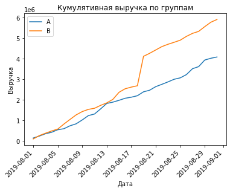
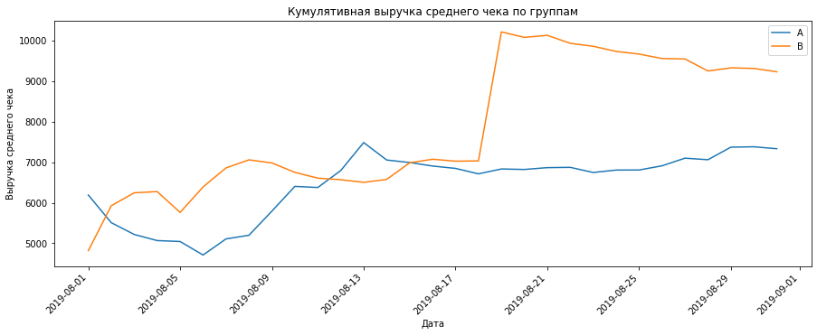
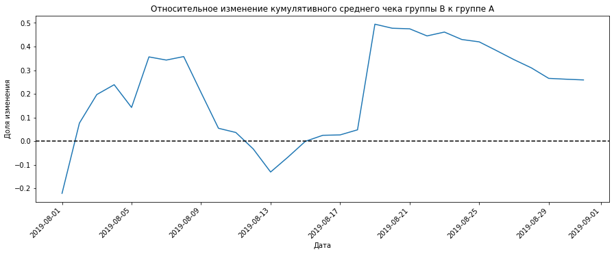
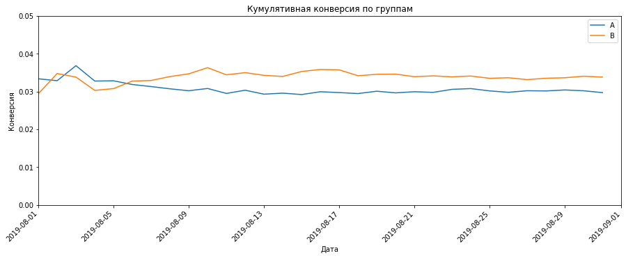
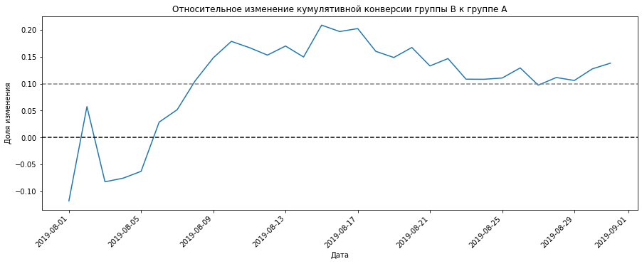
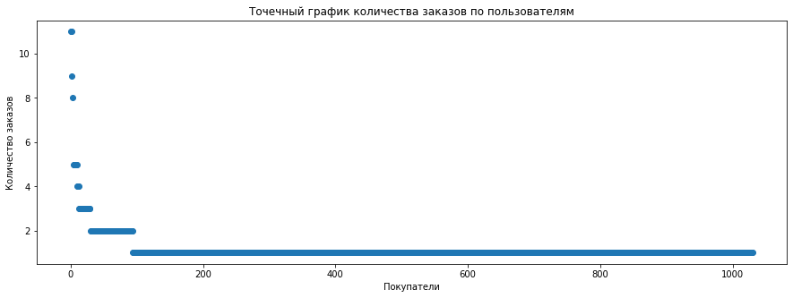
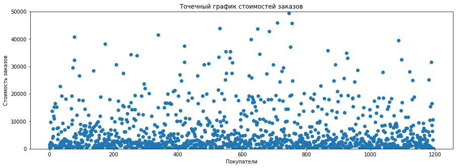

# Проектная работа - Принятие решений в бизнесе

**Описание проекта**

Вы — аналитик крупного интернет-магазина. Вместе с отделом маркетинга вы подготовили список гипотез для увеличения выручки.
Приоритизируйте гипотезы, запустите A/B-тест и проанализируйте результаты.


**Ход исследования**

 **Часть 1. Приоритизация гипотез.**

**Задачи:**
 - Применить фреймворк ICE для приоритизации гипотез. Отсортируйте их по убыванию приоритета.
 - Применить фреймворк RICE для приоритизации гипотез. Отсортируйте их по убыванию приоритета.
 - Указать, как изменилась приоритизация гипотез при применении RICE вместо ICE. Объяснить, почему так произошло.
 
**Часть 2. Анализ A/B-теста**

**Задачи:**
 - Проанализировать A/B-тест:
 - Построить график кумулятивной выручки по группам. 
 - Построить график кумулятивного среднего чека по группам.
 - Построить график относительного изменения кумулятивного среднего чека группы B к группе A. 
 - Построить график кумулятивной конверсии по группам. 
 - Построить график относительного изменения кумулятивной конверсии группы B к группе A. 
 - Построить точечный график количества заказов по пользователям. 
 - Посчитать 95-й и 99-й перцентили количества заказов на пользователя. Выбрать границу для определения аномальных пользователей.
 - Построить точечный график стоимостей заказов. 
 - Построить 95-й и 99-й перцентили стоимости заказов. Выберать границу для определения аномальных заказов.
 - Посчитать статистическую значимость различий в конверсии между группами по «сырым» данным. 
 - Посчитать статистическую значимость различий в среднем чеке заказа между группами по «сырым» данным. 
 - Посчитать статистическую значимость различий в конверсии между группами по «очищенным» данным. 
 - Посчитать статистическую значимость различий в среднем чеке заказа между группами по «очищенным» данным. 
 - Принять решение по результатам. 

**Описание данных**

**Данные для первой части**

Таблица hypothesis:
 - `Hypothesis` — краткое описание гипотезы;
 - `Reach` — охват пользователей по 10-балльной шкале;
 - `Impact` — влияние на пользователей по 10-балльной шкале;
 - `Confidence` — уверенность в гипотезе по 10-балльной шкале;
 - `Efforts` — затраты ресурсов на проверку гипотезы по 10-балльной шкале. Чем больше значение Efforts, тем дороже проверка гипотезы.
 
**Данные для второй части**

Таблица orders:
 - `transactionId` — идентификатор заказа;
 - `visitorId` — идентификатор пользователя, совершившего заказ;
 - `date` — дата, когда был совершён заказ;
 - `revenue` — выручка заказа;
 - `group` — группа A/B-теста, в которую попал заказ.
 
Таблица visitors:
 - `date` — дата;
 - `group` — группа A/B-теста;
 - `visitors` — количество пользователей в указанную дату в указанной группе A/B-теста

## Загрузка, изучение и подготовка данных к анализу


```python
import pandas as pd #импорт библиотеки pandas
import numpy as np #импорт библиотеки numpy
import scipy.stats as stats #импорт библиотеки scipy.stats
import datetime as dt #импорт библиотеки datetime
from matplotlib import pyplot as plt #импорт библиотеки matplotlib
from matplotlib.pyplot import figure
from pylab import rcParams
```


```python
hypothesis, orders, visitors = (
    pd.read_csv('/datasets/hypothesis.csv'),  # описание гипотез 
    pd.read_csv('/datasets/orders.csv', parse_dates=['date']),  # заказы
    pd.read_csv('/datasets/visitors.csv', parse_dates=['date']),  # пользователи
)
```


```python
display(hypothesis.head()) #получение первых 5 строк таблицы hypothesis
print()
display(hypothesis.info()) #получение общей информации о данных в таблице hypothesis
print()
hypothesis.duplicated().sum() #проверяем дубликаты
```


<div>
<table border="1" class="dataframe">
  <thead>
    <tr style="text-align: right;">
      <th></th>
      <th>Hypothesis</th>
      <th>Reach</th>
      <th>Impact</th>
      <th>Confidence</th>
      <th>Efforts</th>
    </tr>
  </thead>
  <tbody>
    <tr>
      <th>0</th>
      <td>Добавить два новых канала привлечения трафика,...</td>
      <td>3</td>
      <td>10</td>
      <td>8</td>
      <td>6</td>
    </tr>
    <tr>
      <th>1</th>
      <td>Запустить собственную службу доставки, что сок...</td>
      <td>2</td>
      <td>5</td>
      <td>4</td>
      <td>10</td>
    </tr>
    <tr>
      <th>2</th>
      <td>Добавить блоки рекомендаций товаров на сайт ин...</td>
      <td>8</td>
      <td>3</td>
      <td>7</td>
      <td>3</td>
    </tr>
    <tr>
      <th>3</th>
      <td>Изменить структура категорий, что увеличит кон...</td>
      <td>8</td>
      <td>3</td>
      <td>3</td>
      <td>8</td>
    </tr>
    <tr>
      <th>4</th>
      <td>Изменить цвет фона главной страницы, чтобы уве...</td>
      <td>3</td>
      <td>1</td>
      <td>1</td>
      <td>1</td>
    </tr>
  </tbody>
</table>
</div>


    
    <class 'pandas.core.frame.DataFrame'>
    RangeIndex: 9 entries, 0 to 8
    Data columns (total 5 columns):
     #   Column      Non-Null Count  Dtype 
    ---  ------      --------------  ----- 
     0   Hypothesis  9 non-null      object
     1   Reach       9 non-null      int64 
     2   Impact      9 non-null      int64 
     3   Confidence  9 non-null      int64 
     4   Efforts     9 non-null      int64 
    dtypes: int64(4), object(1)
    memory usage: 488.0+ bytes


    None


    


    0


```python
display(orders.head()) #получение первых 5 строк таблицы orders
print()
display(orders.info()) #получение общей информации о данных в таблице orders
print()
orders.duplicated().sum() #проверяем дубликаты
```


<div>
<table border="1" class="dataframe">
  <thead>
    <tr style="text-align: right;">
      <th></th>
      <th>transactionId</th>
      <th>visitorId</th>
      <th>date</th>
      <th>revenue</th>
      <th>group</th>
    </tr>
  </thead>
  <tbody>
    <tr>
      <th>0</th>
      <td>3667963787</td>
      <td>3312258926</td>
      <td>2019-08-15</td>
      <td>1650</td>
      <td>B</td>
    </tr>
    <tr>
      <th>1</th>
      <td>2804400009</td>
      <td>3642806036</td>
      <td>2019-08-15</td>
      <td>730</td>
      <td>B</td>
    </tr>
    <tr>
      <th>2</th>
      <td>2961555356</td>
      <td>4069496402</td>
      <td>2019-08-15</td>
      <td>400</td>
      <td>A</td>
    </tr>
    <tr>
      <th>3</th>
      <td>3797467345</td>
      <td>1196621759</td>
      <td>2019-08-15</td>
      <td>9759</td>
      <td>B</td>
    </tr>
    <tr>
      <th>4</th>
      <td>2282983706</td>
      <td>2322279887</td>
      <td>2019-08-15</td>
      <td>2308</td>
      <td>B</td>
    </tr>
  </tbody>
</table>
</div>


    
    <class 'pandas.core.frame.DataFrame'>
    RangeIndex: 1197 entries, 0 to 1196
    Data columns (total 5 columns):
     #   Column         Non-Null Count  Dtype         
    ---  ------         --------------  -----         
     0   transactionId  1197 non-null   int64         
     1   visitorId      1197 non-null   int64         
     2   date           1197 non-null   datetime64[ns]
     3   revenue        1197 non-null   int64         
     4   group          1197 non-null   object        
    dtypes: datetime64[ns](1), int64(3), object(1)
    memory usage: 46.9+ KB


    None


    


    0


```python
display(visitors.head()) #получение первых 5 строк таблицы visitors
print()
display(visitors.info()) #получение общей информации о данных в таблице visitors
print()
visitors.duplicated().sum() #проверяем дубликаты
```


<div>
<table border="1" class="dataframe">
  <thead>
    <tr style="text-align: right;">
      <th></th>
      <th>date</th>
      <th>group</th>
      <th>visitors</th>
    </tr>
  </thead>
  <tbody>
    <tr>
      <th>0</th>
      <td>2019-08-01</td>
      <td>A</td>
      <td>719</td>
    </tr>
    <tr>
      <th>1</th>
      <td>2019-08-02</td>
      <td>A</td>
      <td>619</td>
    </tr>
    <tr>
      <th>2</th>
      <td>2019-08-03</td>
      <td>A</td>
      <td>507</td>
    </tr>
    <tr>
      <th>3</th>
      <td>2019-08-04</td>
      <td>A</td>
      <td>717</td>
    </tr>
    <tr>
      <th>4</th>
      <td>2019-08-05</td>
      <td>A</td>
      <td>756</td>
    </tr>
  </tbody>
</table>
</div>


    
    <class 'pandas.core.frame.DataFrame'>
    RangeIndex: 62 entries, 0 to 61
    Data columns (total 3 columns):
     #   Column    Non-Null Count  Dtype         
    ---  ------    --------------  -----         
     0   date      62 non-null     datetime64[ns]
     1   group     62 non-null     object        
     2   visitors  62 non-null     int64         
    dtypes: datetime64[ns](1), int64(1), object(1)
    memory usage: 1.6+ KB


    None


    


    0


```python
hypothesis.columns = hypothesis.columns.str.lower() #приводим названия столбцов к нижнему регистру
orders.rename(columns = {'transactionId':'transaction_id', 'visitorId' : 'visitor_id'}, inplace = True) 
```

После первого ознакомления с данным видим, что пропусков и дубликатов нет. Колонки с датами в таблицах `orders` и `visitors` преобразовали на этапе чтения данных, также привели названия столбцов в таблице `hypothesis` к нижнему регистру и переименовали названия столбцов в таблице `orders`.
Для анализа есть все необходимые данные, можем приступать.

## Приоритизация гипотез

Ознакомимся с данными нам гипотезами по увеличению выручки интернет-магазина.


```python
pd.set_option('display.max_colwidth', None)
hypothesis
```


<div>
<table border="1" class="dataframe">
  <thead>
    <tr style="text-align: right;">
      <th></th>
      <th>hypothesis</th>
      <th>reach</th>
      <th>impact</th>
      <th>confidence</th>
      <th>efforts</th>
    </tr>
  </thead>
  <tbody>
    <tr>
      <th>0</th>
      <td>Добавить два новых канала привлечения трафика, что позволит привлекать на 30% больше пользователей</td>
      <td>3</td>
      <td>10</td>
      <td>8</td>
      <td>6</td>
    </tr>
    <tr>
      <th>1</th>
      <td>Запустить собственную службу доставки, что сократит срок доставки заказов</td>
      <td>2</td>
      <td>5</td>
      <td>4</td>
      <td>10</td>
    </tr>
    <tr>
      <th>2</th>
      <td>Добавить блоки рекомендаций товаров на сайт интернет магазина, чтобы повысить конверсию и средний чек заказа</td>
      <td>8</td>
      <td>3</td>
      <td>7</td>
      <td>3</td>
    </tr>
    <tr>
      <th>3</th>
      <td>Изменить структура категорий, что увеличит конверсию, т.к. пользователи быстрее найдут нужный товар</td>
      <td>8</td>
      <td>3</td>
      <td>3</td>
      <td>8</td>
    </tr>
    <tr>
      <th>4</th>
      <td>Изменить цвет фона главной страницы, чтобы увеличить вовлеченность пользователей</td>
      <td>3</td>
      <td>1</td>
      <td>1</td>
      <td>1</td>
    </tr>
    <tr>
      <th>5</th>
      <td>Добавить страницу отзывов клиентов о магазине, что позволит увеличить количество заказов</td>
      <td>3</td>
      <td>2</td>
      <td>2</td>
      <td>3</td>
    </tr>
    <tr>
      <th>6</th>
      <td>Показать на главной странице баннеры с актуальными акциями и распродажами, чтобы увеличить конверсию</td>
      <td>5</td>
      <td>3</td>
      <td>8</td>
      <td>3</td>
    </tr>
    <tr>
      <th>7</th>
      <td>Добавить форму подписки на все основные страницы, чтобы собрать базу клиентов для email-рассылок</td>
      <td>10</td>
      <td>7</td>
      <td>8</td>
      <td>5</td>
    </tr>
    <tr>
      <th>8</th>
      <td>Запустить акцию, дающую скидку на товар в день рождения</td>
      <td>1</td>
      <td>9</td>
      <td>9</td>
      <td>5</td>
    </tr>
  </tbody>
</table>
</div>


Сначала применим фреймворк ICE для приоритизации гипотез и отсортируем их по убыванию приоритета.


```python
hypothesis['ICE'] = (hypothesis['impact'] * hypothesis['confidence']) / hypothesis['efforts'] # считаем  фреймворк ICE
hypothesis[['hypothesis', 'ICE']].sort_values(by='ICE', ascending=False) # сортируем по убыванию приоритета
```


<div>
<table border="1" class="dataframe">
  <thead>
    <tr style="text-align: right;">
      <th></th>
      <th>hypothesis</th>
      <th>ICE</th>
    </tr>
  </thead>
  <tbody>
    <tr>
      <th>8</th>
      <td>Запустить акцию, дающую скидку на товар в день рождения</td>
      <td>16.200000</td>
    </tr>
    <tr>
      <th>0</th>
      <td>Добавить два новых канала привлечения трафика, что позволит привлекать на 30% больше пользователей</td>
      <td>13.333333</td>
    </tr>
    <tr>
      <th>7</th>
      <td>Добавить форму подписки на все основные страницы, чтобы собрать базу клиентов для email-рассылок</td>
      <td>11.200000</td>
    </tr>
    <tr>
      <th>6</th>
      <td>Показать на главной странице баннеры с актуальными акциями и распродажами, чтобы увеличить конверсию</td>
      <td>8.000000</td>
    </tr>
    <tr>
      <th>2</th>
      <td>Добавить блоки рекомендаций товаров на сайт интернет магазина, чтобы повысить конверсию и средний чек заказа</td>
      <td>7.000000</td>
    </tr>
    <tr>
      <th>1</th>
      <td>Запустить собственную службу доставки, что сократит срок доставки заказов</td>
      <td>2.000000</td>
    </tr>
    <tr>
      <th>5</th>
      <td>Добавить страницу отзывов клиентов о магазине, что позволит увеличить количество заказов</td>
      <td>1.333333</td>
    </tr>
    <tr>
      <th>3</th>
      <td>Изменить структура категорий, что увеличит конверсию, т.к. пользователи быстрее найдут нужный товар</td>
      <td>1.125000</td>
    </tr>
    <tr>
      <th>4</th>
      <td>Изменить цвет фона главной страницы, чтобы увеличить вовлеченность пользователей</td>
      <td>1.000000</td>
    </tr>
  </tbody>
</table>
</div>


По фреймворку ICE в лидерах оказались три гипотезы:
`Запустить акцию, дающую скидку на товар в день рождения`,
`Добавить два новых канала привлечения трафика, что позволит привлекать на 30% больше пользователей`и
`Добавить форму подписки на все основные страницы, чтобы собрать базу клиентов для email-рассылок`

Далее применим фреймворк RICE для приоритизации гипотез и отсортируем по убыванию приоритета.


```python
hypothesis['RICE'] = (hypothesis['reach'] * hypothesis['impact'] * hypothesis['confidence']) / hypothesis['efforts']
hypothesis[['hypothesis', 'RICE']].sort_values(by='RICE', ascending=False)
```


<div>
<table border="1" class="dataframe">
  <thead>
    <tr style="text-align: right;">
      <th></th>
      <th>hypothesis</th>
      <th>RICE</th>
    </tr>
  </thead>
  <tbody>
    <tr>
      <th>7</th>
      <td>Добавить форму подписки на все основные страницы, чтобы собрать базу клиентов для email-рассылок</td>
      <td>112.0</td>
    </tr>
    <tr>
      <th>2</th>
      <td>Добавить блоки рекомендаций товаров на сайт интернет магазина, чтобы повысить конверсию и средний чек заказа</td>
      <td>56.0</td>
    </tr>
    <tr>
      <th>0</th>
      <td>Добавить два новых канала привлечения трафика, что позволит привлекать на 30% больше пользователей</td>
      <td>40.0</td>
    </tr>
    <tr>
      <th>6</th>
      <td>Показать на главной странице баннеры с актуальными акциями и распродажами, чтобы увеличить конверсию</td>
      <td>40.0</td>
    </tr>
    <tr>
      <th>8</th>
      <td>Запустить акцию, дающую скидку на товар в день рождения</td>
      <td>16.2</td>
    </tr>
    <tr>
      <th>3</th>
      <td>Изменить структура категорий, что увеличит конверсию, т.к. пользователи быстрее найдут нужный товар</td>
      <td>9.0</td>
    </tr>
    <tr>
      <th>1</th>
      <td>Запустить собственную службу доставки, что сократит срок доставки заказов</td>
      <td>4.0</td>
    </tr>
    <tr>
      <th>5</th>
      <td>Добавить страницу отзывов клиентов о магазине, что позволит увеличить количество заказов</td>
      <td>4.0</td>
    </tr>
    <tr>
      <th>4</th>
      <td>Изменить цвет фона главной страницы, чтобы увеличить вовлеченность пользователей</td>
      <td>3.0</td>
    </tr>
  </tbody>
</table>
</div>


Видим, что при применении фреймворка RICE на первое место вышла гипотеза `Добавить форму подписки на все основные страницы, чтобы собрать базу клиентов для email-рассылок`, за счет большого охвата пользователей, которых затронет изменение. 
У гипотезы, попавшей на первое место при применении фреймворка ICE, параметр reach самый маленький, что логично, так как день рождения у каждого пользователя всего один раз в году, а в момент проверки гипотезы не велика вероятность, что наберется нужное количество пользователей. Однако у гипотезы `Запустить акцию, дающую скидку на товар в день рождения` самый высокий confidence и практичеки самый высокий impact. 

### Построим график кумулятивной выручки по группам.


```python
# создаем массив уникальных пар значений дат и групп теста
datesGroups = orders[['date','group']].drop_duplicates()

# получаем агрегированные кумулятивные по дням данные о заказах 
ordersAggregated = datesGroups.apply(lambda x: orders[np.logical_and(orders['date'] <= x['date'], orders['group'] == x['group'])]\
                .agg({'date' : 'max',\
                'group' : 'max',\
                'transaction_id' : 'nunique',\
                'visitor_id' : 'nunique',\
                'revenue' : 'sum'}), axis=1).sort_values(by=['date','group'])

# получаем агрегированные кумулятивные по дням данные о посетителях интернет-магазина 
visitorsAggregated = datesGroups.apply(lambda x: visitors[np.logical_and(visitors['date'] <= x['date'], visitors['group'] == x['group'])]
                .agg({'date' : 'max',\
                'group' : 'max',\
                'visitors' : 'sum'}), axis=1).sort_values(by=['date','group']) 

# объединяем кумулятивные данные в одной таблице и присваиваем ее столбцам понятные названия
cumulativeData = ordersAggregated.merge(visitorsAggregated, left_on=['date', 'group'], right_on=['date', 'group'])
cumulativeData.columns = ['date', 'group', 'orders', 'buyers', 'revenue', 'visitors']

print(cumulativeData.head(5))
```

            date group  orders  buyers  revenue  visitors
    0 2019-08-01     A      24      20   148579       719
    1 2019-08-01     B      21      20   101217       713
    2 2019-08-02     A      44      38   242401      1338
    3 2019-08-02     B      45      43   266748      1294
    4 2019-08-03     A      68      62   354874      1845


```python
# датафрейм с кумулятивным количеством заказов и кумулятивной выручкой по дням в группе А
cumulativeRevenueA = cumulativeData[cumulativeData['group']=='A'][['date','revenue', 'orders']]
# датафрейм с кумулятивным количеством заказов и кумулятивной выручкой по дням в группе B
cumulativeRevenueB = cumulativeData[cumulativeData['group']=='B'][['date','revenue', 'orders']]
fig = plt.plot(cumulativeRevenueA['date'], cumulativeRevenueA['revenue'], label='A')
fig = plt.plot(cumulativeRevenueB['date'], cumulativeRevenueB['revenue'], label='B')
plt.xticks(rotation=45, ha='right')
plt.title("Кумулятивная выручка по группам")
plt.xlabel("Дата")
plt.ylabel("Выручка")
rcParams['figure.figsize'] = 15, 5
plt.legend()
plt.show()

```


    

    


Видим, что на протяжении всего теста выручка увеличивается. Также видим, что группа В показываает значительно лучшие результаты. Возможно, из-за наличия дорогих заказов в выборке. Далее посмотрим на средний чек по группам.


### Построим график кумулятивного среднего чека по группам


```python
plt.plot(cumulativeRevenueA['date'], cumulativeRevenueA['revenue']/cumulativeRevenueA['orders'], label='A')
plt.plot(cumulativeRevenueB['date'], cumulativeRevenueB['revenue']/cumulativeRevenueB['orders'], label='B')
plt.xticks(rotation=45, ha='right')
plt.title("Кумулятивная выручка среднего чека по группам")
plt.xlabel("Дата")
plt.ylabel("Выручка среднего чека")
plt.legend() 
rcParams['figure.figsize'] = 15, 5
```


    

    


На графике видим нестабильное распределение выручки среднего чека и резкий подъем 17.08.2012 для группы В. Это может быть связано с тем, что в группу В на середине теста попали особо крупные заказы. 

### Построим график относительного изменения кумулятивного среднего чека группы B к группе A


```python
# собираем данные в одном датафрейме
mergedCumulativeRevenue = cumulativeRevenueA.merge(cumulativeRevenueB, left_on='date', right_on='date', how='left', suffixes=['A', 'B'])

# cтроим отношение средних чеков
plt.plot(mergedCumulativeRevenue['date'], (mergedCumulativeRevenue['revenueB']/mergedCumulativeRevenue['ordersB'])/(mergedCumulativeRevenue['revenueA']/mergedCumulativeRevenue['ordersA'])-1)

# добавляем ось X
plt.axhline(y=0, color='black', linestyle='--') 
plt.xticks(rotation=45, ha='right')
plt.title("Относительное изменение кумулятивного среднего чека группы B к группе A")
plt.xlabel("Дата")
plt.ylabel("Доля изменения")
rcParams['figure.figsize'] = 15, 5
```


    

    


График сильно скачет, наверняка дело в крупных и дорогих заказах, что мы проверим на следующих шагах. 

### Построим график кумулятивной конверсии по группам.


```python
# считаем кумулятивную конверсию
cumulativeData['conversion'] = cumulativeData['orders']/cumulativeData['visitors']

# отделяем данные по группе A
cumulativeDataA = cumulativeData[cumulativeData['group']=='A']

# отделяем данные по группе B
cumulativeDataB = cumulativeData[cumulativeData['group']=='B']

# строим графики
plt.plot(cumulativeDataA['date'], cumulativeDataA['conversion'], label='A')
plt.plot(cumulativeDataB['date'], cumulativeDataB['conversion'], label='B')
plt.legend()

# задаем масштаб осей
plt.axis([dt.datetime(2019, 8, 1), dt.datetime(2019, 9, 1), 0, 0.05])
plt.xticks(rotation=45, ha='right')
plt.title("Кумулятивная конверсия по группам")
plt.xlabel("Дата")
plt.ylabel("Конверсия")
plt.legend() 
rcParams['figure.figsize'] = 15, 5
```


    

    


Видим небольшое колебание в начале теста, далее конверсия группы В выходит вперед и удерживается выше, чем группа А. 

### Построим график относительного изменения кумулятивной конверсии группы B к группе A.


```python
mergedCumulativeConversions = cumulativeDataA[['date','conversion']].merge(cumulativeDataB[['date','conversion']], left_on='date', right_on='date', how='left', suffixes=['A', 'B'])

plt.plot(mergedCumulativeConversions['date'], mergedCumulativeConversions['conversionB']/mergedCumulativeConversions['conversionA']-1)
plt.axhline(y=0, color='black', linestyle='--')
plt.axhline(y=0.1, color='grey', linestyle='--')
plt.xticks(rotation=45, ha='right')
plt.title("Относительное изменение кумулятивной конверсии группы B к группе A")
plt.xlabel("Дата")
plt.ylabel("Доля изменения")
rcParams['figure.figsize'] = 15, 5
```


    

    


Видим, что конверсия группы В явно лучше группы А. Далее будем анализировать аномалии и выбросы, чтобы удостовериться в результатах. 

### Построим точечный график количества заказов по пользователям.


```python
ordersByUsers = (
    orders.groupby('visitor_id', as_index=False)
    .agg({'transaction_id': 'nunique'})
    .sort_values(by='transaction_id', ascending=False)
)
ordersByUsers.head(10)
```


<div>
<table border="1" class="dataframe">
  <thead>
    <tr style="text-align: right;">
      <th></th>
      <th>visitor_id</th>
      <th>transaction_id</th>
    </tr>
  </thead>
  <tbody>
    <tr>
      <th>1023</th>
      <td>4256040402</td>
      <td>11</td>
    </tr>
    <tr>
      <th>591</th>
      <td>2458001652</td>
      <td>11</td>
    </tr>
    <tr>
      <th>569</th>
      <td>2378935119</td>
      <td>9</td>
    </tr>
    <tr>
      <th>487</th>
      <td>2038680547</td>
      <td>8</td>
    </tr>
    <tr>
      <th>44</th>
      <td>199603092</td>
      <td>5</td>
    </tr>
    <tr>
      <th>744</th>
      <td>3062433592</td>
      <td>5</td>
    </tr>
    <tr>
      <th>55</th>
      <td>237748145</td>
      <td>5</td>
    </tr>
    <tr>
      <th>917</th>
      <td>3803269165</td>
      <td>5</td>
    </tr>
    <tr>
      <th>299</th>
      <td>1230306981</td>
      <td>5</td>
    </tr>
    <tr>
      <th>897</th>
      <td>3717692402</td>
      <td>5</td>
    </tr>
  </tbody>
</table>
</div>


```python
x_values = pd.Series(range(0,len(ordersByUsers)))

plt.scatter(x_values, ordersByUsers['transaction_id']) 
plt.title("Точечный график количества заказов по пользователям")
plt.xlabel("Покупатели")
plt.ylabel("Количество заказов")
rcParams['figure.figsize'] = 15, 5
```


    

    


Большинство пользователей совершают по 1-2 заказу, также видим выбросы, есть пользователи, который совершают больше 10-ти заказов. 

### Посчитаем 95-й и 99-й перцентили количества заказов на пользователя. Выберем границу для определения аномальных пользователей.


```python
display(np.percentile(ordersByUsers['transaction_id'], [95, 99]))
```


    array([2., 4.])


Не более 5% пользователей оформляли больше чем 2 заказа. И 1% пользователей заказывали более четырех раз.

 Выберем границу в 2 заказа для определения аномальных пользователей.

### Построим точечный график стоимостей заказов


```python
x_values = pd.Series(range(0,len(orders['revenue'])))
plt.scatter(x_values, orders['revenue']) 
plt.title("Точечный график стоимостей заказов")
plt.xlabel("Покупатели")
plt.ylabel("Стоимость заказов")
rcParams['figure.figsize'] = 15, 5
```


    

    


На графике видим несколько аномальных выбросов - особо дорогих заказов, в основном все распределение приходится примерно до 20 000 рублей. 

Посмотрим ближе на распределение строимостей заказов для более наглядного отображения.


```python
x_values = pd.Series(range(0,len(orders['revenue'])))
plt.scatter(x_values, orders['revenue']) 
plt.title("Точечный график стоимостей заказов")
plt.xlabel("Покупатели")
plt.ylabel("Стоимость заказов")
rcParams['figure.figsize'] = 15, 5
plt.ylim(0, 50000)
plt.show()
```


    

    


На точечной диаграмме рассеивания видим, что большая часть заказов имеет стоимость не более 20 000 рублей, а подавляющее большинсво заказов стоят в районе 5 000 рублей. 

### Посчитаем 95-й и 99-й перцентили стоимости заказов. Выберем границу для определения аномальных заказов.


```python
display(np.percentile(orders['revenue'], [95, 99]))
```


    array([28000. , 58233.2])


Не более 5% заказов дороже 28 000 рублей и не более 1% дороже 58 233 рублей.

Выберем границу в 28 000 рублей для определения аномальных пользователей.

### Посчитаем статистическую значимость различий в конверсии между группами по «сырым» данным.

Проверим, есть ли пользователи, которые учавствовали в обоих группах одновременно.


```python
test = orders[['visitor_id', 'group']]
groupA = test.query('group == "A"')
groupB = test.query('group == "B"')
```


```python
print("Количество пользователей, учавствовавших в обоих группах:", (groupA['visitor_id']).isin(groupB['visitor_id']).sum())
```

    Количество пользователей, учавствовавших в обоих группах: 89


Удалим из анализа пользователей, которые оказались в обоих группах, так как мы не можем с уверенностью сказать какая именно версия страницы повлияла на их решения.


```python
duplicates = orders.loc[orders['group'] == 'A', 'visitor_id'].isin(orders.loc[orders['group'] == 'B', 'visitor_id'])
orders = orders.drop(duplicates[duplicates].index)
```

Сформулируем гипотезы:

`Нулевая:` различий в среднем количестве заказов между группами по сырым данным нет. 

`Альтернативная:` различия в среднем между группами по сырым данным есть.


```python
visitorsADaily = visitors[visitors['group'] == 'A'][['date', 'visitors']]
visitorsADaily.columns = ['date', 'visitorsPerDateA']

visitorsACummulative = visitorsADaily.apply(
    lambda x: visitorsADaily[visitorsADaily['date'] <= x['date']].agg(
        {'date': 'max', 'visitorsPerDateA': 'sum'}
    ),
    axis=1,
)
visitorsACummulative.columns = ['date', 'visitorsCummulativeA']

visitorsBDaily = visitors[visitors['group'] == 'B'][['date', 'visitors']]
visitorsBDaily.columns = ['date', 'visitorsPerDateB']

visitorsBCummulative = visitorsBDaily.apply(
    lambda x: visitorsBDaily[visitorsBDaily['date'] <= x['date']].agg(
        {'date': 'max', 'visitorsPerDateB': 'sum'}
    ),
    axis=1,
)
visitorsBCummulative.columns = ['date', 'visitorsCummulativeB']

ordersADaily = (
    orders[orders['group'] == 'A'][['date', 'transaction_id', 'visitor_id', 'revenue']]
    .groupby('date', as_index=False)
    .agg({'transaction_id': pd.Series.nunique, 'revenue': 'sum'})
)
ordersADaily.columns = ['date', 'ordersPerDateA', 'revenuePerDateA']

ordersACummulative = ordersADaily.apply(
    lambda x: ordersADaily[ordersADaily['date'] <= x['date']].agg(
        {'date': 'max', 'ordersPerDateA': 'sum', 'revenuePerDateA': 'sum'}
    ),
    axis=1,
).sort_values(by=['date'])
ordersACummulative.columns = [
    'date',
    'ordersCummulativeA',
    'revenueCummulativeA',
]

ordersBDaily = (
    orders[orders['group'] == 'B'][['date', 'transaction_id', 'visitor_id', 'revenue']]
    .groupby('date', as_index=False)
    .agg({'transaction_id': pd.Series.nunique, 'revenue': 'sum'})
)
ordersBDaily.columns = ['date', 'ordersPerDateB', 'revenuePerDateB']

ordersBCummulative = ordersBDaily.apply(
    lambda x: ordersBDaily[ordersBDaily['date'] <= x['date']].agg(
        {'date': 'max', 'ordersPerDateB': 'sum', 'revenuePerDateB': 'sum'}
    ),
    axis=1,
).sort_values(by=['date'])
ordersBCummulative.columns = [
    'date',
    'ordersCummulativeB',
    'revenueCummulativeB',
]

data = (
    ordersADaily.merge(
        ordersBDaily, left_on='date', right_on='date', how='left'
    )
    .merge(ordersACummulative, left_on='date', right_on='date', how='left')
    .merge(ordersBCummulative, left_on='date', right_on='date', how='left')
    .merge(visitorsADaily, left_on='date', right_on='date', how='left')
    .merge(visitorsBDaily, left_on='date', right_on='date', how='left')
    .merge(visitorsACummulative, left_on='date', right_on='date', how='left')
    .merge(visitorsBCummulative, left_on='date', right_on='date', how='left')
)

display(data.head(5))

ordersByUsersA = (
    orders[orders['group'] == 'A']
    .groupby('visitor_id', as_index=False)
    .agg({'transaction_id': pd.Series.nunique})
)
ordersByUsersA.columns = ['visitor_id', 'orders']

ordersByUsersB = (
    orders[orders['group'] == 'B']
    .groupby('visitor_id', as_index=False)
    .agg({'transaction_id': pd.Series.nunique})
)
ordersByUsersB.columns = ['visitor_id', 'orders'] 
pd.Series(0, index=np.arange(data['visitorsPerDateA'].sum() - len(ordersByUsersA['orders'])), name='orders')
[ordersByUsersA['orders'],pd.Series(0, index=np.arange(data['visitorsPerDateA'].sum() - len(ordersByUsersA['orders'])), name='orders')]

sampleA = pd.concat([ordersByUsersA['orders'],pd.Series(0, index=np.arange(data['visitorsPerDateA'].sum() - len(ordersByUsersA['orders'])), name='orders')],axis=0)

sampleB = pd.concat([ordersByUsersB['orders'],pd.Series(0, index=np.arange(data['visitorsPerDateB'].sum() - len(ordersByUsersB['orders'])), name='orders')],axis=0)

ordersByUsersA = (
    orders[orders['group'] == 'A']
    .groupby('visitor_id', as_index=False)
    .agg({'transaction_id': pd.Series.nunique})
)
ordersByUsersA.columns = ['visitor_id', 'orders']

ordersByUsersB = (
    orders[orders['group'] == 'B']
    .groupby('visitor_id', as_index=False)
    .agg({'transaction_id': pd.Series.nunique})
)
ordersByUsersB.columns = ['visitor_id', 'orders']

sampleA = pd.concat(
    [
        ordersByUsersA['orders'],
        pd.Series(
            0,
            index=np.arange(
                data['visitorsPerDateA'].sum() - len(ordersByUsersA['orders'])
            ),
            name='orders',
        ),
    ],
    axis=0,
)

sampleB = pd.concat(
    [
        ordersByUsersB['orders'],
        pd.Series(
            0,
            index=np.arange(
                data['visitorsPerDateB'].sum() - len(ordersByUsersB['orders'])
            ),
            name='orders',
        ),
    ],
    axis=0,
)

print("P-value: ""{0:.5f}".format(stats.mannwhitneyu(sampleA, sampleB)[1]))

print("Относительный прирост конверсии группы B по отношению к группе A: " "{0:.3f}".format(sampleB.mean() / sampleA.mean() - 1))
 
```


<div>
<table border="1" class="dataframe">
  <thead>
    <tr style="text-align: right;">
      <th></th>
      <th>date</th>
      <th>ordersPerDateA</th>
      <th>revenuePerDateA</th>
      <th>ordersPerDateB</th>
      <th>revenuePerDateB</th>
      <th>ordersCummulativeA</th>
      <th>revenueCummulativeA</th>
      <th>ordersCummulativeB</th>
      <th>revenueCummulativeB</th>
      <th>visitorsPerDateA</th>
      <th>visitorsPerDateB</th>
      <th>visitorsCummulativeA</th>
      <th>visitorsCummulativeB</th>
    </tr>
  </thead>
  <tbody>
    <tr>
      <th>0</th>
      <td>2019-08-01</td>
      <td>23</td>
      <td>142779</td>
      <td>21</td>
      <td>101217</td>
      <td>23</td>
      <td>142779</td>
      <td>21</td>
      <td>101217</td>
      <td>719</td>
      <td>713</td>
      <td>719</td>
      <td>713</td>
    </tr>
    <tr>
      <th>1</th>
      <td>2019-08-02</td>
      <td>19</td>
      <td>91602</td>
      <td>24</td>
      <td>165531</td>
      <td>42</td>
      <td>234381</td>
      <td>45</td>
      <td>266748</td>
      <td>619</td>
      <td>581</td>
      <td>1338</td>
      <td>1294</td>
    </tr>
    <tr>
      <th>2</th>
      <td>2019-08-03</td>
      <td>24</td>
      <td>112473</td>
      <td>16</td>
      <td>114248</td>
      <td>66</td>
      <td>346854</td>
      <td>61</td>
      <td>380996</td>
      <td>507</td>
      <td>509</td>
      <td>1845</td>
      <td>1803</td>
    </tr>
    <tr>
      <th>3</th>
      <td>2019-08-04</td>
      <td>11</td>
      <td>41176</td>
      <td>17</td>
      <td>108571</td>
      <td>77</td>
      <td>388030</td>
      <td>78</td>
      <td>489567</td>
      <td>717</td>
      <td>770</td>
      <td>2562</td>
      <td>2573</td>
    </tr>
    <tr>
      <th>4</th>
      <td>2019-08-05</td>
      <td>22</td>
      <td>86383</td>
      <td>23</td>
      <td>92428</td>
      <td>99</td>
      <td>474413</td>
      <td>101</td>
      <td>581995</td>
      <td>756</td>
      <td>707</td>
      <td>3318</td>
      <td>3280</td>
    </tr>
  </tbody>
</table>
</div>


    P-value: 0.00002
    Относительный прирост конверсии группы B по отношению к группе A: 0.355


Анализ сырых данных сообщает, что в количестве заказов меду группами есть статистически значимые различия. Относительный прирост конверсии группы B по отношению к группе A равен 0.138. P-value меньше alpha - 0.05, поэтому имеем основания отвергнуть нудевую гипотезу.

### Посчитаем статистическую значимость различий в среднем чеке заказа между группами по «сырым» данным.

Сформулируем гипотезы:

`Нулевая:` различий в среднем чеке заказа между группами по сырым данным нет.

`Альтернативная:` различия среднем чеке заказа между группами по сырым данным есть.


```python
print("Относительное изменение среднего чека в группе B по отношению группы A: "'{0:.3f}'.format(stats.mannwhitneyu(orders[orders['group']=='A']['revenue'], orders[orders['group']=='B']['revenue'])[1]))
print("P-value: "'{0:.3f}'.format(orders[orders['group']=='B']['revenue'].mean()/orders[orders['group']=='A']['revenue'].mean()-1)) 
```

    Относительное изменение среднего чека в группе B по отношению группы A: 0.765
    P-value: 0.284


P-value больше 0.05, соответственно, можем сделать вывод, что статистически значимых изменений в среднем чеке между группами нет. Относительное различие среднего чека составляет 7.2%

### Посчитаем статистическую значимость различий в конверсии между группами по «очищенным» данным.

Сначала проверим сколько аномальных пользвоателей не входит в установленные границы: не более двух заказов и сумма заказа не более 28 000 руб.


```python
ordersByUsersA = (
    orders[orders['group'] == 'A']
    .groupby('visitor_id', as_index=False)
    .agg({'transaction_id': pd.Series.nunique})
)
ordersByUsersA.columns = ['visitor_id', 'orders']

ordersByUsersB = (
    orders[orders['group'] == 'B']
    .groupby('visitor_id', as_index=False)
    .agg({'transaction_id': pd.Series.nunique})
)
ordersByUsersB.columns = ['visitor_id', 'orders']


usersWithManyOrders = pd.concat(
    [
        ordersByUsersA[ordersByUsersA['orders'] > 2]['visitor_id'],
        ordersByUsersB[ordersByUsersB['orders'] > 2]['visitor_id'],
    ],
    axis=0,
)
usersWithExpensiveOrders = orders[orders['revenue'] > 28000]['visitor_id']
abnormalUsers = (
    pd.concat([usersWithManyOrders, usersWithExpensiveOrders], axis=0)
    .drop_duplicates()
    .sort_values()
)
print('Количество аномальных пользователей:',len(abnormalUsers))

```

    Количество аномальных пользователей: 68


Далее сформируем гипотезы и посчитаем статистическую значимость различия среднего количества заказов после удаления аномальных пользователей.

`Нулевая:` различий в среднем количестве заказов между группами по отфильтрованным данным нет.

`Альтернативная:` различия среднем количестве заказов между группами по отфильтрованным данным есть.


```python
sampleAFiltered = pd.concat(
    [
        ordersByUsersA[
            np.logical_not(ordersByUsersA['visitor_id'].isin(abnormalUsers))
        ]['orders'],
        pd.Series(
            0,
            index=np.arange(
                data['visitorsPerDateA'].sum() - len(ordersByUsersA['orders'])
            ),
            name='orders',
        ),
    ],
    axis=0,
)

sampleBFiltered = pd.concat(
    [
        ordersByUsersB[
            np.logical_not(ordersByUsersB['visitor_id'].isin(abnormalUsers))
        ]['orders'],
        pd.Series(
            0,
            index=np.arange(
                data['visitorsPerDateB'].sum() - len(ordersByUsersB['orders'])
            ),
            name='orders',
        ),
    ],
    axis=0,
) 

print("P-value: "'{0:.5f}'.format(stats.mannwhitneyu(sampleAFiltered, sampleBFiltered)[1]))
print("Относительный прирост конверсии группы B по отношению к группе A по очищенным данным: "'{0:.3f}'.format(sampleBFiltered.mean()/sampleAFiltered.mean()-1)) 
```

    P-value: 0.00006
    Относительный прирост конверсии группы B по отношению к группе A по очищенным данным: 0.307


P-value меньше 0.05. На основании полученных данных делаем вывод, что разница в конверсии для групп А и В статистически значима.

### Посчитаем статистическую значимость различий в среднем чеке заказа между группами по «очищенным» данным.

Сформируем гипотезы:

`Нулевая:` различий в среднем количестве заказов между группами по отфильтрованным данным нет.

`Альтернативная:` различия среднем количестве заказов между группами по отфильтрованным данным есть.


```python
print("P-value:"
    '{0:.3f}'.format(
        stats.mannwhitneyu(
            orders[
                np.logical_and(
                    orders['group'] == 'A',
                    np.logical_not(orders['visitor_id'].isin(abnormalUsers)),
                )
            ]['revenue'],
            orders[
                np.logical_and(
                    orders['group'] == 'B',
                    np.logical_not(orders['visitor_id'].isin(abnormalUsers)),
                )
            ]['revenue'],
        )[1]
    )
)

print("Относительное изменение среднего чека в группе B по отношению группы A по очищенным данным:"
    "{0:.3f}".format(
        orders[
            np.logical_and(
                orders['group'] == 'B',
                np.logical_not(orders['visitor_id'].isin(abnormalUsers)),
            )
        ]['revenue'].mean()
        / orders[
            np.logical_and(
                orders['group'] == 'A',
                np.logical_not(orders['visitor_id'].isin(abnormalUsers)),
            )
        ]['revenue'].mean()
        - 1
    )
) 
```

    P-value:0.934
    Относительное изменение среднего чека в группе B по отношению группы A по очищенным данным:-0.002


После очистки данных P-value показал значение 0.738, выше уровня alpha.делаем вывод, что разничий в средних чеках для групп А и В нет.

### Примимаем решение по результатам теста

В ходе исследования мы ознакомились и предобработали данные, приоритизировали гипотезы с помощью фреймворков ICE и RICE.

В ходе анализа результатов А/В теста мы выявили:
- Большинство пользователей совершают по 1-2 заказу, то также есть пользователи, который совершают больше 10-ти заказов.
- Средняя стоимость всех заказов примерно до 20 000 рублей. 
- В ходе теста были пользователи, которые учавствовали в обоих группах одновременно, таких было 89 человек.
- Кумулятивная выручка в группе В на протяжении всего теста  увеличивается по отношению к группе А.
- Относительный прирост конверсии группы B по отношению к группе A составил 13%.
- На протяжении всего теста лидировала группа В по комулятивной выручке, среднему чеку и конверсии. Также есть статистически значимое различие по конверсии между группами как по сырым данным, так и после фильтрации аномалий. 

По результатам анализа А/В теста можем прекратить тест и зафиксировать победу группы В.
